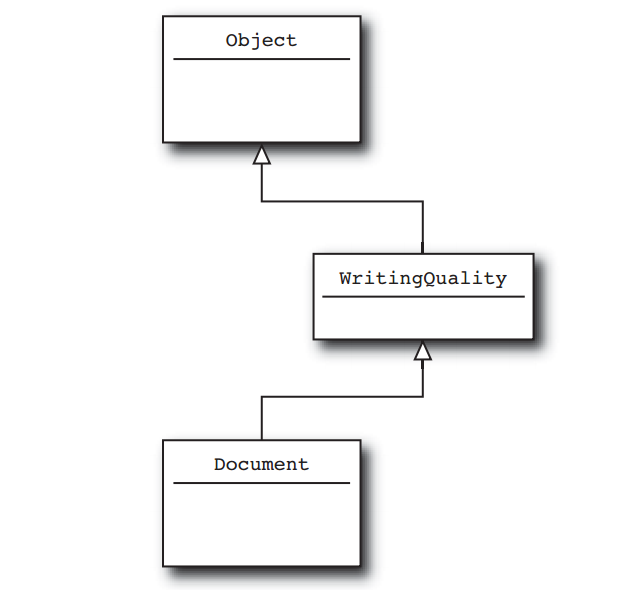
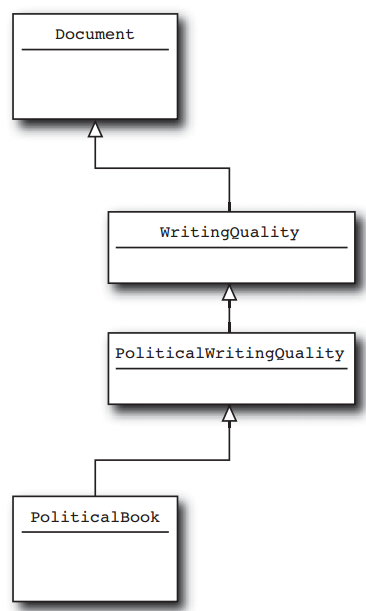
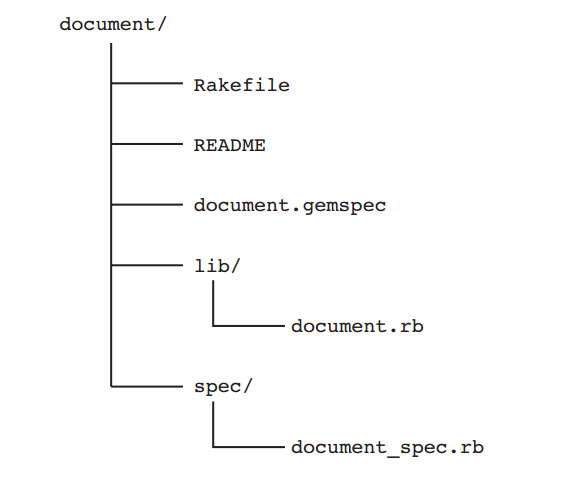

#My notes when reading this book

Navigation:

 - [Write Spec](#write-spec)

 - [Class, module and blocks](#class-module-and-blocks)

   + [Construct Classes from short, focused methods](#construct-classes-from-short-focused-methods)

   + [Composing Methods for Humans](#composing-methods-for-humans)

   + [Composing Ruby Methods](#composing-ruby-methods)

   + [One way output](#one-way-output)

   + [Define Operators Respectfully](#define-operators-respectfully)

   + [Create Classes that Understand Equality](#create-classes-that-understand-equality)

   + [Singleton methods and class methods](#singleton-methods-and-class-methods)

   + [Class Instance Variables](#class-instance-variables)

   + [Module as Namespaces](#module-as-namespaces)

   + [Use Modules as Mixins](#use-modules-as-mixins)

   + [Use Blocks to Iterate](#use-blocks-to-iterate)

   + [Execute Around with a Block](#execute-around-with-a-block)

   + [Save Blocks to Execute later](#save-blocks-to-execute-later)

   + [Save Blocks to Execute later](#save-blocks-to-execute-later)

- [Metaprogramming](#metaprogramming)

   + [Use Hooks to Keep the Program stay Informed](#use-hooks-to-keep-the-program-stay-informed)

   + [Error Handling with method_missing](#error-handling-with-method_missing)

   + [Delegation with method_missing](#delegation-with-method_missing)

   + [Monkey patching](#monkey-patching)

   + [Self-Modifying Classes](#self-modifying-classes)

   + [Classes that Modify Their Subclasses](#classes-that-modify-their-subclasses)

- [Pulling it all together](#pulling-it-all-together)

   + [Internal DSL](#internal-dsl)

   + [External DSL](#external-dsl)

   + [Package Programs as Gems](#package-programs-as-gems)

##Basics

sample code

```ruby
class Document
  attr_accessor :title, :author, :content

  def initialize title, author, content
    @title = title
    @author = author
    @content = content
  end

  def words
    @content.split
  end

  def word_count
    words.size
  end
end
```

Idomatic ruby source: `set.rb`

###Regular Expression

Reading ruby source: `time.rb`

###Write Spec
####1. Test::Unit
Test::Unit comes packaged with Ruby and is a member of the XUnit family of testing frame work. The Test::Unit idea is to exercise the code in a series of individual tests, where each test tries each aspect of the program.

In Test::Unit each test is package in a method whose name needs to begin with `test_`. Example:

```ruby
def test_document_holds_onto_contents
  text = "A bunch of words"
  doc = Document.new("test", "nobody", text)
  assert_equal text, doc.content
end
```

In this test, first a document is created with some text, and then using `assert_equal` to check the Document object still have the text that it created. If the text and content of the document are not equal, the test fails.

Along with the assert equal, Test::Unit also provide some abitrary condition check with assert method:

```ruby
assert doc.words.include?( "bunch" )
```

To really use Test::Unit for tests up, a subclass of Test::Unit::TestCase is needed. Inside the class will have any number of test methods:

```ruby
require "test/unit"
require "document.rb"

class DocumentTest < Test::Unit::TestCase
  def test_document_holds_onto_contents
    text = "A bunch of words"
    doc = Document.new("test", "nobody", text)
    assert_equal text, doc.content, "Contents are still there"
  end

  def test_that_doc_can_return_words_in_array
    text = "A bunch of words"
    doc = Document.new("test", "nobody", text)
    assert doc.words.include?( "A" )
    assert doc.words.include?( "bunch" )
    assert doc.words.include?( "of" )
    assert doc.words.include?( "words" )
  end

  def test_that_word_count_is_correct
    text = "A bunch of words"
    doc = Document.new("test", "nobody", text)
    assert_equal 4, doc.word_count, "Word count is correct"
  end
end
```

To run the test, run the file containing the test class with `ruby`:

    ruby document_test.rb

If one of the test methods are fail, Test::Unit will keep running all other tests.

Test::Unit provides the `setup` method alongs with its friend, the `teardown` method. The `setup` method gets called before each test method is run:

```ruby
class DocumentTest < Test::Unit::TestCase
  def setup
    @text = "A bunch of words"
    @doc = Document.new("test", "nobody", @text)
  end

  def test_that_document_holds_onto_contents
    assert_equal @text, @doc.content, "Contents are still there"
  end

  def test_that_doc_can_return_words_in_array
    assert @doc.words.include?( "A" )
    assert @doc.words.include?( "bunch" )
    assert @doc.words.include?( "of" )
    assert @doc.words.include?( "words" )
  end

  def test_that_word_count_is_correct
    assert_equal 4, @doc.word_count, "Word count is correct"
  end
end
```

In the same way, the `tear down` method gets called after each test method gets run. The `tear down` method is great for closing database connections, deleting temp files, or any other general post-test tidying up.

`setup` and `tear down` get called _around_ each test method, not before, and after all of the tests in the class get run.

**A plethora of Assertion**
In Test::Unit toolkit, there are not only `assert` (test that something is true) or `assert_equal` (one thing is equal to something else), there are another assertion methods like `assert_not_equal`, `assert_nil` and `assert_not_nil`.

To test an regular expression on a string, there is `assert_match`:

    assert_match /times.*/, "times new roman"

To check object is an instance of a class, use `assert_instance`:

    assert_instance_of String, "hello"

To check that code raises an exception or not, use:

```ruby
assert_raise ZeroDivisionError do
  x = 1/0
end
```

```ruby
assert_nothing_thrown do
  x = 1/2
end
```

Test::Unit tests can call on about twenty different assertions.

####2. Spec

The test should focus on its behavior. Example:

    About the Document class: when you have a document instance, it should have the text that it is given. It should return an array containing each word in the document when calling the words method. And it should return the number of words in the document when word_count is called.

Rspec is fit for this job. Example:

```ruby
describe Document do
  it "should hold on to the contents" do
    text = "A bunch of word"
    doc = Document.new "test", "nobody", text
    doc.content.should == text
  end
  it "should return all of the words in the document" do
    text = "A bunch of words"
    doc = Document.new "test", "nobody", text
    doc.words.include?("A").should == true
    doc.words.include?("bunch").should == true
    doc.words.include?("of").should == true
    doc.words.include?("words").should == true
  end

  it "should know how many words it contains" do
    text = "A bunch of words"
    doc = Document.new "test", "nobody", text
    doc.word_count.should == 4
  end
end
```

The code above is not just test, it is a description. The description says that the Document class should hold on to the contents. It does not assert any thing, it only say thing should happen.

By convention, Rspec code - or spec - goes in a file called `<<class_name>>_spec.rb`. To run spec use `spec` command:

  spec document_spec.rb

**A readable tidy Spec**

The above example have some problem. It creates the same document with the same text for every test example. RSpec can deal with this redundant code. It can allowing supply code that is executed _before each example test_. Example:

```ruby
describe Document do
  before :each do
    @text = "A bunch of words"
    @doc = Document.new "test", "nobody", @text
  end

  it "should hold on to the contents" do
    @doc.content.should == @text
  end

  it "should know which words it has" do
    @doc.words.should include "A"
    @doc.words.should include "bunch"
    @doc.words.should include "of"
    @doc.words.should include "words"
  end

  it "should know how many words it contains" do
    @doc.word_count.should == 4
  end
end
```

There is also an `after` method in RSpec which execute code after each example. The `:each` parameter means to run code supplied before (or after) each example. The alternatively is `:all`

####Easy Stubs

An ideal test exercises exactly one class at a time. This mean that when the test fails, there is something wrong with the testing class and not some other class that get dragged along. The trouble is that most classes will not function without other classes to helped them: Programs thend to be complicated ecosystems, with the majority of classes relying on other classes. So, how to test just one class when that class needs other classes in order to work.

This is the job for **stubs** and **mocks**. A **stub** is an object that implements the same interface as the supporting cast member, but returns canned answers when its methods are called.

Example: Imagine that there is a subclass of the Document class, a subclass that supports printing. Suppose that the real work of printing is done by a _printer_ class, which supports two methods. First method is `available?`, which returns true if the printer is actually up and running. Second method is `render`, which is the method for printing the document onto the paper.

```ruby
class PrintableDocument < Document
  def print( printer )
    return "Printer unavailable" unless printer.available?
    printer.render "#{title}\n"
    printer.render "By #{author}\n"
    printer.render content
    "Done"
  end
end
```

In this example, the `print` method have a parameter is a printer object to print the document. The question here is how to test the `print` method without having to get involved with the real `printer` object. Conceptually this can be done easily: just create a stub printer class, which have the same method with the real printer class `available?` and `render` but does not do any thing. But in practice, this is a tedious and error prone job, especially when testing a complex class with a lot of dependencies.

RSpec has `stub` method for dealing with this problem. `stub` take a hash of method names (as symbols) and the corresponding value of the method name as arguments. The `stub` will return an object equiped exactly with those methods. Example:

    stub_printer = stub :available => true, render: nil

With `stub`, there are no classes to create, no methods to code; it does all of this tedious tasks. Example with RSpec:

```ruby
describe PrintableDocument do
  before :each do
    @text = "A bunch of words"
    @doc = PrintableDocument.new "test", "nobody", @text
  end

  it "should know how to print itself" do
    stub_printer = stub :available? => true, render: nil
    @doc.print(stub_printer).should == "Done"
  end

  it "should return the proper string if printer is offline" do
    stub_printer = stub :available? => false, render: nil
    @doc.print(stub_printer).should == "Printer unavailable"
  end
end
```

RSpec also provide `stub!` method, which can stub out individual methods on any regular object. Example: to create a string that claimed to be a million characters long:

    long_string = "actually short string"
    long_string.stub!(:length).and_return 1000000

####Easy mocks

Stub are great for producing the boring infrastructure that needed to make a test work by quitely return canned answers. But sometime the test need a stublike object that takes more of an active role in the test. In the above last example - printing test -, the test does not verify that the `print` method ever called `render`. It is a simply test that does not check to see if something got printed (i,e the working of the printer object is unknown).

This is the job for **mock*. A mock not only know what canned responses to return but also knows which methods should be called with what arguments. Thus, a stub is used to get the test to work and a mock is an active participant in the test, watching how it is treated and failing the test if it does not like what arguments it gets.

RSpec provides a `mock` method to go with `stub`. Example:

```ruby
it "should know how to print itself" do
  mock_printer = mock "Printer"
  mock_printer.should_receive(:available?).and_return true
  mock_printer.should_receive(:render).exactly(3).times
  @doc.print(mock_printer).should == "Done"
end
```

In this example, a mock printer object is created and setup to expect that when the test run, the `available?` will be called at least once and return value `true`, and the `render` method will be called exactly 3 times. RSpec defines a little expectation language to express exactly what should happen (called or not called method, how many times the method is called...).

Good place to look at RSpec example: [RubySpec](http://rubyspec.org)

**Notes**

Unit tests should be quick. Ideally the test for a whole system should run in at most few minutes. Because unit tests will be run often by developer so it must be quick as possible. Unit tests should run quick with the setup that every developer has.

Unit tests should be _silent_. Unit tests need to provide a simple answer to a simple question: Does it work or not? that all. If it failed, come back to look at the code to make it right.

Test also need to be independent of one another. Test should not have to rely on the output of a previous test. In particular, use RSpec `before :any` in preference to `before :all`.

Make sure that the test will _actually_ fail. Example: Implementing the `clone` method for `Document`. The `clone` method get a copy of the called object instance. The default `clone` implementation makes a shallow copy; the second object get from `clone` will have the instance variable point at identically to the same object. So to make a deep copy that also duplicating all instance variable of the object, there is an implementation:

```ruby
class Document

  # ...

  def clone
    Document.new title.clone, author.clone, content.clone
  end
```

Spec for the new `clone`:

```ruby
describe Document do
  it "should have a functional clone method" do
    doc1 = Document.new "title", "author", "some stuff"
    doc2 = doc1.clone
    doc1.title.should == "title"
    doc1.author.should == "author"
    doc1.content.should == "some stuff"
  end
end
```

The problem with the test is that it goes on to test the original `doc1` object instead of the copy `doc2`. An important part of writing test is making sure that it actually test the right funtional.

Although the ideal set of unit tests will cover all of the significant features of the system, sometime it can not get to the ideal. There might be not enough time to do it or the coworkers are just not into the testing thing. What to do?

Write whatever unit tests that possible. Just write a unit test that exercises the code a little, with no assertion at all. Example:

```ruby
require "document"

describe Document do
  it "should not catch fire when creating an instance" do
    Document.new("title", "author", "stuff").should_not == nil
  end
end
```

This test provide a lot of the information for the developer:

- `Document` is a class (or at least act like one)

- The `Document` class is indeed found in the `document.rb` file.

- The `document.rb` file does not contain any really egregious syntax errors.

- `Document.new` will take three arguments.

- `Document.new` actually return something.

- `Document.new` does not throw an exception

##Class, module and blocks

###Construct Classes from short, focused methods.

**Compressing Specification**

Requirement: implement a hearte of the compression algorithm, which take a text string and produce two arrays, which will then be stored in the archive. The first array contain all the unique words in the original text. Example:

    This specification is the specification for a specification

The first array would contain all the unique words in the text:

    ["This", "specification", "is", "the", "for", "a"]

The second array will contain integer indexes. There will be one index in this second array for each word in the original document:

    [0, 1, 2, 3, 1, 4, 5, 1]

Implementation:

```ruby
class TextCompressor
  attr_reader :unique, :index

  def initialize( text )
    @unique = []
    @index = []

    words = text.split
    words.each do |word|
      i = @unique.index word
      @index << if i
        i
      else
        @unique << word
        unique.size - 1
      end
    end
  end
end
```

Using it:

```ruby
text = "This specification is the spec for a specification"
compressor = TextCompressor.new text

unique_word_array = compressor.unique
word_index = compressor.index
```

This code is just fine, it does work (it does lose all the white space and punctuation). But it does not good for maintaining. The next programmer will need to spend some time looking hard at the `initialize` method.

Modification version:

```ruby
class TextCompressor
  attr_reader :unique, :index

  def initialize( text )
    @unique = []
    @index = []

    words = text.split
    words.each do |word|
      i = unique_index_of word
      @index << if i
        i
      else
        add_unique_word word
      end
    end
  end

  def unique_index_of word
    @unique.index(word)
  end

  def add_unique_word word
    @unique << word
    unique.size - 1
  end
end
```

This version is an improvement: the name of new method give meaning full to what is going on in the `initialize` method. But the `initialize` method is doing a lot of jobs. It is involved with all the details of managinng the `@index` array.

Another Modification

```ruby
class TextCompressor
  attr_reader :unique, :index

  def initialize( text )
    @unique = []
    @index = []

    add_text text
  end

  def add_text
    words = text.split
    words.each {|word| add_word word}
  end

  def add_word word
    @index << unique_index_of(word) || add_unique_word(word)
  end

  def unique_index_of word
    @unique.index word
  end

  def add_unique_word word
    @unique << word
    unique.size - 1
  end
end
```

In this version, the `initialize` method delegate the task of doing the compression onto the `add_text`, which itself delegate to `add_word`.

###Composing Methods for Humans

The technique above is the called **composed method**. This technique advocates diving a class up into methods that have 3 characteristics:

- First, each method should do a single thing: focus on solving a single aspect of the problem.

- Second, each methods needs to operate at a single conceptual level: do not mix high-level login with details. A method that implements the business logic like currency conversions should not suddenly veer off into the details of how the various accounts are stored in the database.

- Finnally, each method needs to have a name that reflects its purpose.

###Composing Ruby Methods

Having many fine-grained methods also tends to make the classes easier to test.a. Consider these test cases:

```ruby
describe TextCompressor do
  it "should be able to add some text" do
    c = TextCompressor.new ""
    c.add_text "first second"
    c.unique.should == ["first", "second"]
    c.index.should == [0, 1]
  end

  it "should be able to add a word" do
    c = TextCompressor.new ""
    c.add_word "first"
    c.unique.should == ["first"]
    c.index.should == [0]
  end

  it "should be able to find the index of a word" do
    c = TextCompressor.new "hello world"
    c.unique_index_of("hello").should == 0
    c.unique_index_of("world").should == 1
  end
end
```

###One way output

Every method should have exactly one way output, so that all the logic converges at the botton for a single return.

Example: the `Document` object now need a method to rate the text in the document, base on the number of pretentious or slangy words in the document. First version with the longish method and sprinkle returns:

```ruby
class Document

  def prose_rating
    if pretentious_density > 0.3
      if informal_density < 0.2
        return :really_pretentious
      else
        return :somewhat_pretentious
      end
    elsif pretentious_density < 0.1
      if informal_density > 0.3
        return :really_informal
      end
      return :somewhat_informal
    else
      return :about_right
    end
  end

  def pretentious_density
    # Somehow compute density of pretentious words
  end

  def informal_density
    # Somehow compute density of informal words
  end
end
```
This code is not that bad, it just hard to get a feeling for the flow. Now is a single return version:

```ruby
def prose_rating
  rating = :about_right

  if pretentious_density > 0.3
    if informal_density < 0.2
      rating = :really_pretentious
    else
      rating = :somewhat_pretentious
    end
  elsif pretentious_density < 0.1
    if informal_density > 0.3
      rating = :really_informal
    end
    rating = :somewhat_informal
  else
    rating = :about_right
  end
end
```

A better fix for this example:

```ruby
def prose_rating
  return :really_pretentious if really_pretentious?
  return :somewhat_pretentious if somewhat_pretentious?
  return :really_informal if really_informal?
  return :somewhat_informal if somewhat_informal?
  return :about_right
end

def really_pretentious?
  pretentious_density > 0.3 && informal_density < 0.2
end

def somewhat_pretentious?
  pretentious_density > 0.3 && informal_density >= 0.2
end

def really_informal?
  pretentious_density < 0.1 && informal_density > 0.3
end

def somewhat_informal?
  pretentious_density < 0.1 && informal_density <= 0.3
end

def pretentious_density
  # Somehow compute density of pretentious words
end

def informal_density
  # Somehow compute density of informal words
end
```

###Define Operators Respectfully

**Defining Operators in Ruby**

The Ruby mechanism for defining opertators is base on the fact that Ruby translates every expression involving defined operators equal to a method calls. Example:

    sum = first + second

is equivalent to:

    sum = first.+(second)

The Ruby interpreter is clever about the operator-to-method translation process and will make sure that the translated expression respects operator precedence and parentheses, so that:

    result = first + second * (third - fourth)

will be translate into:

    result = first.+(second.*(third.-(fourth)))

Lets add an operator to the `Document` class:

```ruby
class Document

  def +(other)
    Document.new title, author, "#{content} #{other.content}"
  end
end
```

with thist, the documents can now sum up:

```ruby
doc1 = Document.new "Tag Line1", "Kirk", "These are the voyages"
doc2 = Document.new "Tag Line2", "Kirk", "of the star ship ..."

total_document = doc1 + doc2
puts total_document.content #equal "These are the voyages of the star ship ..."
```

The `+` and `-` opertators can be both binary and unary. It can act as a signed of number. To create the unary operator, the method need to be defined with the special name `+@` or `-@`. Example:

```ruby
class Document

  def +@
    Document.new( title, author, "I am sure that #{@content}" )
  end

  def -@
    Document.new( title, author, "I doubt that #{@content}" )
  end
end
```

In ruby, an object can be made to look like arrays or hashes by define methods like: `[]` and `[]`=. Technically, these methods are not operators, the Ruby parser sprinkles some very operator-like syntax on them: `foo[4]` are identical calling `[]` method on `foo` passing 4 as argument.

To make document instance look like an arrays of words, do:

```ruby
class Document

  def [](index)
    words[index]
  end
end
```

###Create Classes that Understand Equality

**An Identifier for Document**

Suppose that there are a lot of documents object instance created at a furious pace. To managing those document, a system to store and manage all of those documents is built. An identifier object is needed to pick a document out of the crowded documents. Thus there is a `DocumentIdentifier` class:

```ruby
class DocumentIdentifier
  attr_reader :folder, :name

  def initialize( folder, name )
    @folder = folder
    @name = name
  end
end
```

The idea of DocumentIdentifier is: the managament system assigns each document a (presumably unique) name and groups the documents into folders. To locate any given document, both document name and folder is needed.

The problem is there is no easy way to compare two instances of DocumentIdentifier to see whether they actually point at the same document.

**Equality Embarrassment**

Ruby Object class defines four equality methods: `eql?`, `equal?`, `==` and `===`. THe `equal?` method to test for object identity, which mean that if both object references to the same object, the method is evaluated to true.

The `==` or double equals operator is the one that all developer use to compare almost any thing in programming. The default implementation of `==` is identical to `equal?` - it tests for object identity. But it can be overrided with any kind of comparison:

```ruby
class DocumentIdentifier
  attr_reader :folder, :name

  def initialize( folder, name )
    @folder = folder
    @name = name
  end

  def ==(other)
    return false unless other.instance_of? self.class
    return true if other.equal? self
    folder == other.folder && name == other.name
  end
end
```

One problem with this implementation is that the equal is very narrow. The `instance_of?` test only accept DocumentIdentifier instance, not its subclass or any thing related to it. The `instance_of?` can be replaced by `kind_of?` method to accpet an subclass of DocumentIdentifier.

But with Ruby dynamic typing, there is no need to explicit check for subclass like this. Instead, it can work with any kind of object which has the similar value to be compared:

```ruby
def ==(other)
  return false unless other.respond_to? :folder
  return false unless other.respond_to? :name
  folder == other.folder && name == other.name
end
```

**Triple Equals (===) for Case Statements**

The main use for `===` is in `case` statements. By default, `===` calls the double equals methods unless it is overrided.

**Hash tables and the eql? method**

The `eql?` method is rarely called until it is used as a key in a hash. Example:

```ruby
hash = {}
document = Document.new "cia", "Roswell", "story"
first_id = DocumentIdentifier.new "public", "CoverStory"

hash[first_id] = document
```

This will work until it fetching the document by a second instance of DocumentIdentifier with the same value with the first instance, like this:

```ruby
second_id = DocumentIdentifier.new "public", "CoverStory"
the_doc_again = hash[second_id]
```

The value of `the_doc_again` is set to `nil`. This is because of the working of the Hash class in ruby.

The Hash in ruby using a simple model: divide-and-conquer strategy. Instead of maintaining a single key/value list, it only maintains a number of buckets. Like divide 10,000 key/value into 100 bucket, with each bucket have 100 key/value, it will improve the performance dramatically.

The challenging thing with this scheme is picking the right bucket to store and retrieve value.

Every object in ruby have a method which returns a hash value. The **hash value** is a set of random number generated from the value of the object. When a key/value pair is store in a hash table, the hash value is pulled from the key. And then this number will be used to pick a hash bucket, and then the key/value pair is stored in that bucket. When retrieve the value associated with some key, the hash code - which get from key (object) - is used to pick the right bucket to search.

Hash codes need some properties to make this all work. First is stabe over time: if a key generates one hash code now, it must be the same by the time going. Second, Hash code need to be consistent with the value of the key: If two keys are equal, they must return the same hash code.

**Well-Behaved Hash Key**

The `Hash` class in ruby calls the aptly named `hash` method (which is a method of the `Object`) to get the hash code from its keys. The `Hash` class uses the `eql?` method to decide if two keys are equal. The default implementation of `hash` and `eql?` from the `Object` are based on object identity: the default `eql?` returns true only if the other object is identically with this object. The default `hash` method returns the `object_id` of the object, which is guaranteed to be unique.

This behavior can be override with the hash Prime Directive - if `a.eql? b` then `a.hash == b.hash`. Example:

```ruby
class DocumentIdentifier

  def hash
    folder.hash ^ name.hash
  end

  def eql? other
    return false unless other.instance_of? self.class
    folder == other.folder && name == other.name
  end
end
```

###Singleton methods and class methods

Let start with the `stub` objects of RSpec. A stub object can be create like this:

    stub_printer = stub :available? => true, render: nil

The stub_printer is now an object with 2 methods: `available?` and `render`. And then another stub object instance is created:

    stub_font = stub size: 14, name: "Courier"

Look at the classes of these tow stub objects:

    puts stub_printer.class # Spec::Mocks::Mock
    puts stub_font.class    # Spec::Mocks::Mock

This is the example of singleton method in ruby. A singleton method is a method defined for exactly one object instance. Ruby objects can declare independence from their class.

Any object (except for numeric and symbol) can have any singleton method. The mechanics of defining singleton methods are pretty simple: `def instance.method_name`. Example:

```ruby
hand_built_stub_printer = Object.new

def hand_built_stub_printer.available?
  true
end

def hand_built_stub_printer.render content
  nil
end
```

Singleton methods are the same with ordinary method except its can be only call by the object that created it.

Singleton methods override any regular, class defined methods. Example:

```ruby
uncooperative = "Don't ask my class"

def uncooperative.class
  "I'm not telling"
end

puts uncooperative.class # "I'm not telling"
```

An alternative syntax for defining singleton methods:

```ruby
class << hand_built_stub_printer
  def available?
    true
  end

  def render
    nil
  end
end
```

**A real hidden Class**

Every Ruby object carries an additional shadowy class of its own. This class is called **singleton** class. It sit between every object and its regular class. Singleton classes also known as metaclass or eigenclass. This singleton class is just a methodless shell so it is pretty invisible. Only when something is added to this singleton class then it will make its existence felt.


Since it sits directly above the instance, the singleton class method is always inherited directly by the instance first.

To ensure the existence of singleton class, use:

```ruby
singleton_class = class << hand_built_stub_printer
  self
end
```

**Class methods**

The class method is actually singleton methods in disguise. Let see an example:

```ruby
my_object = Document.new "War and Peace", "Tolstoy", "All happy families..."

def my_object.explain
  puts "self is #{self}"
  puts "and its class is #{self.class}"
end

my_object.explain

# output
# self is #<Document:0xb7bc2ca0>
# and its class is Document
```

Now, consider the example when my_object is not an instance of Document, it is the Document itself:

```ruby
my_object = Document

def my_object.explain
  puts "self is #{self}"
  puts "and its class is #{self.class}"
end

my_object.explain
# output
# self is Document
# and its class is Class
```

Since my_object is just a reference to `Document`, the explain method can be called like this:

    Document.explain

The `explain` method can be define on Document explicity:

```ruby
def Document.explain
  puts "self is #{self}"
  puts "and its class is #{self.class}"
end
```

This is the syntax to create a Ruby class method, and it is also a singleton method definition! It make sense because `Document` is an object instance of `Class`. This mean it inherits all method from `Class` like `name` and `superclass`. When defining a class method, the method exist only on the one class (Document), not on all classes. So, creating a method that work only for an instance is the job of singleton method.

###Class Instance Variables

**Quick reviews of class variables**

To store information associated with a Ruby class, the class variable is used. Class variables start with two `@`. Example:

```ruby
class Document
  @@default_paper_size = :a4

  def self.default_paper_size
    @@default_paper_size
  end

  def self.default_paper_size=(new_size)
    @@default_paper_size = new_size
  end

  attr_accessor :title, :author, :content
  attr_accessor :paper_size

  def initialize(title, author, content)
    @title = title
    @author = author
    @content = content
    @paper_size = @@default_paper_size
  end
end
```

The class variables not visible to the outside of the class, but they are visible to instances of the class.

**Wandering variables**

To understand the problem with class variables, let see how they are resolved in Ruby. A class variable is one that associated with a class. So the question here is which class? In the above example, the variable `@@default_paper_size` need to be figured out which class is called or provide the home for it. Ruby start by looking at the current class. If the current class have the variable, the search is end.

If the class variable is not defined in the current class, Ruby will go looking up the inheritance tree for it. It will look to all the super class until it find the needed class method. If Ruby not found the class variable, it will create a new class variable in the current class.

The problem for this mechanism is that this method for resolving class variables means they have tendency to wander from class to class. Let see an example for this problem:

Suppose there is a new sub Document call resume:

```ruby
class Resume < Document
  @@default_font = :arial

  # ...
end
```

When `@@default_font = :arial` gets run, Ruby will look at the Resume class, and then Document, and right on up the inheritance tree. If it can not be found, Ruby will set `@@default_font` on the Resume class.

Lets have another sub class of Document called Presentation with its own default font class variable:

```ruby
class Presentation < Document
  @@default_font = :nimbus

  #...
end
```

It is same with the Resume example above, it look right up to the inheritance tree to resolve the class variable, and if it not have defined, the class variable will eventually attached to the Presentation class.

Now, lets add a `@@default_font` class variable to the Document class:

```ruby
class Document
  @@default_font = :times

  # Rest of the class omitted...
end
```

Because the Document class is the superclass, so it must be loaded before Resume and Presentation class. This mean `@@default_font` of the Document class will get set first, so whenever either of the subclasses (Resume and Presentation) looking for `@@default_font`, it will load the one in Document. This is because Ruby will look up the inheritance tree _first_ before creating and assigning the value.

**Getting control of the Data**

The more controllable alternative to the class variable is the class instance variable. It is defined with a single `@` and attached to a class object.

To see why, recall that inside a class, `self` is always point to the class. When an ordinary is set inside a class like this:

```ruby
class Document
  @default_font = :times

  def self.default_font= font
    @default_font = font
  end

  def self.default_font
    @default_font
  end
end
```

The `@default_font = font` will sets an instance variable on `self`, and the `self.default_font=` method will set the `@default_font` instance variable on the Document class object. This mean that the Document class can call something like this:

    Document.default_font = :arial

Since it is a singleton method, it will not intercept with other method of other class.

**Class Instance variables and subclasses**

Because instance variable are attached to self, which mean it only belong to this class. So the subclasses can define their same own class instance variable with different value and it still work fine with the class method. Example:

```ruby
class Presentation < Document
  @default_font = :nimbus

  class << self
    attr_accessor :default_font
  end
end
```

The Presentation `@default_font` is completely separate from the Document `@default_font` because it only attached to the Presentation class.

###Module as Namespaces

First, let consider what class is. A class is a conglomeration of several different ideas. A class is a factoris to produce objects: `Date.new` and the `Date` class manufactures a new instance of the `Date` class. A class is also a container for containing information, attributes and methods. When a class is created, things like methods and attributes are added to class as well.

A Ruby module is a class without the factory. A module can not be instantiated but it can contain things like attributes and methods, classes... and even other module. Example:

```ruby
module Rendering
  class Font
    attr_accessor :name, :weight, :size

    def initialize( name, weight=:normal, size=10 )
      @name = name
      @weight = weight
      @size = size
    end

  end

  class PaperSize
    attr_accessor :name, :width, :height

    def initialize name="US Let", width=8.5, height=11.0
      @name = name
      @width = width
      @height = height
    end

  end
end
```

To get classes in a module, use double colon `::`, like: `Rendering::Font`. Wrapping a module around classes gives some couple of advantages. It allows to group together related classes. The above example give an information that `Font` and `PaperSize` classes have something to do with Rendering. Second, when the `Font` is put inside a module, it will not likely to be collided with the `Font` class created by someone else.

Modules can also hold constants, and these constants can be accessed like the way a module access its classes (in fact class name is constant), using `::`:

```ruby
module Rendering
# Font and PaperSize classes omitted...

  DEFAULT_FONT = Font.new "default"
  DEFAULT_PAPER_SIZE = PaperSize.new
end

Rendering::DEFAULT_FONT
```

Modules can be nested:

```ruby
module WordProcessor
  module Rendering
    class Font
      # Guts of class omitted...
    end

    # and so on...
  end
end
```

Along with classes, constants and other modules, a module can contains individual methods. Modules is a good place to put methods that just do not fit anywhere else. Example: a method used for conversion between point and inch to print, and a convenient place to put these is a module:

```ruby
module WordProcessor
  def self.points_to_inches( points )
    points / 72.0
  end

  def self.inches_to_points( inches )
    inches * 72.0
  end

end
```

In this example, two methods is defined as module-level methods, which is analogous to class-level methods. And thus, it can be called directly from the module:

    an_inch_full_of_points = WordProcessor.inches_to_points 1.0

Module-level methods can be access with double-colon syntax `::`.

**Building modules a litle at a time**

In Ruby, every thing is ever really done. So, the `end` at the bottom of a module did not mean the module is done. Thus, modules can be defined in severals pieces, spread over a number of source files. The first file define the module and the other files simply add more definition to it. So, with the first example - single `Rendering` module, can be define like so: separate the Font and PaperSize class to two files

`font.rb`

```ruby
module Rendering
  class Font
    # Bulk of class omitted...
  end

  DEFAULT_FONT = Font.new "default"
end
```

`paper_size.rb`

```ruby
module Rendering
  class PaperSize
    # Bulk of class omitted...
  end

  DEFAULT_PAPER_SIZE = PaperSize.new
end
```

Then pull both files into the place that used it:

```ruby
require "font"
require "paper_size"
```

Now, it is like the single `Rendering` modules.

**Modules are Objects**

In the above example, modules is treated as relatively static containers. In Ruby everything is an object, includes modules. Thus, modules can be treated like any other object. A variable can point to a module and then it can be used in place of the module. Example:

```ruby
the_module = Rendering

times_new_roman_font = the_module::Font.new "times-new-roman"
```

This object-ness of modules can be used to swap out whole groups of related classes and constants at runtime. Example: imagine there are 2 type of printer: ink jet and laser. Pretend that there are two classes for each printer type: one class submit and cancel jobs, and another class that does administrative things like turning the power off or running diagnostic test. So basically, there will be 4 classes. Using module for each of printer type to group objects:

```ruby
module TonsOToner
  class PrintQueue
    def submit print_job
    end

    def cancel print_job
    end
  end

  class Administration
    def power_off
    end

    def start_self_test
    end
  end
end
```

```ruby
module OceansOfInk
  class PrintQueue
    def submit print_job
    end
  end

  class Administration
  end
end
```

Now a variable can be set to the correct printer-type module, and from then it will forget which kind of printe it dealing with:

```ruby
if use_laser_printer?
  print_module = TonsOToner
else
  print_module = OceansOfInk
end

admin = print_module::Administration.new
```

When there are a lot of classes names that all start with the same word, like `TonsOTonerPrintQueue` and `TonsOTonerAdministration`, then a module should be created for grouping classes.

###Use Modules as Mixins

Ruby class is a combination of two things: a container and a factory. Class is built with full of code (container) and used to manufacture instance (factory). But Ruby class can also by _super_: Ruby class arranged in an inheritance tree, so constructing a new class involved picking parent or superclass.

In Ruby, there can be insert, or "mix in", modules into the inheritance tree of classes. Mixin allow to share common code among the unrelated classes. Mixins are custom-designed to include methods in a number of different classes.

**Mixin Modules**

Mixin modules allow sharing code among otherwise unrelated classes. So, if multiple class want to have same ultility methods, first thing is creating a module that contain those method. Then including the module into classes that need it.

Example:

```ruby
module WritingQuality
  CLICHES = [/play fast and loose/,
    /make no mistake/,
    /does the trick/,
    /off and running/,
    /my way or the highway/]

  def number_of_cliches
    CLICHES.inject(0) do |count, phrase|
      count += 1 if phrase =~ content
      count
    end
  end
end
```

```ruby
class Document
  include WritingQuality

end

class OtherwiseDocument < SomeSuperClass
  include WritingQuality

end
```

When including a module into a class, the methods of the module _magically_ become avaiable to the class.

```ruby
doc_instance = Document.new "title", "author", text
doc_instance.number_of_cliches

other_doc = OtherwiseDocument.new
other_doc.number_of_cliches
```

In Ruby jargon, including a module in a class is called **mixed it in** to the class. The module is called a **mixin module**. A class maybe mixed with many modules. Example:

```ruby
module ProjectManagement
  #code...
end

module AuthorAccountTracking
  #code...
end

class OtherwiseDocument < SomeSuperClass
  include WritingQuality
  include ProjectManagement
  include AuthorAccountTracking
end
```

In practice, if there are several unrelated classes that need to share some code, use module to wrap those method and including the module to classes that need it.

**Extending a module**

Module can be use to extending not only class instance but the class itself. To make module methods become class method, there is a way to do it:

```ruby
module Finders
  def find_by_name( name )
    # Find a document by name...
  end

  def find_by_id( doc_id )
    # Find a document by id
  end
end

class Document
  #code...

  class << self
    include Finders
  end
end
```

This code includes the module into the singleton class of Document. Thus, it make the methods of `Finders` singleton (class) methods of `Document`:

    Document.find_by_name "name"

There is a common syntax to including modules into the singleton class in Ruby:

```ruby
class Document
  extend Finders

  #code...
end
```

When a module is mixed into a class, Ruby rewires the class hierarchy, inserting the module as a sort of pseudo superclass of the class.



This explains how the module methods appear in the including classes - they effectively become methods just up the inheritance chain from the class.

Although including a module inserts it into the class hierarchy, Ruby ensure that instances of a class still claim to be instances of the class, which mean `instance.class` result with the class that create this instance: `instance = Class.new`. However, module inclusion is not completely secret. To discover the modules that a class of an instance included, use `kind_of?` method on the instance. Example: if `Document` includes `WritingQuality` module, then `document_instance.kind_of? WritingQuality` will return true. Or to list a complete inheritance ancestry of a class (modules included, superclass), use `ancestors` methods on the class:

```ruby
Document.ancestors
#return
#[Document, WritingQuality, Object, Kernel, BasicObject]
```

Module is included into class with the mechanism: insert the module before the superclass. A new module included to a class will becomes the nearest parent class of the including class. So, the most recently included module is the first superclass. Thus, the methods in this module will always override the same method in the hierarchy.

```ruby
class PoliticalBook < Document
  include WritingQuality
  include PoliticalWritingQuality

  # codes...
end
```



When writing mixin module, always consider that: what is the interface between the module and its including class?, what is the relationship between them when mixing.

Since including a module in a class inserts the module into the class hierarchy, the including class not only gains access to the module’s methods but also to its constants.

```ruby
module ErrorCode
  OK = 0
  ERROR = 1
  INTERNAL = 2
  ABORT = 3
  BUSY = 4
end

class SomeClass
  include ErrorCode

  def print_code
    puts OK, ERROR, INTERNAL, ABORT, BUSY
  end
end
```

###Use Blocks to Iterate.

**Review**

In Ruby, blocks is created by tacking them on to the end of a method call:

```ruby
do_something {puts "hello world"}
#Or
do_something do
  puts "hello world"
end
```

When a block is tacked onto the end of a method call, Ruby will package the block as sort of a secret argument and passes this secret argument to the method. The method can detect whether it has a block through `block_given?` method and execute the block with `yield`:

```ruby
def do_something
  yield if block_given?
end
```

Blocks can take arguments, which is supplied to `yield`:

```ruby
def do_something_with_an_arg
  yield("Hello World") if block_given?
end

do_something_with_an_arg do |message|
  puts "The message is #{message}"
end
```

Blocks always return a value -last expression of the block-which is return by `yield`.

An iterator method call its block once for each element in some collection, passing the element into the block as a parameter. Example:

```ruby
class Document
  # codes...

  def each_word
    words.each {|word| yield word}
  end
end

doc = Document.new "title", "author", "Text in the document..."
d.each_word {|word| puts word}
# result:
# Text
# in
# the
# document
# ...
```

**Enumerable**

The Enumerable module is a mixin that give classes all sorts of interesting collection-related methods. In order to make Enumerable work, make sure the class have the `each` method:

```ruby
class Document
  include Enumerable

  # codes...

  def each
    words.each{|word| yield word}
  end
end
```

Including Enumerable adds a lot of collection-related methods-which rely on the each method- to the class. So, if a instance of the Enumerable-enhanced Document is created:

    doc = Document.new "Enumerable title", "Enumerable author", "Enumerable contain text"

Then, it can use method like `include?` to find out whether the document includes a given word. It can provide a lot of methods for the document.

If the element in the collection (in this case, string) define the `<=>` operator, the Enumerable-supplied sort method can be used to return a sorted array of all element in the collection.

If a class have more than one iterating method (each), and it still want to have all the Enumerable method to work with those iterating methods, Ruby have provide the `Enumerator` class. To make it happen, first create the Enumerator instance, passing it the collection class and the name of the iterating method. Example:

```ruby
doc = Document.new "example", "russ", "We are all characters"
enum = Enumerator.new doc, :each_character
```

Then, the `enum` instance will have all of the Enumerable methods based on the `each_character` iterator method of the `doc` collection.

```ruby
puts enum.count # print the length of the doc

enum.sort # sort characters Inside doc
```

One of the problem with iterate using block is that the code in block is created by other. Block may changes the underlying collection or rasing some exception. A stray exception may not make much difference but when it come with expensive resource which need to be cleaned, it is a serious problem:

```ruby
def each_name
  name_server = open_name_server # Get some expensive resource
  while name_server.has_more?
    yield name_server.read_name
  end
  name_server.close # Close the expensive resource
end
```

Now, if a code block raise exceptions in mid-yield, then the expensive resource will never be cleaned. This problem can be fixed by catching exception:

```ruby
def each_name
  name_server = open_name_server # Get some expensive resource
  begin
    while name_server.has_more?
      yield name_server.read_name
    end
  ensure
    name_server.close # Close the expensive resource
  end
end
```

Ruby allows applications to call break in mid-block. The idea is to give the code using an iterating method a way to escape early:

```ruby
def count_till_tuesday doc
  count = 0
  doc.each_word do |word|
    count += 1
    break if word == "Tuesday"
  end
count
```

When called from inside a block, `break` will trigger a return out of _the method that called the block_. An explicit `return` from inside the block cause the method that defined the block to return (not the called method).

###Execute Around with a Block.

Because code block can delivering code in any where in a function. Thus codes can be wrapped by some other helper codes like logging, exception handling and so on. Example:

```ruby
class SomeApplication
  def do_something
    with_logging("load") {@doc = Document.load "resume.txt"}
    # Do something with the document...
    with_logging("save") { @doc.save }
  end

# codes...

  def with_logging description
    begin
      @logger.debug "Starting #{description}"
      yield
      @logger.debug "Completed #{description}"
    rescue
      @logger.error "#{description} failed!!"
    raise
    end
  end
end
```

This will make the code DRY and easy to read. The `with_logging` method can be called to log other block of code, which mean it can logging everything:

```ruby
def do_some_other_thing
  with_logging("Compute miles in a light year") do
    # a lot of codes
  end
end
```

This technique is call **execute around**. This technique is used when something need to happend before or after some operation, or when the operation fails with a exception.

**Setting up Objects with an Initialization Block**

Object `initialize` method can take a block, so that when create object with `new` it can take and execute a block:

```ruby
class Document
  attr_accessor :title, :author, :content

  def initialize title, author, content = ""
    @title = title
    @author = author
    @content = content
    yield( self ) if block_given?
  end

  # codes...
end

new_doc = Document.new  "US Constitution", "Madison", "" do |d|
  d.content << "We the people"
  d.content << "In order to form a more perfect union"
  d.content << "provide for the common defense"
end
```

Using execute around for Initialization is about making the code readable: _this code is setting up the new object_

**Scope with Block**

All of the variables that are visible just before the block (`do` or `{}`) are still visible inside the code block. Code blocks drag along the scope in which they were created.

```ruby
def do_something
  doc = Document.load "book"

  with_logging("save") {doc.save} # doc object is autpmatically visible inside the code block.
end
```

Block execute around should take arguments only from the execute around method itself, not pass arguments directly to block. Example:

```ruby
def with_database_connection connection_info
  connection = Database.new connection_info
  begin
    yield connection
  ensure
    connection.close
  end
end
```

**Return from block**

The only way to return value from the block is to assign the value of the called block (through `yield`) in the method.

```ruby
def with_logging(description)
  begin
    @logger.debug "Starting #{description}"
    return_value = yield
    @logger.debug "Completed #{description}"
    return_value
  rescue
    @logger.error "#{description} failed!!"
    raise
  end
end
```

###Save Blocks to Execute later

**Explicit Blocks**

Ruby treats a code block appended to the end of a method call as a sort of implicit parameter to the call, and that parameter can only get by `yield` and `block_given?` method.

To explicit passing a block to a method, simply prefixed an ampersand to the parameter at the end of the parameter list. Ruby will turn any block passed in to method into a garden-variety parameter. To run the block, calling the `call` method on the parameter represent the block. Example:

```ruby
def run_that_block &that_block
  puts "About to run the block"
  that_block.call if that_block
  puts "Done running the block"
end
```

Explicit block parameters make it easy to determine which methods expect a code block. Methods with an explicit code block parameter can also treat the block as an ordinary object. Explicit block can be stored in a variable like any other object and can be called latter, whenever it want.

```ruby
class Document
# codes...

  def on_save &block
    @save_listener = block
  end

  def on_load &block
    @load_listener = block
  end

  def load path
    @content = File.read path
    @load_listener.call(self, path) if @load_listener
  end

  def save path
    File.open(path, "w") {|f| f.print @contents}
    @save_listener.call(self, path) if @save_listener
  end
end
```

**Different between Proc and Lambda**

- Proc does not check the number of passing arguments while `lambda` will check for it. Pass to few arguments to `proc` will set the excess block parameters to nil; pass to many arguments and it will ignore the extra arguments. While in lambda, it will throw an exception if the number of arguments is not match.

- The `return` in a Proc will return the enclosing of the `proc` or the scope that created the block. In constrast, `lambda` return will return _from the block_. Example:

```ruby
lambda {return :foo}.call # => :foo
Proc.new {return :foo}.call # => LocalJumpError: unexpected return
```

Code blocks drag along the variables from the code that defines them. Therefore, a variable existence will be longer than expected. Example:

```ruby
def some_method( doc )
  big_array = Array.new( 10000000 )

  # Do something with big_array...

  doc.on_load do |d|
    puts "Hey, I've been loaded!"
  end
end
```

Because big array was is a scope when the block is created, the block will drag along the local environment with it, which mean the block holds onto a reference to the big array even if it never uses it. Thus the big array is going to stay around for as long as the block does, in this case as long as the `doc` is around. So, if the block does not need the local variables to execute, simply clear it before defining the block.

##Metaprogramming

###Use Hooks to Keep the Program stay Informed

Metaprogramming is, in fact, a set of coding technique that allows code to be generated at runtimes, therefore writing less code. Ruby support for metaprogramming starts by allowing code to stay inform about what happen around (the code) it. Like when a new class is created, when a method gets called, and even when the application is about to exit.

####Hook New Subclass

A hook is code that gets called when something is about to happen or has already happened. An example is when a class gain a subclass. To stay informed of the appearance of new subclasses, define a class method called `inherited`. Example:

```ruby
class SimpleBaseClass
  def self.inherited new_subclass
    puts "Hey #{new_subclass} is now a subclass of #{self}!"
  end
end

class ChildClass < SimpleBaseClass
end
```

When the interpreter reads the `end` statement of the `ChildClass`, it will print "Hey ChildClass is now a subclass of SimpleBaseClass!"

Suppose that there are many documents stored in many different file formats (plain text, YAML, XML...). Thus, there will be a series of reader classes, where each reader class understand single format and turn a file format into a `Document` instance.

```ruby
class PlainTextReader < DocumentReader
  def self.can_read? path
    /.*\.txt/ =~ path
  end

  def initialize path
    @path = path
  end

  def read(path)
    File.open(path) do |f|
      title = f.readline.chomp
      author = f.readline.chomp
      content = f.read.chomp
      Document.new title, author, content
    end
  end
end


class YAMLReader < DocumentReader
  def self.can_read? path
    /.*\.yaml/ =~ path
  end

  def initialize path
    @path = path
  end

  def read path
    # Lots of simple YAML stuff omitted
  end
end


class XMLReader < DocumentReader
  def self.can_read? path
    /.*\.xml/ =~ path
  end

  def initialize path
    @path = path
  end

  def read path
    # Lots of complicated XML stuff omitted
  end
end
```

In the `DocumentReader` class, it will handle the calling the right reader for a given file. To do this, `DocumentReader` will have to search in a list of all the reader class to find the appropriate class. To populate the list, the handy `inherited` method comes in:

```ruby
class DocumentReader
  @reader_classes = []

  def self.read path
    reader = reader_for path
    return nil unless reader
    reader.read path
  end

  class << self
    attr_reader :reader_classes

    def reader_for path
      reader_class = DocumentReader.reader_classes.find do |klass|
        klass.can_read? path
      end
      reader_class ? reader_class.new(path) : nil
    end

    def inherited subclass
      DocumentReader.reader_classes << subclass
    end
  end
end
```

Every time a new DocumentReader subclass is created, the `inherited` hook will add the new subclass to the list of readers.

####Inform of Modules

The module analog of `inherited` is `included`. `included` gets called when a module gets included in a class.

```ruby
module WritingQuality
  def self.included klass
    puts "Hey, I've been included in #{klass}"
  end

  def number_of_cliches
  end
end
```

A common use for the `included` hook is to add some **class methods** to the _included_ class by a module. When a module is included in a class, all of the module's instance methods will become the class instance methods. So, if `WritingQuality` module is included in a class, instances of that class will have `number_of_cliches` method. When a module is pulled into a class with `extend`, the module's methods will become class methods of the class.

When a class want to have both instance methods and class methods from modules, the common way of thinking is to use two module, one with module's class methods and one with module's instance methods, and the class will include and extend the two module.

With the `included` class method of module, a module will knows when it included into a class. Thus, in `included` method, a class can extend the module to have the class methods of module.

```ruby
module UsefulMethods
  module ClassMethods
    def a_class_method
    end
  end

  def self.included host_class
    host_class.extend ClassMethods
  end

  def an_instance_method
  end
end

class Host
  include UsefulMethods
end
```

####Exiting

The `at_exit` hook gets called just before the Ruby interpreter exits. To use `at_exit`, just call it directly with a block:

```ruby
at_exit do
  puts "Have a nice day."
end
```

The Ruby interpreter will fire off the block just before it expires. The `at_exit` can be called several times with different blocks each time and it will execute all the blocks with "last in/first out" order. Thus:

```ruby
at_exit do
  puts "Have a nice day."
end

# codes...

at_exit do
  puts "Goodbye"
end
```

The result will be:

    Goodbye
    Have a nice day.

The ultimate Ruby hook might be `set_trace_func`. It will gets called whenever a method gets called or returns, when a class definition is opened with `class` keyword or closed with an `end`, when an exception get raised, and whenever a line ode code executed.


The key to using Ruby hooks is knowing when they will or will not get called. Example with `inherited` method: If all the subclasses are in the same file with the parent class, then the `inherited` method will get called after the Ruby interpreter reads the `end` keyword of each subclass.

If each subclasses are stored into a several files and they are required in a file:

```ruby
require "document_reader"

require "plaintext_reader" # inherited fires for PlainTextReader
require "xml_reader" # inherited fires for XMLReader
require "yaml_reader" # inherited fires for YAMLReader
```

The `inherited` method will get called just after each subclass is defined, even if it in different places. It will even gets called if a subclass of the subclass is created. It will fires for all of the subclasses, not just the one that directed inherit:

```ruby
class AsianDocumentReader < DocumentReader
end

class JapaneseDocumentReader < AsianDocumentReader
end

class ChineseDocumentReader < AsianDocumentReader
end

# the inherited method will gets called 3 times.
```

Sometime, hooks do not get called. Example: the `at_exit` will not get called if a program or system crash.

The `Test::Unit` framework use hook to execute test case with out to have write a main program to run it. Example:

`simple_test.rb`

```ruby
require "test/unit"

class SimpleTest < Test::Unit::TestCase
  def test_addition
    assert_equal 2, 1 + 1
  end
end
```

Execute it:

    ruby simple_test.rb

And the test will be executed. `Test::Unit` framework use `at_exit` hook to trigger the test case.

```ruby
at_exit do
  unless $! || Test::Unit.run?
    exit Test::Unit::AutoRunner.run
  end
end
```

The `$!` variable in Ruby is a global variable which store the last exception raised. In the code above, it is used to determine whether there has been an error and if it does, do nothing. It prevent `Test::Unit` running problems code (syntax errors). It there is no exception, Test:Unit will automatically run the test.

###Error Handling with method_missing

The mechanism of looking up method in Ruby is: it first look at the current object instance, if the method is not found, it will look up the inheritance tree until it find the method. If the method is found then it will gets called. If there is no such method, Ruby will trigger `method_missing` hook to generates the exception (NameError exception). `method_missing` can be overrided to handle the missing method.

Example:

```ruby
class RepeatBackToMe
  def method_missing  method_name, *args
    puts "Hey, you just called the #{method_name} method"
    puts "With these arguments: #{args.join(' ')}"
    puts "But there ain't no such method"
  end
end

repeat = RepeatBackToMe.new
repeat.hello 1, 2, 3
# result:
# > Hey, you just called the hello method
# > With these arguments: 1 2 3
# > But there ain't no such method

repeat.good_bye "for", "now"
# result
# > Hey, you just called the good_bye method
# > With these arguments: for now
# > But there ain't no such method
```

With that, `method_missing` can be used to give some more information when errors orcur or log the errors to examine later.

**Constants Missing**

Ruby provide method `const_missing` to determine whether or not the constant present. It gets called whenever Ruby detects a reference to an undefined constant. `const_missing` is a class method because constant is belong to class it self, not the instance, thus to use it, define it like this:

```ruby
class Document
# codes...

  def self.const_missing const_name
    msg = %Q{
      You tried to reference the constant #{const_name}
      There is no such constant in the Document class.
    }
    raise msg
  end
end
```

The most spectacular use of `const_missing` is the way that Rails uses it to load Rubby code as needed. All of the ActiveRecord model classes are loaded through `const_missing`. The idea is to use `const_missing` method to figures out what file to require from the name of the missing class, load (require) that file, and return the loaded class:

```ruby
def self.const_missing name
  file_name = "#{name.to_s.downcase}"
  require file_name
  raise "Undefined: #{name}" unless const_defined?(name)
  const_get name
end
```

###Delegation with method_missing

In programming world, delegation is the idea that an object might secretly use another object to do part of its job. The basic concept is: when a new object wants to do something that another existing object does, the new object can simply _delegate_ the job to the existing object. The new object is supplied with a reference of the existing one, and when it need to do something, it will use the reference to call the right method.

Example:

Suppose that there is a program that want to create a read-only version of any `Document` and the program that gains access to one of these document is only allowed to see it for 5 seconds. And the document are liable to change anytime. To do it, a document wrapper is defined:

```ruby
class SuperSecretDocument
  def initialize original_document, time_limit_seconds
    @original_document = original_document
    @time_limit_seconds = time_limit_seconds
    @create_time = Time.now
  end

  def time_expired?
    Time.now - @create_time >= @time_limit_seconds
  end

  def check_for_expiration
    raise "Document no longer available" if time_expired?
  end

  def content
    check_for_expiration
    return @original_document.content
  end

  def title
    check_for_expiration
    return @original_document.title
  end

  def author
    check_for_expiration
    return @original_document.author
  end

  # codes...
end
```

The `SuperSecretDocument` class holds a reference to the `Document` instance and a time limit. As long as the time has not expired, the `SuperSecretDocument` will delegate any method call off to the original document.

**The Troubles**

The trouble with this traditional style of delegation is that it not fully delegate the job to the other subject. To see the problem, imagine that the `Document` class support more features like page layout, size, and so on. The `SuperSecretDocument` needs to grow right along with the `Document` class:

```ruby
class SuperSecretDocument
  # original codes...

  def page_layout
    check_for_expiration
    return @original_document.page_layout
  end

  def page_size
    check_for_expiration
    return @original_document.page_size
  end
end
```

The problem with this kind of delegating code is that it not let the `Document` instance do its jobs by itself, instead the SuperSecretDocument will always have to specify the job to Document.

####method_missing for delegation

The idea here is that when an object call a missing method, it will trigger the method_missing and in this method, the object can delegate the missing method to the appropriate object instead of rasing exception.

```ruby
class SuperSecretDocument
  # original codes...

  def method_missing name, *args
    check_for_expiration
    @original_document.send name, *args
  end
end
```

This new version of SuperSecretDocument use method_missing to catch all of the calls that need to be delegated to the original document. When it catches a method call, it uses the `send` method on original document to forward the call:

    @original_document.send name, *args

The `send` method can be used on an object to make arbitrary method calls on that object.

This technique can works well with handling exception on the real missing method. Because it delegate the calling method to other object, the other object will handle the method_missing exception for the wrapped object.

In fact, the SuperSecretDocument is generic that it can delegate the job to any other object. Example: wrap a String

```ruby
> string = "Good morning, Mr. Phelps"
> secret_string = SuperSecretDocument.new string, 5
> puts secret_string.length
24
> sleep 6
> puts secret_string.length
RuntimeError: Document no longer available
```

Ruby standard library have a very handy `method_missing` based delegation utility in the `delegate.rb` file. This file contains a number of classes which provide delegating with `method_missing` mechanism. The simplest one is `SimpleDelegator` class, which used as a superclass for delegating class (similar to the example). Example:

```ruby
require "delegate"

class DocumentWrapper < SimpleDelegator
  def initialize real_doc
    super real_doc
  end
end
```

```ruby
text = "The Hare was once boasting of his speed..."
real_doc = Document.new "Hare & Tortoise", "Aesop", text
wrapper_doc = DocumentWrapper.new real_doc
```

Any call to `wrapper_doc` will behave just like a call to the real_doc.

ActiveRecord use delegation by `method_missing` to return the values of fields from a row in a table. Example:

```ruby
doc = Document.first

doc.title # call method_missing
doc.author # call method_missing
```

In the late-model version, ActiveRecord will call method_missing for the first time it access the fields methods, then it will create new function with that name so the next call will just use the newly created method instead of trigger method_missing.

###Monkey patching.

####Open Classes.

Ruby classes work in exactly the same way with the variable declaration. Example:

    name = "A"

If `name` has not already been defined, the it will be defined and set the string "A" to its value. If `name` is defined then it will be set to a new value. Ruby classes work like so, if a class is defined for the first time, and later it is defined again then this time, instead of defining a new class, it will _modifying_ the existing class. Example:

```ruby
class Document
  attr_accessor :title, :author, :content

  def initialize title, author, content
    @title = title
    @author = author
    @content = content
  end
end

class Document
  def words
    @content.split
  end

  def word_count
    words.size
  end
end

doc = Document.new "Title", "Author", "Content"
doc.words
# [Content]
doc.word_count
# 1
```

This mechanism is not only able to adding new methods to an existing class, but it can also redefine existing methods on Ruby classes. This works on the "last `def` wins" principal: new method definition overwrites the old one.

This technique of modifying existing classes without opening the source code of the class is called **monkey patching**.

**Improving Exiting classes.**

Every classes in Ruby can be modified with monkey patching technique. Example: to make `+` operator of `String` to work with `Document` instance, simply reopen the class end then overwrite the `+` method to make it work with `Document` instance.

```ruby
class String
  def + other
    if other.kind_of? Document
      new_content = self + other.content
      return Document.new(other.title, other.author, new_content)
    end
    result = self.dup
    result << other.to_str
    result
  end
end
```

**alias_method

The downside of this `String` modification is that it will have to reproduce the original `+` method to make it work normaly (creates a bigger string from two smaller string). To avoid this, use `alias_method`. `alias_method` copies a method implementation and giving it a new name. Example: with `alias_method`, a couple of methods can be created to do exactly the same thing as `word_count`:

```ruby
class Document
  def word_count
    words.size
  end

  alias_method :number_of_words, :word_count
  alias_method :size_in_words, :word_count
end
```

`alias_method` comes in handy when modifying the existing class method and still want to keep it behavior without redefine it again. Example with `+` operator of `String`:

```ruby
class String
  alias_method :old_addition, :+

  def +(other)
    if other.kind_of? Document
      new_content = self + other.content
      return Document.new other.title, other.author, new_content
    end
    old_addition other
  end
end
```

The call to `alias_method` copies the implementation of the original `+` method, then the new implementation can take advantages of the old method to keep it old behavior.

**Modifying any class at anytime

When a class is reopened, it can be modified by anything, a method can be made public, private or even deleted. Example:

```ruby
class Document
  private :word_count
end

class Document
  public :word_count
end

class Document
  remove_method :word_count
end
```

###Self-Modifying Classes

Ruby class definition can be changed by simply repeating the class definition. If a class is already defined, to change this class, just redefinition it again like `class SameClass` and it will be changed. So how classes ge defined in the first place, let see an example:

```ruby
class EmptyClass
  puts "hello from inside the class"
end
```

Run the code above and the following line will be printed to the output:

    hello from inside the class

That mean Ruby class definitions are executable. Code in the class definitions body will get executed along with the class definitions.

Let see how methods get defined with the help of this mechanism:

```ruby
require "pp"

class LessEmpty
  pp instance_methods false
  # passing false to instance_methods will make it not return any inherited methods.

  def do_something
    puts "I'm doing something!"
  end

  pp instance_methods false
end
```

The `instance_method` method will return all the methods defined on a class. With the above example, it can find out when the `do_something` method gets defined. When the code run, the following result will be printed:

    []
    [:do_something]

This output prove that method is not defined at the top of the class - before the `def` do_something - but it is defined at the bottom after the method definition. Ruby classes are defined one step (method) at a time. When Ruby encounter the initial `class LessEmpty`, it creates a new and empty class. Then it executes the class body, the code between the `class` and `end`. Every code inside the class definition gets executed in turn.

####Put Programming Logic in Classes

Being able to embed code in classes means that classes can make run-time decisions about what methods to define and the code that those methods will contain. Example:

```ruby
class Document
  # codes...

  def save path
    File.open (path, "w") do |f|
      f.puts encrypt @title
      f.puts encrypt @author
      f.puts encrypt @content
    end
  end

  if ENCRYPTION_ENABLED
    def encrypt  string
      string.tr "a-zA-Z", "m-za-lM-ZA-L"
    end
  else
    def encrypt string
      string
    end
  end
end
```

This code starts with a `save` method, which writes the data in the document out to a file, after running through the `encrypt` method. The class-level logic will makes decision to use which encrypt method through `if..else` structure using `ENCRYPTION_ENABLED` constant. But, the ENCRYPTION_ENABLED logic runs exactly once when the class is loaded.

####Class Methods that change Their Class

The code run inside a class definition and the class methods has some common: they both executed with the `self` context. This mean that class methods can run directly on class definition, thus class methods can be used to make the class logics structure changes. Example:

```ruby
class Document
  ENCRYPTION_ENABLED = true

  # codes...

  def self.enable_encryption enabled
    if enabled
      def encrypt_string string
        string.tr "a-zA-Z", "m-za-lM-ZA-L"
      end
    else
      def encrypt_string string
        string
      end
    end
  end

  enable_encryption ENCRYPTION_ENABLED
end
```

After running `enable_encryption` method, the method will return `encrypt_string` method which defined in the `self` context, which mean it is a Document instance method. With this implementation, the encryption can be toggle on and off by calling the `enable_encryption` class method from outside.

    Document.enable_encryption false
    Document.enable_encryption true

Executable class definitions are wonderfully useful when writing code that will work in different environments. Example: writing code that can work for each Ruby version. In Ruby 1.9, string indexing like `"name"[2]`, will return`"m"` but in Ruby 1.8, it will return `109` which is the character encoding number. So, in order to make the 1.8 version work like 1.9, a function call `char_at` is created for that, and for each version, it will be implemented differently, like so:

```ruby
class Document
  # codes...

  if RUBY_VERSION >= "1.9"
    def char_at index
      @content[index]
    end
  else
    def char_at index
      @content[index].chr
    end
  end
end
```

The built in `RUBY_VERSION` constant will determine which Ruby version is the code running on and it will decide what function to be created.

Rails has take advantage of class modification to be able to detect the code changes on the fly, whenever a class has changed. To see why, let have an example: add a reload method to the Document class:

```ruby
class Document
  def self.reload
    load  __FILE__
  end

  # codes...
end
```

The `load` method in the reload function is used to reread its own source. The `load` method is similar to `require` method. The different between `load` and `require` is that `require` keeps track of which files are already loaded so that it does not load the same file twice. The `load` method just loads the file, no matter what. So, because of reloading the class, the class definition will happen twice which make the code inside it run again, thus any change in the class will be applied. The `__FILE__` will return the path of the source file of the current class, so `load` method will load the current class again.

Because `load` can not make the deleted methods disappear from the environment, thus method have to be removed _manually_ before loading the class.

```ruby
class Document
  def self.reload
    remove_instance_methods
    load  __FILE__
  end

  def self.remove_instance_methods
    instance_methods(false).each do |method|
      remove_method method
    end
  end

  # codes...
end
```

The example above only delete instance methods, not class methods, class variables, and class instance variables. To remove all class methods, use this:

```ruby
class Document
  def self.reload
    remove_class_methods
    load  __FILE__
  end

  # codes...

  class << self
    def remove_class_methods
      self.singleton_methods(false).each do |method|
        class << self; self; end.send :remove_method, method
      end
    end
  end
end
```

To remove all class variable and instances variable, use this:

```ruby
class Document
  def self.reload
    remove_instance_variables
    remove_class_variables
    load  __FILE__
  end

  # codes...

  class << self
    def remove_instance_variables
      instance_variables.each do |variable|
        remove_instance_variable variable
      end
    end

    def remove_class_variables
      class_variables.each do |variable|
        remove_class_variable variable
      end
    end
  end
end
```

###Classes that Modify Their Subclasses

First, let enhance the Document class with more features. Real document have paragraphs and fonts. So, a class for paragraphs is required for this:

```ruby
class Paragraph
  attr_accessor :font_name, :font_size, :font_emphasis
  attr_accessor :text

  def initialize font_name, font_size, font_emphasis, text=""
    @font_name = font_name
    @font_size = font_size
    @font_emphasis = font_emphasis
    @text = text
  end

  def to_s
    @text
  end

  # codes...
end
```

The Document now become StructuredDocument:

```ruby
class StructuredDocument
  attr_accessor :title, :author, :paragraphs

  def initialize title, author
    @title = title
    @author = author
    @paragraphs = []
    yield(self) if block_given?
  end

  def << paragraph
    @paragraphs << paragraph
  end

  def content
    @paragraphs.inject("") { |text, para| "#{text}\n#{para}" }
  end

  # ...
end
```

The new StructuredDocument class is now a collection of paragraphs where each paragraph consists texts, a font name, font size and font emphasis. With StructuredDocument class like this, a resume may be created like so:

```ruby
russ_cv = StructuredDocument.new("Resume", "RO") do |cv|
  cv << Paragraph.new :nimbus, 14, :bold, "Russ Olsen"
  cv << Paragraph.new :nimbus, 12, :italic, "1313 Mocking Bird Lane"
  cv << Paragraph.new :nimbus, 12, :none, "russ@russolsen.com"
  # ...
end
```

The problem with this is when building a document require more work. Take resume for example, each time creating a resume, user have to repeat the work of defining a new paragraph, set font name, size and emphasis. The user may need more specific method to create name, address... So, a Resume class is created for this:

```ruby
class Resume < StructuredDocument
  def name text
    paragraph = Paragraph.new :nimbus, 14, :bold, text
    self << paragraph
  end

  def address text
    paragraph = Paragraph.new :nimbus, 12, :italic, text
    self << paragraph
  end

  def email text
    paragraph = Paragraph.new :nimbus, 12, :none, text
    self << paragraph
  end

  # ...
end
```

Using these methods make the work of building a resume easier. But there are a lot of repeat code, each function doing some kind a same thing: create a paragraph and add it to the document.

**Class Methods That Build Instance Methods**

In Ruby, a class can be change at runtime and classes definition are executed. So it can be used to generates methods to avoid redundant code. A method like `paragraph_type` can be used to generate methods:

```ruby
class Resume < StructuredDocument
  paragraph_type :introduction, font_name: :arial, font_size: 18, font_emphasis: :italic
  # codes...
end
```

The `paragraph_type` method will be defined in StructuredDocument like so:

```ruby
class StructuredDocument
  def self.paragraph_type paragraph_name, options
    # define function with name is paragraph_name and take options to built method body
  end

  # ...
end
```

The `def` statement can not be used to dynamic define method. Ruby provides numbers of methods for dynamic generate functions like `class_eval`, `define_method`.

`class_eval` takes a string and evaluates it like the code that appeared in class body. Example:

```ruby
class StructuredDocument
  def self.paragraph_type paragraph_name, options
    name = options[:font_name] || :arial
    size = options[:font_size] || 12
    emphasis = options[:font_emphasis] || :normal
    code = %Q{
      def #{paragraph_name}(text)
        p = Paragraph.new(:#{name}, #{size}, :#{emphasis}, text)
        self << p
      end
    }
    class_eval code
  end

  # ...
end
```

The `paragraph_type` method starts by pulling the font name, size, and emphasis out of the options hash, filling in defaults as needed. Then, it creates a string that contains the code for the new _subclass_ instance method. Finally, `paragraph_type` uses `class_eval` to execute the string to create an instance method for the subclass (any class that call paragraph_type method).

Example:

```ruby
class Resume < StructuredDocument
  paragraph_type :name, font_name: :arial, font_size: 18, font_emphasis: :bold
  # return the following method:
  # def name(text)
  #   p = Paragraph.new(:arial, 18, :bold, text)
  #   self << p
  # end

  # codes...
end
```

The `define_method` method is used only for defining a method. It avoid evaluate string to runtime code. To use `define_method`, just call it with the name of the new method and a block, which is the defined method logic. It will return a new method with the given name and execute the block when called. Example:

```ruby
class StructuredDocument
  def self.paragraph_type paragraph_name, options
    name = options[:font_name] || :arial
    size = options[:font_size] || 12
    emphasis = options[:font_emphasis] || :none
    define_method(paragraph_name) do |text|
      paragraph = Paragraph.new name, size, emphasis, text
      self << paragraph
    end
  end

  # ...
end
```

The `forwardable.rb`, which is part of Ruby standard library, has a lot of class-modifying methods. The idea of `forwardable.rb` is similar to `delegate.rb`, which is used for delegating methods. When `delegate.rb` use `method_missing` approach to delegation, catching calls to nonexistent methods and sending them to other object, `forwardable` just generates the delegating methods by calling class modified method.

Forwardable is actually a module, so it have to be mix in at the class level with `extend`. Example:

```ruby
class DocumentWrapper
  extend Forwardable

  def_delegators :@real_doc, :title, :author, :content

  def initialize real_doc
    @real_doc = real_doc
  end
end

real_doc = Document.new "Two Cities", "Dickens", "It was..."
wrapped_doc = DocumentWrapper.new real_doc

puts wrapped_doc.title
puts wrapped_doc.author
puts wrapped_doc.content
```

Here is a partial implementation of Forwardable module:

```ruby
module Forwardable
  # codes...

  def def_instance_delegator accessor, method, ali = method
    str = %{
      def #{ali} *args, &block
        #{accessor}.__send__ :#{method}, *args, &block
      end
    }
    module_eval str, __FILE__, line_no
  end
end
```

##Pulling it all together

###Internal DSL

Rake. RSpec. ActiveRecord models are examples of the internal Domain Specific Language, or DSL. It is a particular style of programming which allows the developer to create tools that can solve a class of problems.

DSL tries to solve a small narrowly defined class of problems, not to be able to solve general problems. The traditional way to build a DSL is to start coding a whole new language with parsers and compilers. This approach is called the **external DSL**, external in the sense that the new language is separate or external from the implementation language. The downside of this approach is to build a whole new language, which is complicated with various choices and work to do.

The alternative is to build a DSL atop an existing language. The advantages of this approach is that it can use all the feature of the existing language and the developer did not have to write the language from scratch to solve the problem. This approach is called the **internal DSL**. Internal DSLs are internal in that the DSL is built right into the implementation language.

Example: Dealing with XML.

First, let see an example of how to read XML file with ruby.

```xml
<?xml version="1.0" encoding="UTF-8"?>
<document>
  <title>The Fellowship Of The Ring</title>
  <author>J. R. R. Tolken</author>
  <published>1954</published>

  <chapter>
    <title>A Long Expected Party</title>
    <content>When Mr. Bilbo Bagins of Bag End...</content>
  </chapter>

  <chapter>
    <title>A Shadow Of The Past</title>
    <content>The talk did not die down...</content>
  </chapter>

  <!-- ect -->
</document>
```


```ruby
require "rexml/document"

File.open "fellowship.xml" do |f|
  doc = REXML::Document.new f
  author = REXML::XPath.first doc, "/document/author"
  puts author.text
end
```


This script relies on Ruby XML parsing library rexml. It provide a lot of facilities including XPath, which allows to navigate through the XML heirarchy with string like "document/author". So, finding all title in this XML is just a tiny step:

```ruby
require "rexml/document"

File.open "fellowship.xml" do |f|
  doc = REXML::Document.new f
  REXML::XPath.first doc, "/document/chapter/title"
    puts author.text
  end
end
```

But, there is a lot of redundant code in the above examples. Each one needs to require the REXML library, open the file and do some XPath searching. It needs to be refactored:

```ruby
require "rexml/document"

class XmlRipper
  def initialize(&block)
    @before_action = proc{}
    @path_actions = {}
    @after_action = proc{}
    block.call(self) if block
  end

  def on_path path, &block
    @path_actions[path] = block
  end

  def before &block
    @before_action = block
  end

  def after &block
    @after_action = block
  end

  def run xml_file_path
    File.open xml_file_path do |f|
      document = REXML::Document.new f
      @before_action.call document
      run_path_actions document
      @after_action.call document
    end
  end

  def run_path_actions document
    @path_actions.each do |path, block|
      REXML::XPath.each document, path do |element|
        block.call element
      end
    end
  end
end
```

The `XmlRipper` class is built around the `@path_actions` hash, which map strings containing XPaths to Ruby code blocks. The idea is that `@path_actions` hash is filled by calling the `on_path` method. When it is done, the `run` method is called with the XML file name. The `run` method will open the XML file, find the matching XPaths and fire off the associated code block for each match.

Example using `XmlRipper`:

```ruby
ripper = XmlRipper.new do |r|
  r.on_path "/document/author" {|a| puts a.text}
  r.on_path "/document/chapter/title" {|t| puts t.text}
end

ripper.run "fellowship.xml"
```

Fixing the name of the author:

```ruby
ripper = XmlRipper.new do |r|
  r.on_path "/document/author" {|a| a.text = "J.R.R. Tolkien"}
  r.after {|doc| puts doc}
end

ripper.run "fellowship.xml"
```

**Brief of DSL**

XmlRipper scripts have a very declarative and specialized language feel but is not literally a DSL. Let make it more DSL like. First is to get rid of the need to constantly refer to the new `XMLRipper` instance (`r`) inside the code block. It can be done by passing the code block to `instance_eval` method. `instance_eval` will execute the code block with the value of `self` is the value of the object that call the `instance_eval` method: like `some_object.instance_eval block`, the value of self in `instance_eval` will become `some_object` as the block executes.

Let rewrite the `XMLRipper` initialize method using instance_eval:

```ruby
class XmlRipper
  def initialize(&block)
    @before_action = proc{}
    @path_actions = {}
    @after_action = proc{}
    instance_eval &block if block
  end

  # codes
end
```

So, the example above can be rewrite with the new implementation of the XmlRipper class:

```ruby
ripper = XmlRipper.new do
  on_path "/document/author"  do |author|
    author.text = "J.R.R. Tolkien"
  end
  after { |doc| puts doc }
end

ripper.run "fellowship.xml"
```

The Metaprogramming technique can be used here to make the XmlRipper class more flexible. For example XmlRipper can provide a method name represent the XPath like this:

    on_document_author { |author| puts author.text }

Definitely a job for `method_missing`:

```ruby
class XmlRipper
  # codes...

  def method_missing( name, *args, &block )
    return super unless name.to_s =~ /on_.*/
    parts = name.to_s.split  "_"
    parts.shift
    xpath = parts.join "/"
    on_path xpath, &block
  end
end
```

###External DSL

**Why External DSL**

Consider the Ripper Internal DSL case. What if the users want to use something simple like this:

    print /document/author

instead of this:

    on_path "/document/author" { |author| puts author.text }

And they want simpler `delete` and `replace` commands just like that:

    delete /document/published
    replace /document/author Tolkien

It is not possible to write an internal DSL for these expression because it is invalid Ruby expression.

The external DSL is fits for this jobs. It is like the traditional language-building approach: a new syntax, has it own parser. Because of the custom parser, the external DSL does not encumbered by the rules of Ruby grammar.

Ruby has powerful strings and built-in regular expressions so it is a pretty good language for building external DSL.

Let's have an example of a simple parser:

```ruby
class EzRipper
  def initialize program_path
    @ripper = XmlRipper.new
    parse_program program_path
  end

  def run xml_file
    @ripper.run xml_file
  end

  def parse_program program_path
    File.open(program_path) do |f|
      until f.eof?
        parse_statement f.readline
      end
    end
  end

  def parse_statement statement
    tokens = statement.strip.split
    return if tokens.empty?

    case tokens.first
    when "print"
      @ripper.on_path tokens[1] do |el|
        puts el.text
      end
    when "delete"
      @ripper.on_path tokens[1] {|el| el.remove}
    when "replace"
      @ripper.on_path tokens[1] {|el| el.text = tokens[2]}
    when "print_document"
      @ripper.after do |doc|
        puts doc
      end
    else
      raise "Unknown keyword: #{tokens.first}"
    end
  end
end
```

To change the author name and delete the publication date from an XML file with the new external DSL, first create a file with any kind of name, like `edit.erz`, containing:

```
delete /document/published
replace /document/author Tolkien
print_document
```

After that, we use EzRipper to run this file, like so:

    EzRipper.new("edit.ezr").run "fellowship.xml"

The `EzRipper` class really just provides a fancy front end for the original `XmlRipper` class. The parser reads in a line at a time and breaks up the statement into tokens (separated by space). The EzRipper use the first token to determine the action to perform with.

It can be improve with some errors checking and exception handling:

```ruby
def parse_statement( statement )
  # ...
  case tokens.first
  when "print"
    raise "Expected print <xpath>" unless tokens.size == 2
    # ...
  end
  when "delete"
    raise "Expected delete <xpath>" unless tokens.size == 2
    # ...
  when "replace"
    raise "Expected replace <xpath> <value>" unless tokens.size == 3
    # ...
  when "print_document"
    raise "Expected print_document" unless tokens.size == 1
    # ...
  else
    raise "Unknown keyword: #{tokens.first}"
  end
end
```

**Heavier Parsing with Regular Expressions**

EzRipper have a potentially serious problem: it can not handle space embeded in the command arguments, like:

    replace '/document/author' 'Russ Olsen'

Regular Expression is the key to this problem. It can handle a lot more complex syntax. Here is a new `parse_statement` method implement with regular expressions:

```ruby
def parse_statement( statement )
  case statement.strip
  when ""
    # Skip blank lines
  when /print\s+'(.*?)'/
    @ripper.on_path( $1 ) do |el|
      puts el.text
    end
  when /delete\s+'(.*?)'/
    @ripper.on_path($1) {|el| el.remove}
  when /replace\s+'(.*?)'\s+'(.*?)'$/
    @ripper.on_path($1) {|el| el.text = $2}
  when /uppercase\s+'(.*?)'/
    @ripper.on_path($1) {|el| el.text = el.text.upcase}
  when /print_document/
    @ripper.after do |doc|
      puts doc
    end
  else
    raise "Don't know what to do with: #{statement}"
  end
end
```

They may look formidable but these regular expressions are not really complex. Let's take one example to examine further:

    /replace\s+'(.*?)'\s+'(.*?)'$/

The `replace` in this expression telling that if the statement want to use `replace` command. Next, let's see what this:

    \s+'(.*?)'

do. This expression is designed to match one quoted argument, like '/document/chapter/title' or 'Russ  Olsen'. This expression starts with `\s+`, which match one or more white space characters. Next, the '(.*?)' mean any character within a quote. `*?` mean non gready matching, which match the smallest bit of text. By putting parentheses around any part of the regular expressions, Ruby will capture exactly any thing matched in the parentheses and store them in the `$1, $2, $3` variables, so it can be referenced later.

**To deal with a complicated jobs, consider using Treetop for parsing.**

###Package Programs as Gems

**Gem Version**

Every gem is tagged with a version number and most gens exist in multiple versions. To see what vesions are available for any given gem, use `gem list` command:

    gem list -a --remote gem-name

`-a`: print all gem's versions

`--remote`: list gems stored in default remote repository, not just on local machine.

The technology behind RubyGems is simple: The gem developer package up their work into a single file, a standardized archive containing code and metadata (gem version number, other dependent gems). Once the code is packed into the **gem file**, the developer uploads it to a well-known repository, where gem install will find it.

When a gem is installed, Ruby will unpack it to a well-known directory, and Ruby will ensure that the directory containing the code for that gem is searched when it's loaded by `require` or `load`.

**Building a Gem**

To build a gem, the first thing is organize the project directories to match the standard gem layout. Example with the `Document` class:



The top-level directory name will match the name of the gem, in this case `Document`. Under this directory, there are README file, a directory for unit test (spec/), and `lib` directory for holding Ruby code. Naming the main Ruby file after gem is polite, but not required.

If the gem is complicated and have multiple source files, creates directories under the `lib` directory and store those source files. In the main Ruby gem file, include those additional source files with `require` like so:

```r
require "directories/source-file"
```

Th other thing that a gem needs is metadata. RubyGems need to know what is the gem name, it version... To do that, a file called `gemspec` need to be created. A `gemspec` is a Ruby file that creates an instance of the `Gem::Specification` class. Example:

gemspec
```ruby
Gem::Specification.new do |s|
  s.name = "document"
  s.version = "1.0.1"
  s.authors = ["Russ Olsen"]
  s.date = %q{2010-01-01}
  s.description = "Document - Simple document class"
  s.summary = s.description
  s.email = "russ@russolsen.com"
  s.files = ["README", "lib/document.rb","spec/document_spec.rb"]
  s.homepage = "http://www.russolsen.com"
  s.has_rdoc = true
  s.rubyforge_project = "simple_document"
end
```

If the gem depends on having other gems installed in order to work, it can be specified in the `gemspec` too. Example, if the Document gem need the text gem to work, just add:

    s.add_dependency "text"

If the gem includes executable scripts, it can be specified too. Example:

    s.bindir = "bin"                          # Specify the directory
    s.executables = ["spellcheck"]            # Then the file in the dir

Once ready, just run the `gem build` command:

    gem build document.gem

This command will create a file called `document-1.0.1.gem`, and it can be installed by:

    gem install document-1.0.1.gem

**Upload to a Repository**

To upload a gem to `http://gems.rubyforge.org`, first set up an account at `http://gemcutter.org` and then install the gemcutter:

    gem install gemcutter

Finally, push the gem up to the Gemcutter repository:

    gem push document-1.0.0.gem


**Automating Gem creation with Rakefile**

```ruby
require "spec/rake/spectask"
require "rake/gempackagetask"

task :default => [:spec, :gem]
Spec::Rake::SpecTask.new do |t|
  t.spec_files = FileList["spec/**/*_spec.rb"]
end

gem_spec = Gem::Specification.new do |s|
  s.name = "document"
  s.version = "1.0.1"
  s.authors = ["Russ Olsen"]
  s.date = %q{2010-05-23}
  s.description = "Document - Simple document class"
  s.summary = s.description
  s.email = "russ@russolsen.com"
  s.files = ["README","lib/document.rb", "spec/document_spec.rb"]
  s.homepage = "http://www.russolsen.com"
  s.has_rdoc = true
  s.rubyforge_project = "simple_document"
end

Rake::GemPackageTask.new gem_spec do |t|
  t.need_zip = true
end
```

This Rakefile use the built-in tasks that will build a gem. All it need is specify the gemspec information in the Rakefile.

Because Rake does not have a built-in task to push the final gem file up to Gemcutter, so it need be added:

```ruby
task push: :gem do |t|
  sh "gem push pkg/#{gem_spec.name}-#{gem_spec.version}.gem"
end
```
