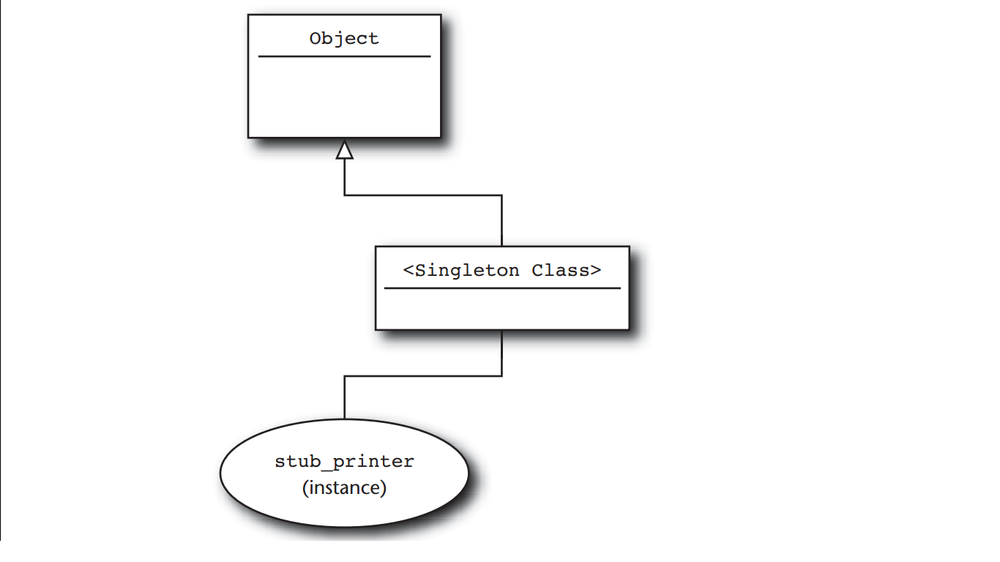

#Ruby programming language note

##Basics

sample code

```ruby
class Document
  attr_accessor :title, :author, :content

  def initialize title, author, content
    @title = title
    @author = author
    @content = content
  end

  def words
    @content.split
  end

  def word_count
    words.size
  end
end
```

Idomatic ruby source: `set.rb`

###Regular Expression

Reading ruby source: `time.rb`

###Write Spec
####1. Test::Unit
Test::Unit comes packaged with Ruby and is a member of the XUnit family of testing frame work. The Test::Unit idea is to exercise the code in a series of individual tests, where each test tries each aspect of the program.

In Test::Unit each test is package in a method whose name needs to begin with `test_`. Example:

```ruby
def test_document_holds_onto_contents
  text = "A bunch of words"
  doc = Document.new("test", "nobody", text)
  assert_equal text, doc.content
end
```

In this test, first a document is created with some text, and then using `assert_equal` to check the Document object still have the text that it created. If the text and content of the document are not equal, the test fails.

Along with the assert equal, Test::Unit also provide some abitrary condition check with assert method:

```ruby
assert doc.words.include?( "bunch" )
```

To really use Test::Unit for tests up, a subclass of Test::Unit::TestCase is needed. Inside the class will have any number of test methods:

```ruby
require "test/unit"
require "document.rb"

class DocumentTest < Test::Unit::TestCase
  def test_document_holds_onto_contents
    text = "A bunch of words"
    doc = Document.new("test", "nobody", text)
    assert_equal text, doc.content, "Contents are still there"
  end

  def test_that_doc_can_return_words_in_array
    text = "A bunch of words"
    doc = Document.new("test", "nobody", text)
    assert doc.words.include?( "A" )
    assert doc.words.include?( "bunch" )
    assert doc.words.include?( "of" )
    assert doc.words.include?( "words" )
  end

  def test_that_word_count_is_correct
    text = "A bunch of words"
    doc = Document.new("test", "nobody", text)
    assert_equal 4, doc.word_count, "Word count is correct"
  end
end
```

To run the test, run the file containing the test class with `ruby`:

    ruby document_test.rb

If one of the test methods are fail, Test::Unit will keep running all other tests.

Test::Unit provides the `setup` method alongs with its friend, the `teardown` method. The `setup` method gets called before each test method is run:

```ruby
class DocumentTest < Test::Unit::TestCase
  def setup
    @text = "A bunch of words"
    @doc = Document.new("test", "nobody", @text)
  end

  def test_that_document_holds_onto_contents
    assert_equal @text, @doc.content, "Contents are still there"
  end

  def test_that_doc_can_return_words_in_array
    assert @doc.words.include?( "A" )
    assert @doc.words.include?( "bunch" )
    assert @doc.words.include?( "of" )
    assert @doc.words.include?( "words" )
  end

  def test_that_word_count_is_correct
    assert_equal 4, @doc.word_count, "Word count is correct"
  end
end
```

In the same way, the `tear down` method gets called after each test method gets run. The `tear down` method is great for closing database connections, deleting temp files, or any other general post-test tidying up.

`setup` and `tear down` get called _around_ each test method, not before, and after all of the tests in the class get run.

**A plethora of Assertion**
In Test::Unit toolkit, there are not only `assert` (test that something is true) or `assert_equal` (one thing is equal to something else), there are another assertion methods like `assert_not_equal`, `assert_nil` and `assert_not_nil`.

To test an regular expression on a string, there is `assert_match`:

    assert_match /times.*/, "times new roman"

To check object is an instance of a class, use `assert_instance`:

    assert_instance_of String, "hello"

To check that code raises an exception or not, use:

```ruby
assert_raise ZeroDivisionError do
  x = 1/0
end
```

```ruby
assert_nothing_thrown do
  x = 1/2
end
```

Test::Unit tests can call on about twenty different assertions.

####2. Spec

The test should focus on its behavior. Example:

    About the Document class: when you have a document instance, it should have the text that it is given. It should return an array containing each word in the document when calling the words method. And it should return the number of words in the document when word_count is called.

Rspec is fit for this job. Example:

```ruby
describe Document do
  it "should hold on to the contents" do
    text = "A bunch of word"
    doc = Document.new "test", "nobody", text
    doc.content.should == text
  end
  it "should return all of the words in the document" do
    text = "A bunch of words"
    doc = Document.new "test", "nobody", text
    doc.words.include?("A").should == true
    doc.words.include?("bunch").should == true
    doc.words.include?("of").should == true
    doc.words.include?("words").should == true
  end

  it "should know how many words it contains" do
    text = "A bunch of words"
    doc = Document.new "test", "nobody", text
    doc.word_count.should == 4
  end
end
```

The code above is not just test, it is a description. The description says that the Document class should hold on to the contents. It does not assert any thing, it only say thing should happen.

By convention, Rspec code - or spec - goes in a file called `<<class_name>>_spec.rb`. To run spec use `spec` command:

  spec document_spec.rb

**A readable tidy Spec**

The above example have some problem. It creates the same document with the same text for every test example. RSpec can deal with this redundant code. It can allowing supply code that is executed _before each example test_. Example:

```ruby
describe Document do
  before :each do
    @text = "A bunch of words"
    @doc = Document.new "test", "nobody", @text
  end

  it "should hold on to the contents" do
    @doc.content.should == @text
  end

  it "should know which words it has" do
    @doc.words.should include "A"
    @doc.words.should include "bunch"
    @doc.words.should include "of"
    @doc.words.should include "words"
  end

  it "should know how many words it contains" do
    @doc.word_count.should == 4
  end
end
```

There is also an `after` method in RSpec which execute code after each example. The `:each` parameter means to run code supplied before (or after) each example. The alternatively is `:all`

####Easy Stubs

An ideal test exercises exactly one class at a time. This mean that when the test fails, there is something wrong with the testing class and not some other class that get dragged along. The trouble is that most classes will not function without other classes to helped them: Programs thend to be complicated ecosystems, with the majority of classes relying on other classes. So, how to test just one class when that class needs other classes in order to work.

This is the job for **stubs** and **mocks**. A **stub** is an object that implements the same interface as the supporting cast member, but returns canned answers when its methods are called.

Example: Imagine that there is a subclass of the Document class, a subclass that supports printing. Suppose that the real work of printing is done by a _printer_ class, which supports two methods. First method is `available?`, which returns true if the printer is actually up and running. Second method is `render`, which is the method for printing the document onto the paper.

```ruby
class PrintableDocument < Document
  def print( printer )
    return "Printer unavailable" unless printer.available?
    printer.render "#{title}\n"
    printer.render "By #{author}\n"
    printer.render content
    "Done"
  end
end
```

In this example, the `print` method have a parameter is a printer object to print the document. The question here is how to test the `print` method without having to get involved with the real `printer` object. Conceptually this can be done easily: just create a stub printer class, which have the same method with the real printer class `available?` and `render` but does not do any thing. But in practice, this is a tedious and error prone job, especially when testing a complex class with a lot of dependencies.

RSpec has `stub` method for dealing with this problem. `stub` take a hash of method names (as symbols) and the corresponding value of the method name as arguments. The `stub` will return an object equiped exactly with those methods. Example:

    stub_printer = stub :available => true, render: nil

With `stub`, there are no classes to create, no methods to code; it does all of this tedious tasks. Example with RSpec:

```ruby
describe PrintableDocument do
  before :each do
    @text = "A bunch of words"
    @doc = PrintableDocument.new "test", "nobody", @text
  end

  it "should know how to print itself" do
    stub_printer = stub :available? => true, render: nil
    @doc.print(stub_printer).should == "Done"
  end

  it "should return the proper string if printer is offline" do
    stub_printer = stub :available? => false, render: nil
    @doc.print(stub_printer).should == "Printer unavailable"
  end
end
```

RSpec also provide `stub!` method, which can stub out individual methods on any regular object. Example: to create a string that claimed to be a million characters long:

    long_string = "actually short string"
    long_string.stub!(:length).and_return 1000000

####Easy mocks

Stub are great for producing the boring infrastructure that needed to make a test work by quitely return canned answers. But sometime the test need a stublike object that takes more of an active role in the test. In the above last example - printing test -, the test does not verify that the `print` method ever called `render`. It is a simply test that does not check to see if something got printed (i,e the working of the printer object is unknown).

This is the job for **mock*. A mock not only know what canned responses to return but also knows which methods should be called with what arguments. Thus, a stub is used to get the test to work and a mock is an active participant in the test, watching how it is treated and failing the test if it does not like what arguments it gets.

RSpec provides a `mock` method to go with `stub`. Example:

```ruby
it "should know how to print itself" do
  mock_printer = mock "Printer"
  mock_printer.should_receive(:available?).and_return true
  mock_printer.should_receive(:render).exactly(3).times
  @doc.print(mock_printer).should == "Done"
end
```

In this example, a mock printer object is created and setup to expect that when the test run, the `available?` will be called at least once and return value `true`, and the `render` method will be called exactly 3 times. RSpec defines a little expectation language to express exactly what should happen (called or not called method, how many times the method is called...).

Good place to look at RSpec example: [RubySpec](http://rubyspec.org)

**Notes**

Unit tests should be quick. Ideally the test for a whole system should run in at most few minutes. Because unit tests will be run often by developer so it must be quick as possible. Unit tests should run quick with the setup that every developer has.

Unit tests should be _silent_. Unit tests need to provide a simple answer to a simple question: Does it work or not? that all. If it failed, come back to look at the code to make it right.

Test also need to be independent of one another. Test should not have to rely on the output of a previous test. In particular, use RSpec `before :any` in preference to `before :all`.

Make sure that the test will _actually_ fail. Example: Implementing the `clone` method for `Document`. The `clone` method get a copy of the called object instance. The default `clone` implementation makes a shallow copy; the second object get from `clone` will have the instance variable point at identically to the same object. So to make a deep copy that also duplicating all instance variable of the object, there is an implementation:

```ruby
class Document

  # ...

  def clone
    Document.new title.clone, author.clone, content.clone
  end
```

Spec for the new `clone`:

```ruby
describe Document do
  it "should have a functional clone method" do
    doc1 = Document.new "title", "author", "some stuff"
    doc2 = doc1.clone
    doc1.title.should == "title"
    doc1.author.should == "author"
    doc1.content.should == "some stuff"
  end
end
```

The problem with the test is that it goes on to test the original `doc1` object instead of the copy `doc2`. An important part of writing test is making sure that it actually test the right funtional.

Although the ideal set of unit tests will cover all of the significant features of the system, sometime it can not get to the ideal. There might be not enough time to do it or the coworkers are just not into the testing thing. What to do?

Write whatever unit tests that possible. Just write a unit test that exercises the code a little, with no assertion at all. Example:

```ruby
require "document"

describe Document do
  it "should not catch fire when creating an instance" do
    Document.new("title", "author", "stuff").should_not == nil
  end
end
```

This test provide a lot of the information for the developer:

- `Document` is a class (or at least act like one)

- The `Document` class is indeed found in the `document.rb` file.

- The `document.rb` file does not contain any really egregious syntax errors.

- `Document.new` will take three arguments.

- `Document.new` actually return something.

- `Document.new` does not throw an exception

##Class, module and blocks

###Construct Classes from short, focused methods.

**Compressing Specification**

Requirement: implement a hearte of the compression algorithm, which take a text string and produce two arrays, which will then be stored in the archive. The first array contain all the unique words in the original text. Example:

    This specification is the specification for a specification

The first array would contain all the unique words in the text:

    ["This", "specification", "is", "the", "for", "a"]

The second array will contain integer indexes. There will be one index in this second array for each word in the original document:

    [0, 1, 2, 3, 1, 4, 5, 1]

Implementation:

```ruby
class TextCompressor
  attr_reader :unique, :index

  def initialize( text )
    @unique = []
    @index = []

    words = text.split
    words.each do |word|
      i = @unique.index word
      @index << if i
        i
      else
        @unique << word
        unique.size - 1
      end
    end
  end
end
```

Using it:

```ruby
text = "This specification is the spec for a specification"
compressor = TextCompressor.new text

unique_word_array = compressor.unique
word_index = compressor.index
```

This code is just fine, it does work (it does lose all the white space and punctuation). But it does not good for maintaining. The next programmer will need to spend some time looking hard at the `initialize` method.

Modification version:

```ruby
class TextCompressor
  attr_reader :unique, :index

  def initialize( text )
    @unique = []
    @index = []

    words = text.split
    words.each do |word|
      i = unique_index_of word
      @index << if i
        i
      else
        add_unique_word word
      end
    end
  end

  def unique_index_of word
    @unique.index(word)
  end

  def add_unique_word word
    @unique << word
    unique.size - 1
  end
end
```

This version is an improvement: the name of new method give meaning full to what is going on in the `initialize` method. But the `initialize` method is doing a lot of jobs. It is involved with all the details of managinng the `@index` array.

Another Modification

```ruby
class TextCompressor
  attr_reader :unique, :index

  def initialize( text )
    @unique = []
    @index = []

    add_text text
  end

  def add_text
    words = text.split
    words.each {|word| add_word word}
  end

  def add_word word
    @index << unique_index_of(word) || add_unique_word(word)
  end

  def unique_index_of word
    @unique.index word
  end

  def add_unique_word word
    @unique << word
    unique.size - 1
  end
end
```

In this version, the `initialize` method delegate the task of doing the compression onto the `add_text`, which itself delegate to `add_word`.

####Composing Methods for Humans

The technique above is the called **composed method**. This technique advocates diving a class up into methods that have 3 characteristics:

- First, each method should do a single thing: focus on solving a single aspect of the problem.

- Second, each methods needs to operate at a single conceptual level: do not mix high-level login with details. A method that implements the business logic like currency conversions should not suddenly veer off into the details of how the various accounts are stored in the database.

- Finnally, each method needs to have a name that reflects its purpose.

####Composing Ruby Methods

Having many fine-grained methods also tends to make the classes easier to test.a. Consider these test cases:

```ruby
describe TextCompressor do
  it "should be able to add some text" do
    c = TextCompressor.new ""
    c.add_text "first second"
    c.unique.should == ["first", "second"]
    c.index.should == [0, 1]
  end

  it "should be able to add a word" do
    c = TextCompressor.new ""
    c.add_word "first"
    c.unique.should == ["first"]
    c.index.should == [0]
  end

  it "should be able to find the index of a word" do
    c = TextCompressor.new "hello world"
    c.unique_index_of("hello").should == 0
    c.unique_index_of("world").should == 1
  end
end
```

####One way output

Every method should have exactly one way output, so that all the logic converges at the botton for a single return.

Example: the `Document` object now need a method to rate the text in the document, base on the number of pretentious or slangy words in the document. First version with the longish method and sprinkle returns:

```ruby
class Document

  def prose_rating
    if pretentious_density > 0.3
      if informal_density < 0.2
        return :really_pretentious
      else
        return :somewhat_pretentious
      end
    elsif pretentious_density < 0.1
      if informal_density > 0.3
        return :really_informal
      end
      return :somewhat_informal
    else
      return :about_right
    end
  end

  def pretentious_density
    # Somehow compute density of pretentious words
  end

  def informal_density
    # Somehow compute density of informal words
  end
end
```
This code is not that bad, it just hard to get a feeling for the flow. Now is a single return version:

```ruby
def prose_rating
  rating = :about_right

  if pretentious_density > 0.3
    if informal_density < 0.2
      rating = :really_pretentious
    else
      rating = :somewhat_pretentious
    end
  elsif pretentious_density < 0.1
    if informal_density > 0.3
      rating = :really_informal
    end
    rating = :somewhat_informal
  else
    rating = :about_right
  end
end
```

A better fix for this example:

```ruby
def prose_rating
  return :really_pretentious if really_pretentious?
  return :somewhat_pretentious if somewhat_pretentious?
  return :really_informal if really_informal?
  return :somewhat_informal if somewhat_informal?
  return :about_right
end

def really_pretentious?
  pretentious_density > 0.3 && informal_density < 0.2
end

def somewhat_pretentious?
  pretentious_density > 0.3 && informal_density >= 0.2
end

def really_informal?
  pretentious_density < 0.1 && informal_density > 0.3
end

def somewhat_informal?
  pretentious_density < 0.1 && informal_density <= 0.3
end

def pretentious_density
  # Somehow compute density of pretentious words
end

def informal_density
  # Somehow compute density of informal words
end
```

####Define Operators Respectfully

**Defining Operators in Ruby**

The Ruby mechanism for defining opertators is base on the fact that Ruby translates every expression involving defined operators equal to a method calls. Example:

    sum = first + second

is equivalent to:

    sum = first.+(second)

The Ruby interpreter is clever about the operator-to-method translation process and will make sure that the translated expression respects operator precedence and parentheses, so that:

    result = first + second * (third - fourth)

will be translate into:

    result = first.+(second.*(third.-(fourth)))

Lets add an operator to the `Document` class:

```ruby
class Document

  def +(other)
    Document.new title, author, "#{content} #{other.content}"
  end
end
```

with thist, the documents can now sum up:

```ruby
doc1 = Document.new "Tag Line1", "Kirk", "These are the voyages"
doc2 = Document.new "Tag Line2", "Kirk", "of the star ship ..."

total_document = doc1 + doc2
puts total_document.content #equal "These are the voyages of the star ship ..."
```

The `+` and `-` opertators can be both binary and unary. It can act as a signed of number. To create the unary operator, the method need to be defined with the special name `+@` or `-@`. Example:

```ruby
class Document

  def +@
    Document.new( title, author, "I am sure that #{@content}" )
  end

  def -@
    Document.new( title, author, "I doubt that #{@content}" )
  end
end
```

In ruby, an object can be made to look like arrays or hashes by define methods like: `[]` and `[]`=. Technically, these methods are not operators, the Ruby parser sprinkles some very operator-like syntax on them: `foo[4]` are identical calling `[]` method on `foo` passing 4 as argument.

To make document instance look like an arrays of words, do:

```ruby
class Document

  def [](index)
    words[index]
  end
end
```

####Create Classes that Understand Equality

**An Identifier for Document**

Suppose that there are a lot of documents object instance created at a furious pace. To managing those document, a system to store and manage all of those documents is built. An identifier object is needed to pick a document out of the crowded documents. Thus there is a `DocumentIdentifier` class:

```ruby
class DocumentIdentifier
  attr_reader :folder, :name

  def initialize( folder, name )
    @folder = folder
    @name = name
  end
end
```

The idea of DocumentIdentifier is: the managament system assigns each document a (presumably unique) name and groups the documents into folders. To locate any given document, both document name and folder is needed.

The problem is there is no easy way to compare two instances of DocumentIdentifier to see whether they actually point at the same document.

**Equality Embarrassment**

Ruby Object class defines four equality methods: `eql?`, `equal?`, `==` and `===`. THe `equal?` method to test for object identity, which mean that if both object references to the same object, the method is evaluated to true.

The `==` or double equals operator is the one that all developer use to compare almost any thing in programming. The default implementation of `==` is identical to `equal?` - it tests for object identity. But it can be overrided with any kind of comparison:

```ruby
class DocumentIdentifier
  attr_reader :folder, :name

  def initialize( folder, name )
    @folder = folder
    @name = name
  end

  def ==(other)
    return false unless other.instance_of? self.class
    return true if other.equal? self
    folder == other.folder && name == other.name
  end
end
```

One problem with this implementation is that the equal is very narrow. The `instance_of?` test only accept DocumentIdentifier instance, not its subclass or any thing related to it. The `instance_of?` can be replaced by `kind_of?` method to accpet an subclass of DocumentIdentifier.

But with Ruby dynamic typing, there is no need to explicit check for subclass like this. Instead, it can work with any kind of object which has the similiar value to be compared:

```ruby
def ==(other)
  return false unless other.respond_to? :folder
  return false unless other.respond_to? :name
  folder == other.folder && name == other.name
end
```

**Triple Equals (===) for Case Statements**

The main use for `===` is in `case` statements. By default, `===` calls the double equals methods unless it is overrided.

**Hash tables and the eql? method**

The `eql?` method is rarely called until it is used as a key in a hash. Example:

```ruby
hash = {}
document = Document.new "cia", "Roswell", "story"
first_id = DocumentIdentifier.new "public", "CoverStory"

hash[first_id] = document
```

This will work until it fetching the document by a second instance of DocumentIdentifier with the same value with the first instance, like this:

```ruby
second_id = DocumentIdentifier.new "public", "CoverStory"
the_doc_again = hash[second_id]
```

The value of `the_doc_again` is set to `nil`. This is because of the working of the Hash class in ruby.

The Hash in ruby using a simple model: divide-and-conquer strategy. Instead of maintaining a single key/value list, it only maintains a number of buckets. Like divide 10,000 key/value into 100 bucket, with each bucket have 100 key/value, it will improve the performance dramatically.

The challenging thing with this scheme is picking the right bucket to store and retrieve value.

Every object in ruby have a method which returns a hash value. The **hash value** is a set of random number generated from the value of the object. When a key/value pair is store in a hash table, the hash value is pulled from the key. And then this number will be used to pick a hash bucket, and then the key/value pair is stored in that bucket. When retrieve the value associated with some key, the hash code - which get from key (object) - is used to pick the right bucket to search.

Hash codes need some properties to make this all work. First is stabe over time: if a key generates one hash code now, it must be the same by the time going. Second, Hash code need to be consistent with the value of the key: If two keys are equal, they must return the same hash code.

**Well-Behaved Hash Key**

The `Hash` class in ruby calls the aptly named `hash` method (which is a method of the `Object`) to get the hash code from its keys. The `Hash` class uses the `eql?` method to decide if two keys are equal. The default implementation of `hash` and `eql?` from the `Object` are based on object identity: the default `eql?` returns true only if the other object is identically with this object. The default `hash` method returns the `object_id` of the object, which is guaranteed to be unique.

This behavior can be override with the hash Prime Directive - if `a.eql? b` then `a.hash == b.hash`. Example:

```ruby
class DocumentIdentifier

  def hash
    folder.hash ^ name.hash
  end

  def eql? other
    return false unless other.instance_of? self.class
    folder == other.folder && name == other.name
  end
end
```

####Singleton methods and class methods

Let start with the `stub` objects of RSpec. A stub object can be create like this:

    stub_printer = stub :available? => true, render: nil

The stub_printer is now an object with 2 methods: `available?` and `render`. And then another stub object instance is created:

    stub_font = stub size: 14, name: "Courier"

Look at the classes of these tow stub objects:

    puts stub_printer.class # Spec::Mocks::Mock
    puts stub_font.class    # Spec::Mocks::Mock

This is the example of singleton method in ruby. A singleton method is a method defined for exactly one pbject instance. Ruby objects can declare independence from their class.

Any object (except for numeric and symbol) can have any singleton method. The mechanics of defining singleton methods are pretty simple: `def instance.method_name`. Example:

```ruby
hand_built_stub_printer = Object.new

def hand_built_stub_printer.available?
  true
end

def hand_built_stub_printer.render content
  nil
end
```

Singleton methods are the same with ordinary method except its can be only call by the object that created it.

Singleton methods override any regular, class defined methods. Example:

```ruby
uncooperative = "Don't ask my class"

def uncooperative.class
  "I'm not telling"
end

puts uncooperative.class # "I'm not telling"
```

An alternative syntax for defining singleton methods:

```ruby
class << hand_built_stub_printer
  def available?
    true
  end

  def render
    nil
  end
end
```

**A real hidden Class**

Every Ruby object carries an additional shadowy class of its own. This class is called **singleton** class. It sit between every object and its regular class. Singleton classes also known as metaclass or eigenclass. This singleton class is just a methodless shell so it is pretty invisible. Only when something is added to this singleton class then it will make its existence felt.



Since it sits directly above the instance, the singleton class method is always inherited directly by the instance first.

To ensure the existence of singleton class, use:

```ruby
singleton_class = class << hand_built_stub_printer
  self
end
```

**Class methods**

The class method is actually singleton methods in disguise. Let see an example:

```ruby
my_object = Document.new "War and Peace", "Tolstoy", "All happy families..."

def my_object.explain
  puts "self is #{self}"
  puts "and its class is #{self.class}"
end

my_object.explain

# output
# self is #<Document:0xb7bc2ca0>
# and its class is Document
```

Now, consider the example when my_object is not an instance of Document, it is the Document itself:

```ruby
my_object = Document

def my_object.explain
  puts "self is #{self}"
  puts "and its class is #{self.class}"
end

my_object.explain
# output
# self is Document
# and its class is Class
```

Since my_object is just a reference to `Document`, the explain method can be called like this:

    Document.explain

The `explain` method can be define on Document explicity:

```ruby
def Document.explain
  puts "self is #{self}"
  puts "and its class is #{self.class}"
end
```

This is the syntax to create a Ruby class method, and it is also a singleton method definition! It make sense because `Document` is an object instance of `Class`. This mean it inherits all method from `Class` like `name` and `superclass`. When defining a class method, the method exist only on the one class (Document), not on all classes. So, creating a method that work only for an instance is the job of singleton method.

####Class Instance Variables

**Quick reviews of class variables**

To store information associated with a Ruby class, the class variable is used. Class variables start with two `@`. Example:

```ruby
class Document
  @@default_paper_size = :a4

  def self.default_paper_size
    @@default_paper_size
  end

  def self.default_paper_size=(new_size)
    @@default_paper_size = new_size
  end

  attr_accessor :title, :author, :content
  attr_accessor :paper_size

  def initialize(title, author, content)
    @title = title
    @author = author
    @content = content
    @paper_size = @@default_paper_size
  end
end
```

The class variables not visible to the outside of the class, but they are visible to instances of the class.

**Wandering variables**

To understand the problem with class variables, let see how they are resolved in Ruby. A class variable is one that associated with a class. So the question here is which class? In the above example, the variable `@@default_paper_size` need to be figured out which class is called or provide the home for it. Ruby start by looking at the current class. If the current class have the variable, the search is end.

If the class variable is not defined in the current class, Ruby will go looking up the inheritance tree for it. It will look to all the super class until it find the needed class method. If Ruby not found the class variable, it will create a new class variable in the current class.

The problem for this mechanism is that this method for resolving class variables means they have tendency to wander from class to class. Let see an example for this problem:

Suppose there is a new sub Document call resume:

```ruby
class Resume < Document
  @@default_font = :arial

  # ...
end
```

When `@@default_font = :arial` gets run, Ruby will look at the Resume class, and then Document, and right on up the inheritance tree. If it can not be found, Ruby will set `@@default_font` on the Resume class.

Lets have another sub class of Document called Presentation with its own default font class variable:

```ruby
class Presentation < Document
  @@default_font = :nimbus

  #...
end
```

It is same with the Resume example above, it look right up to the inheritance tree to resolve the class variable, and if it not have defined, the class variable will eventually attached to the Presentation class.

Now, lets add a `@@default_font` class variable to the Document class:

```ruby
class Document
  @@default_font = :times

  # Rest of the class omitted...
end
```

Because the Document class is the superclass, so it must be loaded before Resume and Presentation class. This mean `@@default_font` of the Document class will get set first, so whenever either of the subclasses (Resume and Presentation) looking for `@@default_font`, it will load the one in Document. This is because Ruby will look up the inheritance tree _first_ before creating and assigning the value.

**Getting control of the Data**

The more controllable alternative to the class variable is the class instance variable. It is defined with a single `@` and attached to a class object.

To see why, recall that inside a class, `self` is always point to the class. When an ordinary is set inside a class like this:

```ruby
class Document
  @default_font = :times

  def self.default_font= font
    @default_font = font
  end

  def self.default_font
    @default_font
  end
end
```

The `@default_font = font` will sets an instance variable on `self`, and the `self.default_font=` method will set the `@default_font` instance variable on the Document class object. This mean that the Document class can call something like this:

    Document.default_font = :arial

Since it is a singleton method, it will not intercept with other method of other class.

**Class Instance variables and subclasses**

Because instance variable are attached to self, which mean it only belong to this class. So the subclasses can define their same own class instance variable with different value and it still work fine with the class method. Example:

```ruby
class Presentation < Document
  @default_font = :nimbus

  class << self
    attr_accessor :default_font
  end
end
```

The Presentation `@default_font` is completely separate from the Document `@default_font` because it only attached to the Presentation class.

####Module as Namespaces


