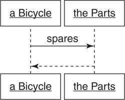
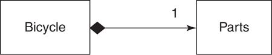
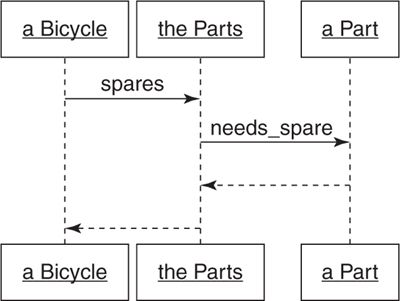

#Combining Objects with Composition

Composition in Object Oriented Programming is the combination of simple, independent objects into larger, more complex whole. In composition, the larger object is connected to its parts via a **_has-a_** relationship.

Example: Bicycle has parts. It is the containing object which contain parts. Bicycle communicates with parts via an interface. Part is a _role_ and bicycles can collaborate with any object that plays this role.

##Composing a Bicycle of Parts

Here, composition technique is used to create the `Bicycle` class instead of using [Inheritance](inheritance.md) technique.

The `Bicycle` class responsible for responding to the `spares` message. This `spares` message should return a list of spare parts. `Bicycle` have parts so this can be represented with a has-a relationship. `Bicycle` can be able to collaborate with an object which hold all of a bicycle's parts.

This new class can be called `Parts`. `Parts` object is responsible for holding a collection of bike's parts and for knowing which parts needs spares. `Bicycle` can delegate the `spares` method to `Parts` object.

This sequence diagram illustrates this idea: a `Bicycle` sends the `spares` method to its `Parts`.



The relationship between `Bicycle` and `Parts` is that `Bicycle` **has-a** `Parts`. This relationship is illustrated in this class diagram:



The new design of the `Bicycle` class:

```ruby
class Bicycle
  attr_reader :size, :parts

  def initialize(args={})
    @size       = args[:size]
    @parts      = args[:parts]
  end

  def spares
    parts.spares
  end
end
```

`Bicycle` responsibility: knowing its `size`, hold onto its `Parts` and answering its `spares`.

###Composing the Parts Object

`Parts` is the class which contain a list of individual parts, so a class that represent this single part need to be created. The class name for an individual part ought to be `Part`. `Parts` object may contains multiple `Part` object.

####Creating a Part

The next sequence diagram illustrates the conversation between `Bicycle` and its `Parts` object, and between a `Parts` object and its `Part` objects: a `Bicycle` sends `spares` to `Parts` and then `Parts` `needs_spare` to each of its `Part`



The relationship between `Parts` and its `Part` is illustrated in this class diagram:


Introducing the new `Part` class show that the `Parts` class now is just a _simple wrapper_ around an array of `Part` object. `Parts` can filter its list of `Part` objects and return the ones that need spares. The code below show this idea:

```ruby
class Bicycle
  # unchange
end

class Parts
  attr_reader :parts

  def initialize(parts)
    @parts = parts
  end

  def spares
    parts.select {|part| part.needs_spare}
  end
end

class Part
  attr_reader :name, :description, :needs_spare

  def initialize(args)
    @name         = args[:name]
    @description  = args[:description]
    @needs_spare  = args.fetch(:needs_spare, true)
  end
end
```

Now, individual `Part` objects can be created independently. Example:

```ruby
chain = Part.new(name: "chain", description: "10-speed")

road_tire = Part.new(name: "tire_size",  description: "23")

tape = Part.new(name: "tape_color", description: "red")
```

Individual `Part` objects can be grouped together into a `Parts`. Example:

```ruby
road_bike_parts = Parts.new([chain, road_tire, tape])
```

Create bicycle using `Parts` and `Part`:

```ruby
road_bike = Bicycle.new( size: "L", parts: Parts.new([chain, road_tire, tape]))

road_bike.size    # => "L"

road_bike.parts   # => <#Parts..>

road_bike.spares  # => [#<Part>..]
```

The Bicycle's old `spares` method return a hash while the new `spares` method return an array of `Part` objects.

Composition show that `Part` object is not just instances of `Part` class, they play the `Part` role. If object act like a `Part` it is a `Part`.

####Making the Parts Object More Like an Array

Since `parts` in `Bicycle` represent a collection of `Part`, it should act like an array which can respond to methods like `size`, `each` etc. Right now, `parts` return an `Parts` instance which hasn't respond to these method yet:

```ruby
road_bike.spares.size
# -> NoMethodError:
#      undefined method 'size' for #<Parts:...>
```

This problem can be fixed by adding these array's method to `Parts`, which simply write methods to delegate to an actual array (`parts`):

```ruby
def size
  parts.size
end
```

With the knowledge of `Parts` act like an array, it can be think of that `Parts` is an `Array` with some extra behavior. This mean `Parts` class is a subclass of `Array`:

```ruby
class Parts < Array
  def spares
    select {|part| part.needs_spare}
  end
end
```

This solution is exactly correct if it is in a perfect object-oriented language. However, the Ruby language hasn't quite achieved perfection and this design contains a hidden flaw.

When `Parts` inherits all of `Array` behavior, it includes methods like `+` which adds two arrays together and return a third. When using this method on two `Parts` instance, instead of return another `Parts` instance, it returns an `Array` instance:

```ruby
combo_parts = mountain_bike.parts + road_bike.parts

combo_parts.spares

# -> NoMethodError: undefined method 'spares'
#      for #<Array:...>

combo_parts.class   # -> Array
```

These method always return an instance of `Array` instead of the `Array`'s subclasses. This will cause the misleading about the `Parts` class when using it.

These implementation of `Parts`: the non array-like version, the manually array's method implementation and the `Array`'s subclass, are not perfect solutions. It's the matter of making decision. The first version is good enough if the array-like behavior isn't needed. The second solution is fit with limited array-like behavior application. And the last one is acceptable if the flaw never occur.

The following solution lies between complexity and usability. `Parts` class delegates `size` and `each` method to its `@parts` and includes `Enumerable`, which relies on `each` method, to get common traversal and searching method.

```ruby
require 'forwardable'
class Parts
  extend Forwardable
  def_delegators :@parts, :size, :each
  include Enumerable

  def initialize(parts)
    @parts = parts
  end

  def spares
    select {|part| part.needs_spare}
  end
end
```

`Parts` is not an actual array so sending methods like `+` will raise `NoMethodError` exception. However, `Parts` now can responds to `size`, `each` and all of `Enumerable` methods, which is good enough.

###Manufacturing Parts

A new bike instance can be created by the above solution like this:

```ruby
mountain_bike = Bicycle.new(size:  "L",
  parts: Parts.new([chain, mountain_tire, front_shock, rear_shock]))
```

In order to create a new bike, first is creating the `Part` objects. And some object has to know how to create these parts. This is a lot of knowledge which may leak all over the application. Whenever a bike instance is created, these `Part` objects must be also created. And different bike have different kind of parts so this logic will be duplicated all over the application. Since each bike has a combinations of parts, the bike should have a description of the combination of parts (through some data structure).

Here, the combination of parts that make up a bike is represented with a 2-dimensional array, where each row contains three possible columns. First is the part name (`chain`..), second is the description (`10-speed`) and third (optional) a Boolean that indicates whether a part need a spare.

```ruby
road_config = [["chain", "10-speed"], ["tire_size", "23"], ["tape_color", "red"]]

mountain_config = [["chain", "10-speed"], ["tire_size", "2.1"],
  ["front_shock",  "Manitou", false], ["rear_shock", "Fox"]]
```

####Creating the PartsFactory

A factory object is an object that manufactures other objects. Factory is used to hide the details to initialize an object with a specific data structure.

`PartsFactory` is used to create `Parts` with the 2-dimensional array from above. It hides the use of 2-dimensional array to create `Parts` and `Part`.

```ruby
module PartsFactory
  def self.build(config, part_class  = Part, parts_class = Parts)
    parts_class.new(
      config.collect do |part_config|
        part_class.new(
          name:         part_config[0],
          description:  part_config[1],
          needs_spare:  part_config.fetch(2, true))
      end)
  end
end
```

This `PartsFactory` take three arguments: a `config`, and the classes to be used for `Part` and `Parts`. This mean it not only create `Parts` and `Part` instances, but it creates objects that have `Parts` and `Part` role.

Putting knowledge of `config`'s structure in the factory has two consequences: First, the `config` can be expressed very tersely (array rather than hash). Second, once array is used to keep `config`, `Parts` object should always be created by the factory. To create new `Parts` via any other mechanism requires the duplicating knowledge from the above factory.

Now `Parts` can be created like this:

```ruby
road_parts = PartsFactory.build(road_config)
mountain_parts = PartsFactory.build(mountain_config)
```

####Leveraging the PartsFactory

With the `PartsFactory` created, there is no need to have a `Part` class. `Part` can be replaced with a simple `Openstruct`.

Ruby's `Openstruct` class is a lot like the `Struct` class, it provides a convenient way to bundle a number of attributes into an object. The difference between them is that `Struct` takes position order initialization arguments while `Openstruct` takes a hash.

```ruby
module PartsFactory
  def self.build(config, parts_class = Parts)
    parts_class.new(config.collect{|part_config| create_part(part_config)})
  end

  def self.create_part(part_config)
    OpenStruct.new(name: part_config[0], description: part_config[1],
      needs_spare: part_config.fetch(2, true))
  end
end
```

Now a bike can be created like this:

```ruby
road_bike = Bicycle.new(size: "L", parts: PartsFactory.build(road_config))

road_bike.spares
# -> [#<OpenStruct PartsFactory::Part...

mountain_bike = Bicycle.new(size: "L",
  parts: PartsFactory.build(mountain_config))

mountain_bike.spares
# -> [#<OpenStruct PartsFactory::Part...
```

##Deciding Between Inheritance and Composition

Inheritance and Composition is a **code arrangement technique**. With inheritance, the **behavior is dispersed among objects** and these objects are **organized into class relationships** such that automatic delegation of messages invoke the correct behavior. It can be think of this way: for the cost of arranging objects in a hierarchy, it comes with free message delegation.

Composition is an alternative that reverse these cost and benefits. In composition, **object stand alone** and it must **explicitly know** about and **delegate messages** to another. Composition allows objects to have **structural independence**, but at the cost of **explicit message delegation**.

The general rule is that, if a problem can be solved with composition, it should be biased towards doing so. Composition contains fewer built-in dependencies than inheritance so it's often the best choice.

###Accepting the Consequences of Inheritance

####Benefits of Inheritance

In the [Designing Classes with a Single Responsibility](chap1-2.md#organizing-code-to-allow-for-easy-changes), outlined four goals for code: **transparent**, **reasonable**, **usable**, and **exemplary**. Inheritance, when correctly applied, excels at the second, third and forth goal.

Methods defined near the top of inheritance hierarchies have widespread influence. Changes made to these methods pass down the inheritance tree, so a big changes in behavior can be achieved via small changes in code, thus the code is **reasonable**.

Inheritance results in code that is **open-closed**; hierarchies are open for extension while remaining closed for modification. Adding a new subclass requires no changes to existing code thus it is **usable**; new subclasses are created to accommodate new variants.

Correctly written hierarchies are easy to extend. The root superclass embodies the abstraction and every new subclass plugs in a new concrete differences. The existing pattern is easy to follow and replicating it will be the natural choice of any programmer charged with creating new subclasses. Hierarchies are therefore **exemplary**; by their nature they provide guidance for writing the code to extend them.

In Ruby, the `Numeric` class provides an excellent example. `Integer` and `Float` are subclasses of `Numeric`.

####Cost of Inheritance

There are two concerns about the use of inheritance:

- First is that choosing inheritance to solve the wrong kind of problem.

- Second, even when inheritance is applicable to the problem, the written code can be used by other for unanticipated purposes. These programmers want the behavior but may not be able to tolerate the dependencies that inheritance demands.

With benefits there are drawbacks. The drawback side of the **reasonable** is the high cost of making changes near the top of an incorrectly modeled hierarchy. A small changes can break everything.

The opposing side of **usable** is the impossibility of adding behavior when new subclasses represent a mixture of behaviors. Example: the `Bicycle` hierarchy from [inheritance](inheritance.md). The hierarchy already contains `MountainBike` and `RecumbentBike`; combining the qualities of these two classes into a single object (`RecumbentMountainBike`) is not possible in the current hierarchy.

Other side of the **exemplary** is the chaos that ensues when novice programmers attempt to extend incorrectly modeled hierarchies. These hierarchies should not be extended and they need to be refactored but novices don't have the skill to do so. They duplicate existing code or add dependencies on class names instead.

Inheritance comes with a deeply embedded set of dependencies. Subclasses **depend on the methods defined** in their superclasses and on the **automatic delegation of messages** to those superclasses. Subclasses are bound, **irrevocably** and **by design**, to the classes above them in the hierarchy. These built-in dependencies amplify the effects of modifications made to superclasses; small changes of code can lead to enormous, broad-reaching changes of behavior.

###Accepting the Consequences of Composition

Composed objects do not depend on the structure of the class hierarchy, and they delegate their own messages.

####Benefits of Composition

When using composition, multiple small objects, which contain a single responsibility and specify their own behavior, are created and combined together. These objects are **transparent**;  it's easy to understand the code and it's clear what will happen if it changes. Also the composed object is generally immune from side effects when changing classes above it in the hierarchy.

Because composed objects deal with their parts via an interface, adding new kind of part is equivalence to plugging in a new object that honors the interface. Adding a new variant of an existing part is thus  **resonable**, and because it only needs to create a new class that have the agreed interface with the composed object to add new behavior while the composed class is remain unchanged, it's also **usable** as well.

####Costs of Composition

A composed object relies on its many parts. Because of that, even if each part is small and understandable, the combination of the whole may be less than obvious. The whole is not **transparent** even each individual part is.

The composed object must explicitly know which messages to delegate and to whom. These delegation may be needed by many different objects and composition don't have a way to share this behavior.

Composition is excellent at **prescribing rules** for **assembling** an object **made of parts** but **doesn't provide as much help** for the problem of **arranging code** for a **collection of parts** that are **very nearly identical**.

###Choosing Relationships

####Use Inheritance for is-a Relationships

####Use Duck Types for behaves-like-a Relationships

####Use Composition for has-a Relationships

##Summary

Composition, classical inheritance, and behavior sharing via modules are competing techniques for arranging code. Each has different costs and benefits; these differences predispose them to be better at solving slightly different problems.

These techniques are only tools, nothing more.
