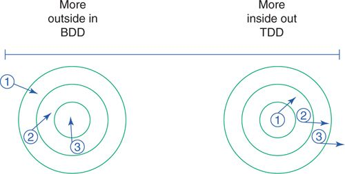

# Designing Cost-Effective Tests

Writing changeable code requires three skill:

  1. Understanding Object-Oriented Design. Changeability is the only design metric that matter; code that's easy to change is **well-design**.

  2. Skilled at refactoring code. Refactoring is the process of **changing a software system** in such a way that it **does not alter the external behavior** of the code yet **improves the internal structure**.

  3. Write high-value tests. Tests give confidence to refactor constantly. Efficient tests prove that altered code continues to behave correctly without raising overall costs. Good tests don't need to rewrite if there is changes in the code.

##1. Intentional Testing.

Tests can reduce bugs and provide documentation, and writing tests **first** improves application design. However, the **true purpose of testing is to reduce costs**.

Writing good tests requires **clarity of intention** and knowing what, when and how to test.

### 1.1 Intentions

**Finding Bugs**

Finding faults or bugs early in the development process reduces the cost drastically.

**Supplying Documentation**

Tests provide the only reliable documentation of design. Tests remain longer than paper documents and human memory.

**Deferring Design Decisions**

Test allow safely defer design decisions. When tests depend on interfaces, the underlying code can be refactored with reckless abandon. The tests verify the continued good behavior of the interface and changes to the underlying code do not force rewrites of the test. Design decision can be made safely without penalty.

**Supporting Abstractions**

Good design naturally progresses toward small independent objects that rely on abstractions. The behavior of a well-designed application becomes the result of interactions among these abstraction. Abstractions improve the flexible in design but they also have cost: although each individual abstraction might be easy to understand, the behavior of the whole is much obscure.

Tests make the whole behavior more visible and understandable.

**Expose Design Flaws**

If a test requires painful setup, the code expects too much context. If testing one object requires a bunch of others, the code has too many dependencies. If the test is hard to write, other objects will find the code difficult to reuse.

When the design is bad, testing is hard.

However, costly tests do not mean that the application is poorly designed. It's possible to write bad tests for well-designed code. Therefore, both the underlying application and the tests must be well-designed.

### 1.2 Knowing What to Test

The design principles that are enforced in the application apply to test as well. Each test is merely another application object that needs to use an existing class. The more test gets coupled to that class, the more vulnerable the test is to unnecessary forced to change.

Not only limiting coupling, but also coupled to stable things. Public interface is the most stable thing of any object. The messages that are defined in public interfaces should be tested. The most costly and least useful are those method that are defined in the private interfaces. Private interface is the most unstable and often changed parts in object.

Test should **concentrate on the incoming** or **outgoing messages** that cross an object's boundaries. The **incoming messages make up the public interface** of the receiving object. The **outgoing messages** are coming into **other object's public interface**.

Each object is responsible for testing its own interface and it does so by making assertions about the results that these messages return. These tests are tests of state.

Object should not and need not to test the outgoing messages for state. Objects should **make assertions about state** only for **messages in their own public interfaces**.

There are two types of outgoing messages, one is the messages like the above, and one that needs a different kind of test:

  1. _Query messages_: Outgoing messages have no side effects and only return value, and thus matter only to their senders. Only sender cares about the result from the message but no other part of the application cares if the messages gets sent. Query messages don't need to be tested.

  2. Command messages: Outgoing messages that have side effects (write a file, save a database record..). The sending object need to prove that these messages are properly sent. Proving a message gets sent is a test of behavior, not state, and involves assertions about the number of time with what arguments the message is sent.

Guidelines for what to test: **Incoming messages should be tested for the state they return. Outgoing command messages should be tested to ensure they get sent. Outgoing query messages should not be tested**.

### 1.3 Knowing When to Test

**Test should be written first whenever it makes sense to do so**.

### 1.4 Knowing How to Test

Test frameworks for Ruby: `MiniTest`, `RSpec`..

Testing style: Test Driven Development (TDD) and Behavior Driven Development (BDD).

Illustrating TDD and BDD:



Both styles create code by writing tests first. **BDD** takes an outside-in approach, **creating objects at the boundary of an application and move inward**, with necessary mocking to supply unwritten objects. **TDD** take an inside-out approach, **starting with tests of domain objects** and then reusing these objects in the test of adjacent layers of code.

When testing, application's objects should be divided into two major categories:

  1. **Object under test**: object that being tested.

  2. The other objects

Test must know things about the first category and remain as ignorant as possible about the second. Pretend that only the first category object exist and the other objects aren't even exist.

## 2. Testing Incoming Messages

The code is about `Gear` and `Wheel` before it's applied with techniques in [Managing Dependencies](managing-dependencies.md).

```ruby
class Wheel
  attr_reader :rim, :tire
  def initialize(rim, tire)
    @rim       = rim
    @tire      = tire
  end

  def diameter
    rim + (tire * 2)
  end
# ...
end

class Gear
  attr_reader :chainring, :cog, :rim, :tire
  def initialize(args)
    @chainring = args[:chainring]
    @cog       = args[:cog]
    @rim       = args[:rim]
    @tire      = args[:tire]
  end

  def gear_inches
    ratio * Wheel.new(rim, tire).diameter
  end

  def ratio
    chainring / cog.to_f
  end
# ...
end
```

### 2.1 Deleting Unused Interfaces

Incoming messages ought to have dependents. Some object **other than the original implementer** depends on these messages. In order to expose it easily, one technique is to construct a table which show the messages that cross the object under test's boundaries:

|Object|Incoming Messages|Outgoing Messages|Has Dependents|
|:------|:------|:------|:------|
|Wheel|`diameter`||Yes|
|Gear||`diameter`|No|
||`gear_inches`||Yes|
||`ratio`||Yes|

If there is a _incoming message_ that doesn't have any dependents, it might not be an incoming message. Thus these kind of message don't need to be tested and it should be deleted immediately.

### 2.2 Proving the Public Interface

Incoming messages are tested by **making assertions about the value**, or **state** that **their invocation returns**. The **first requirement** for testing an incoming message is to **prove** that it **returns the correct value** in **every possible situation**.

The following code shows a test of Wheel's `diameter` method:

```ruby
class WheelTest < MiniTest::Unit::TestCase
  def test_calculates_diameter
    wheel = Wheel.new(26, 1.5)

    assert_in_delta(29, wheel.diameter, 0.01)
  end
end
```

`Wheel` has no dependencies and thus it allows to be tested independently.

`Gear`, on the other hand is more complicate than `Wheel`. It requires more arguments than `Wheel` but the overall structure of test is just like `Wheel`. Here is the test for `gear_inches` method:

```ruby
class GearTest < MiniTest::Unit::TestCase
  def test_calculates_gear_inches
    gear =  Gear.new(chainring: 52, cog: 11, rim: 26, tire: 1.5)

    assert_in_delta(137.1, gear.gear_inches, 0.01)
  end
end
```

Although this `gear_inches` test looks similar to Wheel's `diameter`, it has entanglements that the `diameter` test didn't have. `gear_inches` implementation creates and use another object `Wheel`. `Gear` and `Wheel` are coupled in the code **and** in the test.

The fact that a **method that creates and uses another object** effects **how long the test runs** and **how likely** it is to **suffer unintended consequences** as a result of **changes to unrelated parts of the application**. If `Wheel` are expensive to create, the `gear_inches` test pays that cost and if `Gear` is correct but `Wheel` is broken, the `Gear` test might fail in a misleading way.

The coupling that creates this problem is hidden inside of `Gear` and totally invisible in this test. The test's purpose is to prove that `gear_inches` returns the right result and it certainly fulfills that requirement, but the underlying code structure adds these hidden risk.

Tests run fastest when they execute the least code and the volume of external code that a test invokes is directly related to the design. When tightly coupled objects are tested, a test of one object runs code in many others.

Because tests are the first reuse of code, these problems are manifested in the tests.

### 2.3 Isolating the Object Under Test

In [Managing Dependencies](managing-dependencies.md), it introduces the technique that broke this coupled by injecting an object that understand `diameter`:

```ruby
class Gear
  attr_reader :chainring, :cog, :wheel
  def initialize(args)
    @chainring = args[:chainring]
    @cog       = args[:cog]
    @wheel     = args[:wheel]
  end

  def gear_inches
    # The object in the'wheel' variable plays the 'Diameterizable' role.
    ratio * wheel.diameter
  end

  def ratio
    chainring / cog.to_f
  end
# ...
end
```

`Gear` no longer cares about the class of the injected object, it expect an object that play a role, which responds to `diameter`. This role can be named as `Diameterizable`.

During `Gear` creation an instance of `Diameterizable` must be injected to it. `Wheel` now is the only class that play this role, so it's the only thing that can be used to inject to `Gear` creation. However, injecting a `Wheel` to `Gear` is different with injecting a `Diameterizable`. Thinking of the injected object as an instance of its role gives more choices about what kind of `Diameterizable` to inject into Gear during tests.

The next test use `Wheel` instance to inject into `Gear` in a test:

```ruby
class GearTest < MiniTest::Unit::TestCase
  def test_calculates_gear_inches
    gear =  Gear.new(chainring: 52, cog: 11, wheel: Wheel.new(26, 1.5))
    assert_in_delta(137.1, gear.gear_inches, 0.01)
  end
end
```

With this test, it's not so obvious that `Wheel` is playing the `Diameterizable` role. The role is virtual and nothing about the test guides other programmers to think of `Wheel` as `Diameterizable`.

However, structuring test this way has a real advantage as follow:

### 2.4 Injecting Dependencies Using Classes

When code in the test uses the same collaborating objects as the code in the application, tests always break when they should. This brings value to the application.

Example: imagine that `Diameterizable` public interface changes, the `diameter` method is changed to `width`. Also, `Gear` still sends `diameter` in its `gear_inches` method. Because the `Gear` test injects an instance of `Wheel` so the test is failed now.

This failure show that the `Gear` needs to updated to send `width` instead of `diameter`. This test only work for a concrete class `Wheel` but there are other situation which testing abstraction is more appropriate.

### 2.5 Injecting Dependencies as Roles

`Gear` and `Wheel` both have relationships with `Diameterizable` role. `Diameterizable` is depended on by (injected into) `Gear` and implemented by `Wheel`.  This role is an abstraction of the objects that have `diameter`. Abstraction role should be more stable than the concretion which it came. However in this case, the abstraction interface is changed.

There are two places in the application know about `Diameterizable`. First `Gear` knows `Diameterizable`'s interface, that is it can send `diameter` to `Diameterizable`'s instance. Second, the code that create the object to be injected to `Gear` believes that `Wheel` implement this interface, that is it expects `Wheel` to implement `diameter`. Now the `Diameterizable`'s interface has changed so there might be a problem that `Wheel` may update its interface, but `Gear` still expects the old one (which is in this case) or vice versa.

This show that the interface of the role can be changed, which means abstraction is not stabilized.

When a role has a single player, the concrete player and the abstract role are easy blurred together and sometime this doesn't matter. In this case, `Wheel` is the only player and if `Wheel` is cheap to create, injecting `Wheel` to the class is acceptable.

However, if `Wheel` is expensive or there are more than one player that play `Diameterizable` role, it is necessary to use other technique to tackle this problem. For expensive `Diameterizable`, faking a cheap one can make the test run faster. For different `Diameterizable`, creating and idealized one so the tests clearly convey the idea of this role.

#### 2.5.1 Creating Test Doubles

**Test double** is an idea of **creating a fake object**. For example: using test double to play the `Diameterizable` role.

```ruby
class DiameterDouble
  def diameter
    10
  end
end

class GearTest < MiniTest::Unit::TestCase
  def test_calculates_gear_inches
    gear =  Gear.new(chainring: 52, cog: 11, wheel: DiameterDouble.new)
    assert_in_delta(47.27, gear.gear_inches, 0.01)
  end
end
```

A test double is a **stylized instance of a role player** that is used exclusively for testing. Doubles like this are very easy to make, creating a Ruby class which have the role's method and return some canned result.

In this example, the double stubs `diameter`. It implements a version of `diameter` that return `10` as the canned answer. Since creating `DiameterDouble` is fast, the test will always run fast as well.

Using test double introduces a new problem. When the role interface changes, there is a chance that the test is still pass but the application is broken. Consider the previous example when changing `diameter` to `width` method in `Diameterizable` interface. If `Gear` is not updated with the `Diameterizable` new interface, the `Gear` now is broken but the previous test is still pass.

The problem here is , when `GearTest` created `DiameterDouble`, it **introduce a second player of the role**. When the interface of the role changes, all players must adopt the new interface. While `Wheel` is updated its interface, `DiameterDouble` does not.

#### 2.5.2 Using Tests to Document Roles

This problem occurs because the role is nearly invisible. One way to raise the role's visibility is to assert that players play it. For example, using assertion to check if `Wheel` plays `Diameterizable` role:

```ruby
class WheelTest < MiniTest::Unit::TestCase
  def setup
    @wheel = Wheel.new(26, 1.5)
  end

  def test_implements_the_diameterizable_interface
    assert_respond_to(@wheel, :diameter)
  end
  #...
end
```

This test is not the ideally solution. First, it can't be shared with other `Diameterizable`, and other players have to duplicate this test. Next, it does not prevent the problem of test double. `DiameterDouble` is still not be tested to ensure that it plays `Diameterizable` role.

The solution for documenting and testing roles will be revised in [Proving the Correctness of Ducks](#testing-duck-types).

The choice between injecting real or fake objects has consequences. Injecting concrete objects at test ensures that tests break correctly but may lead to long running tests. While injecting doubles can speed tests but leave them vulnerable to a possible that tests work but the application fails.

**Testing didn't force an improvement in design. Test doesn't force removing coupling and injecting the dependency. Test only raises costs on the coupling objects.**

##3. Testing Private Methods

The private messages is the messages that sent to `self`. Private messages doesn't visible to the rest of the application except its sender (which is itself). Because of that, private messages don't need to be tested.

However, dealing with private message requires judgment and flexibility.

### 3.1 Ignoring Private Methods During Tests.

These private methods are hidden inside the object under test and their result cannot be seen by others. These method are invoked by public methods that already have tests so testing them is redundant. And since private methods are unstable, tests of private methods are therefore coupled to code that are likely to change. So when the application change the tests have to change as well. One possible to not testing private methods is that it might mislead others into using them.

### 3.2 Removing Private Methods from the Class Under Test

It is better to avoid private methods altogether. No methods no tests.

An object with many private methods shows that it has too many responsibilities. These private methods need to be extracted to new object. The extracted methods form the core of the responsibilities of the new object and so make up its public interface, which is ought to be stable. Because the new public interface will be as stable as the original private interface, it is still costly to couple to these methods.

### 3.3 Choosing to Test a Private Method

Sometime private methods can be used to place the smelly, offending code in order to defer a design decision. This complexity need to be isolated behind the best interface (public interface). Testing these private method will reduce the overall cost caused by this decision. These tests produce error messages that directly point to the falling parts of the private code. These errors make it easier to understand the effects of changes in the private code.

## 4 Testing Outgoing Messages

### 4.1 Ignoring Query Messages

Query messages, which are introduced in [Knowing What to Test](#knowing-what-to-test) are messages that have no side effects. These messages don't need to be tested in the sender object because it is tested in the receiver object.

### 4.2 Proving Command Messages

Command messages have side effect other than just return a result. The sender objects are depended on these effects and so it needs to be tested to ensure that these command messages are sent.

Example, `Gear` has a new requirement that it needs to be add an `observer`. When `Gear` is shifted, the `set_cog` and `set_chainring` methods execute. These method then sends `changed` to `observer`:

```ruby
class Gear
  attr_reader :chainring, :cog, :wheel, :observer
  def initialize(args)
    # ...
    @observer  = args[:observer]
  end
  # ...
  def set_cog(new_cog)
    @cog = new_cog
    changed
  end

  def set_chainring(new_chainring)
    @chainring = new_chainring
    changed
  end

  def changed
    observer.changed(chainring, cog)
  end
# ...
end
```

Now the test should prove that when a `Gear` instance sends `set_cog` or `set_chainring`, it should also send `changed` method to `observer`. And the test not only should prove that the message get sent, but it also should do so without making assertions about the result that `change` returns. The responsibility for testing a method's return value lies with its receiver.

One technique that can solve this problem is using _mock_. **Mocks are tests of behavior**, as opposed to tests of state. Instead of making assertions about what a message returns, **mocks define an expectation that a message will get sent**.

The test below introduces this technique. It proves that `Gear` fulfills its responsibilities and it does so without knowing about how `observer`'s `changed` behaves:

```ruby
class GearTest < MiniTest::Unit::TestCase
  def setup
    @observer = MiniTest::Mock.new
    @gear = Gear.new(chainring: 52, cog: 11, observer: @observer)
  end

  def test_notifies_observers_when_cogs_change
    @observer.expect(:changed, true, [52, 27])
    @gear.set_cog(27)
    @observer.verify
  end

  def test_notifies_observers_when_chainrings_change
    @observer.expect(:changed, true, [42, 11])
    @gear.set_chainring(42)
    @observer.verify
  end
end
```

The `test_notifies_observers_when_cogs{chainrings}_change` test passed only if sending `set_cogs{chainring}` does something that causes `observer` to receive `changed` with the given arguments.

## 5 Testing Duck Types

Testing duck types means testing roles.

### 5.1 Testing Roles

The first example code comes from the `Preparer` duck type from [Reducing Costs with Duck Typing](duck-typing.md). `Mechanic`, `TripCoordinator` and `Driver` are `Preparer` that have `prepare_trip` method:

```ruby
 class Mechanic
  def prepare_trip(trip)
    trip.bicycles.each {|bicycle| prepare_bicycle(bicycle)}
  end
  # ...
end

class TripCoordinator
  def prepare_trip(trip)
    buy_food(trip.customers)
  end
  # ...
end

class Driver
  def prepare_trip(trip)
    vehicle = trip.vehicle
    gas_up(vehicle)
    fill_water_tank(vehicle)
  end
  # ...
end
```

`Trip` acts as `Preparable` object which calls `prepare_trip` on each of its `Preparer`:

```ruby
class Trip
  attr_reader :bicycles, :customers, :vehicle

  def prepare(preparers)
    preparers.each {|preparer| preparer.prepare_trip(self)}
  end
end
```

The tests should document the existence of the `Preparer` role, prove that each of its players behave correctly and show that `Trip` interacts with them appropriately.

Because there are several classes act as `Preparer`, the role's test should be shared between these classes. And Ruby provide a mechanism for this problem: `Module`

```ruby
module PreparerInterfaceTest
  def test_implements_the_preparer_interface
    assert_respond_to(@object, :prepare_trip)
  end
end
```

This module proves that `@object` responds to `prepare_trip`, which is `Preparer` interface. Other `Preparer` player's test can include this module and assign its class's instance to verify if it plays the `Preparer` role correctly.

```ruby
class MechanicTest < MiniTest::Unit::TestCase
  include PreparerInterfaceTest
  def setup
    @mechanic = @object = Mechanic.new
  end
  # other tests which rely on @mechanic
end

class TripCoordinatorTest < MiniTest::Unit::TestCase
  include PreparerInterfaceTest
  def setup
    @trip_coordinator = @object = TripCoordinator.new
  end
end

class DriverTest < MiniTest::Unit::TestCase
  include PreparerInterfaceTest
  def setup
    @driver = @object =  Driver.new
  end
end
```

The `PreparerInterfaceTest` module serves as a test and as documentation. It raises the visibility of the role and makes it easy to prove that any `Preparer` fulfills its obligations.

Having proved that all `Preparer` correctly implement `prepare_trip`, now `Trip` has to be proved that it correctly sends it:

```ruby
class TripTest < MiniTest::Unit::TestCase
  def test_requests_trip_preparation
    @preparer = MiniTest::Mock.new
    @trip     = Trip.new
    @preparer.expect(:prepare_trip, nil, [@trip])

    @trip.prepare([@preparer])
    @preparer.verify
  end
end
```

The `test_requests_trip_preparation` lives directly in `TripTest`. Because `Trip` is the only `Preparable` so there's no other object which need to share this test. If there are more `Preparable`, the test should be extracted into a module and shared among `Preparable`s.

### 5.2 Using Role Tests to Validate Doubles

The Role testing technique can be used to reduce the brittleness caused by stubbing. In the [testing incoming message](#testing-incoming-messages), the problem of stubbing is introduced. When stubbing don't get verified that if it is implementing the role's interface, it will cause the problem that the tests are still pass but the application is broken.

Role testing will test every role's players if they implement the role's interface by adding the role's module tests in each player's test. For stubbing, it is just the same. Creating a test for the stubbing and adding role's module test in it. Example with `DiameterDouble`:

```ruby
module DiameterizableInterfaceTest
  def test_implements_the_diameterizable_interface
    assert_respond_to(@object, :width)
  end
end

class DiameterDouble
  def diameter
    10
  end
end

# Prove the test double honors the interface this test expects.
class DiameterDoubleTest < MiniTest::Unit::TestCase
  include DiameterizableInterfaceTest
  def setup
    @object = DiameterDouble.new
  end
end
```

This test will force `DiameterDouble` to change from `diameter` to `width` method to ensure that `DiameterDouble` implements `Diameterizable` interface. It ensure that the test runs correctly as the application's function.

### 5.3 Refactor to Duck Types

If the code is too coupled (using `case` to switch on class name instead of using duck types) and it hasn't have a test, the best practice is to refactor the code to use duck types first then writing test later.

## 6 Testing Inherited Code

The example code used here is the final `Bicycle` hierarchy from [Acquiring Behavior through Inheritance](inheritance.md).

```ruby
class Bicycle
  attr_reader :size, :chain, :tire_size

  def initialize(args={})
    @size       = args[:size]
    @chain      = args[:chain]     || default_chain
    @tire_size  = args[:tire_size] || default_tire_size
    post_initialize(args)
  end

  def spares
    {tire_size: tire_size, chain: chain}.merge(local_spares)
  end

  def default_tire_size
    raise NotImplementedError
  end

  # subclasses may override
  def post_initialize(args) nil; end

  def local_spares {}; end

  def default_chain '10-speed'; end
end
```

### 6.1 Specifying the Inherited Interface

The first testing goal is to prove that all objects in this hierarchy honor their contract. The LSP declares that subtypes should be substitutable for their supertype. The easiest way to prove this is to write a shared test for the common contract and include this test in every object in the hierarchy. The following test demonstrate this idea on `Bicycle` hierarchy:

```ruby
module BicycleInterfaceTest
  def test_responds_to_default_tire_size
    assert_respond_to(@object, :default_tire_size)
  end

  def test_responds_to_default_chain
    assert_respond_to(@object, :default_chain)
  end

  def test_responds_to_chain
    assert_respond_to(@object, :chain)
  end

  def test_responds_to_size
    assert_respond_to(@object, :size)
  end

  def test_responds_to_tire_size
    assert_respond_to(@object, :size)
  end

  def test_responds_to_spares
    assert_respond_to(@object, :spares)
  end
end
```

Any object that passes the `BicycleInterfaceTest` can be trusted to act like a `Bicycle`. All of the classes in the Bicycle hierarchy must respond to this interface and should be able to pass this test.

```ruby
class BicycleTest < MiniTest::Unit::TestCase
  include BicycleInterfaceTest

  def setup
    @bike = @object = Bicycle.new({tire_size: 0})
  end
end

class RoadBikeTest < MiniTest::Unit::TestCase
  include BicycleInterfaceTest

  def setup
    @bike = @object = RoadBike.new
  end
end
```

The `BicycleInterfaceTest` will work for every kind of `Bicycle` and can be easily included in any new subclass. It documents the interface and prevents accidental regressions.

### 6.2 Specifying Subclass Responsibilities

The abstract `Bicycle` superclass imposes requirements upon its subclasses.

#### 6.2.1 Confirming Subclass Behavior

Some behavior of the abstract superclass is only a stub for its subclasses to implement. These behavior belong to subclass so they need a separate module to document it. In this `Bicycle` example, the `post_initialize`, `local_spares`, and `default_tire_size` are methods that subclasses can implement more specifically. They are documented in a separate module:

```ruby
module BicycleSubclassTest
  def test_responds_to_post_initialize
    assert_respond_to(@object, :post_initialize)
  end

  def test_responds_to_local_spares
    assert_respond_to(@object, :local_spares)
  end

  def test_responds_to_default_tire_size
    assert_respond_to(@object, :default_tire_size)
  end
end
```

This test just proves that a subclass does nothing so crazy that it causes these messages to fail. The only method that must be implemented by subclasses is `default_tire_size`. Because the `default_tire_size` implementation of `Bicycle` raises an error, subclasses have to implement this method in order to pass the test.

#### 6.2.2 Confirming Superclass Enforcement

The `Bicycle` should raise error if a subclass doesn't implement `default_tire_size`. Even though this requirement applies to subclasses, the actual enforcement is in `Bicycle`. Therefore the test should placed directly in `BicycleTest`:

```
class BicycleTest < MiniTest::Unit::TestCase
  include BicycleInterfaceTest

  def setup
    @bike = @object = Bicycle.new({tire_size: 0})
  end

  def test_forces_subclasses_to_implement_default_tire_size
    assert_raises(NotImplementedError) {@bike.default_tire_size}
  end
end
```

Notice: `Bicycle` instance in this test is created with `tire_size` argument. This is because `Bicycle`'s initialization method require `default_tire_size` and its implementation in `Bicycle` raises an error. `Bicycle` doesn't have and doesn't need a friendly creation protocol. Actual application never creates instances of `Bicycle`. However, in order to enforce the behavior of the abstract super class, an instance of `Bicycle` need to be created like in this example.

This problem is ubiquitous when testing abstract classes. Abstract class need to be tested to enforce its behavior, however creating an instance for it is not always possible or costless. There is an easy solution for this problem which will be describe in [Testing abstract superclass behavior](testing-abstract-superclass-behavior.md)

### 6.3 Testing Unique Behavior

Specializations supplied by individual subclasses and also with the behavior that is unique to the superclass need to be tested.

#### 6.3.1 Testing Concrete Subclass Behavior

It's important to test specializations without embedding knowledge of the superclass into the test. Example: `RoadBike` implements `local_spares` and also responds to `spares`. `RoadBike` should ensure that `local_spares` works while ignoring the existence of `spares` method since `RoadBike` proves that it responds to `spares` with `BicycleInterfaceTest`.

#### 6.3.2 Testing Abstract Superclass Behavior

In order to test the abstract superclass without having to create an instance directly from it, instead creating a subclass of the abstract superclass and stubbing those methods which need concrete implementation in order to run properly.

Example: using `StubbedBike` as `Bicycle` subclass with stubbing methods `default_tire_size` and `local_spares`:

```ruby
class StubbedBike < Bicycle
  def default_tire_size
    0
  end
  def local_spares
    {saddle: 'painful'}
  end
end

class BicycleTest < MiniTest::Unit::TestCase
  include BicycleInterfaceTest

  def setup
    @stubbed_bike = StubbedBike.new
  end

  def test_forces_subclasses_to_implement_default_tire_size
    assert_raises(NotImplementedError) {@stubbed_bike.default_tire_size}
  end

  def test_includes_local_spares_in_spares
    assert_equal @stubbed_bike.spares,
      {tire_size: 0, chain: '10-speed', saddle: 'painful'}
  end
end
```

This technique only works in conjunction with LSP. Subclasses have to follow Liskov principle.

In order to prevent the situation when `StubbedBike` become obsolete and permit `BicycleTest` to pass when it should fail, just using the same technique from the [testing duck types](#testing-duck-types). Add an interface test to ensure that it honor the contract with `Bicycle` interface, which already written `BicycleSubclassTest` and `BicycleInterfaceTest`

```ruby
class StubbedBikeTest < MiniTest::Unit::TestCase
  include BicycleSubclassTest
  include BicycleInterfaceTest

  def setup
    @object = StubbedBike.new
  end
end
```
