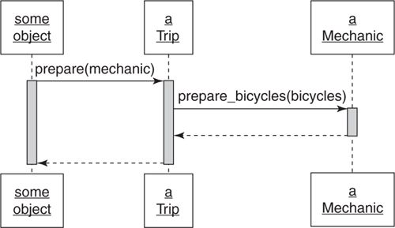

#Reducing Costs with Duck Typing

**Duck types** are public interfaces that are **not tied to any specific class** and they are **across-class interfaces**. They **replace** the costly **dependencies on class** with _more forgiving_ **dependencies on messages**.

Duck typed objects are **defined by their behavior instead of their class**. If an object quacks like a duck and walks like a duck, then its class is immaterial, it's a duck.

##Understanding Duck Typing

**Type** in programming language term describe the **catefory of the contents of a variable**. Types are generally used to describe kinds of _data_.

The knowledge of the category of the contents (type) of a variable allows an application to have an expectation about the behave of those contents. Application can assume that numbers can be used in mathematical expressions, string concatenated, and arrays indexed.

In Ruby, **object's behaviors come in the form of its public interfaces**. If one object knows another's type, it knows to which messages that object can respond.

Objects in Ruby **implement the public interfaces from its class**. An instance of a class contains the class's complete public interface. However, a Ruby object is **not limited to just one interface**; it can **implement many different interfaces**. (A class should have single responsibility but an object can have many interfaces).

Users of an object need not, and should not, be concerned about its class. **Class is just one way for an object to acquire a public interface**; object can contain several public interfaces. Many **public interfaces are not just related to one specific class**; they cut across class. An object can be expect to use one or all of its public interfaces. The application **doesn't care about what object is**, **it care about what object does**.

Across-class types, duck types, have public interfaces that represent a contract that must be explicit and well-documented.

###Overlooking the Duck

This example continue with the `Trip` and `Mechanic` example from the [flexible interfaces section](flexible-interfaces.md). `Trip`'s prepare method sends messages `prepare_bicycles` to the object contained in its `mechanic` parameter:

```ruby
class Trip
  attr_reader :bicycles, :customers, :vehicle

  # this 'mechanic' argument could be of any class
  def prepare(mechanic)
    mechanic.prepare_bicycles(bicycles)
  end

  # ...
end

# if you happen to pass an instance of *this* class,
# it works
class Mechanic
  def prepare_bicycles(bicycles)
    bicycles.each {|bicycle| prepare_bicycle(bicycle)}
  end

  def prepare_bicycle(bicycle)
    #...
  end
end
```

The following diagram illustrate the above code design:



The `prepare` method has no explicit dependency on the `Mechanic` class but it does depend on receiving an object that can respond to `prepare_bicycles` with `bicycles` as argument.

###Compounding the Problem

Imagine that requirements change. Trip preparation now involves a trip coordinator and a driver. Trip's `prepare` method now need to change to invoke the correct behavior from it argument:

```ruby
class Trip
  attr_reader :bicycles, :customers, :vehicle

  def prepare(preparers)
    preparers.each do |preparer|
      case preparer
      when Mechanic
        preparer.prepare_bicycles(bicycles)
      when TripCoordinator
        preparer.buy_food(customers)
      when Driver
        preparer.gas_up(vehicle)
        preparer.fill_water_tank(vehicle)
      end
    end
  end
end

class TripCoordinator
  def buy_food(customers)
    # ...
  end
end

class Driver
  def gas_up(vehicle)
    #...
  end

  def fill_water_tank(vehicle)
    #...
  end
end
```

Trip's `prepare` method now refers to three different classes by name and knows specific methods implemented in each of these classes, which in turn create dependencies with all these classes.

The root of problem may be the thinking of the original `prepare` method as expecting an instance of `Mechanic`, which know the `prepare_bicycles`. This works until something changes: instances of other classes other than `Mechanic` appear on the argument list. `prepare` now must deal with objects that don't understand `prepare_bicycles`. New arguments are instances of `Mechanic`, `TripCoordinator` or `Driver`, which have different public interfaces. In order to `prepare` to invoke the behavior, the obvious way is to send the messages it needs on each arguments. But the `preparers` argument now is of a different class and implements different methods; it needs to determine its class in order to send correct behavior. The `case` statement here could solve the problem but it causes new dependencies.

_This problem caused by design based on class instead of base on messages. It based on the knowledge of existing classes and their behavior (public interface)._

###Finding the Duck

Focusing on what the method need rather than focusing on what object and the behavior it provides can help avoiding this problem. Let's consider about what `prepare` need. This method wants to prepare the trip and it has arguments to collaborate for trip preparation. `prepare` should trust each of the arguments to do its jobs, which is prepare something for the trip.

The following argument illustrates this idea. Here, `prepare` method expects a `Preparer` objects to do the jobs:


The next step is figure out what message to send to the `Preparer` object. Obviously, it's `prepare_trip`. The following diagram will illustrate it:


This design show one of the characteristic of OOP, it's **abstraction**. `Preparer` has no concrete existence, it's an abstraction, **an agreement about the public interface on an idea**.

Objects that implement `prepare_trip` are `Preparer` and objects that interact with `Preparer` only need trust them to implement the `Preparer` interface.

Here's the code for new design base on `Preparer` interface:

```ruby
class Trip
  attr_reader :bicycles, :customers, :vehicle

  def prepare(preparers)
    preparers.each {|preparer| preparer.prepare_trip(self)}
  end
end

# when every preparer is a Duck
# that responds to 'prepare_trip'
class Mechanic
  def prepare_trip(trip)
    trip.bicycles.each {|bicycle| prepare_bicycle(bicycle)}
  end
end

class TripCoordinator
  def prepare_trip(trip)
    buy_food(trip.customers)
  end
end

class Driver
  def prepare_trip(trip)
    vehicle = trip.vehicle
    gas_up(vehicle)
    fill_water_tank(vehicle)
  end
end
```

###Consequences of Duck Typing

Duck typing make the code more abstract which in turn make the code harder to comprehend than the concrete class usage. Concrete code is easy to understand but costly to extend. Abstract code may initially seem more obscure but, once understood, is far easier to change.

When design, focus on the objects as if they are **defined by their behavior rather than by their class**.

###Polymorphism

Polymorphism in OOP refers to the **ability** of many **different objects** to **respond to the same message**. Senders of the message need not care about the class of the receiver; receivers supply their own version of the behavior. Thus single message has may forms.

Ways to achieve polymorphism: duck typing, inheritance and behavior sharing (via Ruby modules or Java interface).

Any object implementing a polymorphic method can be substituted for any other; the sender of the message need not know or care about this substitution.

##Writing Code That Relies on Ducks

The design challenge is to recognize the places where duck typing is suitable.

###Recognizing Hidden Ducks

These coding patterns can be replaced with duck typing:

1. **Case statement that switch on class**

This pattern is the most obvious one. The Trip's preparer is an example for this problem.

When this pattern occur, there must be something in common between these classes that used in the switch statement. Examine the code and ask this question: _"What is the method wants from each cases?"_

The answer to that question suggests that the message implies a duck type.

2. `kind_of?` and `is_a?`

The `kind_of?` and `is_a?` messages are used to check the class of an object like the `case` statement. Using these methods is no different than using a `case` statement. It should use the same technique as `case` to solve the problem.

3. `responds_to?`

Instead of depend on class names, `responds_to` is used to depend on the messages. Example:

```ruby
if preparer.responds_to?(:prepare_bicycles)
  preparer.prepare_bicycles(bicycle)
elsif preparer.responds_to?(:buy_food)
  preparer.buy_food(customers)
elsif preparer.responds_to?(:gas_up)
  preparer.gas_up(vehicle)
  preparer.fill_water_tank(vehicle)
end
```

The class names are gone but the code is still very bound to class. It only hides the explicit class references with implicit method call.

###Trust the Ducks

The style of using `kind_of?`, `is_a?`, `responds_to?` and `case` statement is an indication that there is a missing object, which its public interface haven't been discovered yet.

When these code patterns occur, **concentrate on** the offending **code's expectations** and **use those expectations to find the duck type**. Once the duck type have appeared, define its interface, implement that interface where necessary, then trust those implementers to behave correctly.

###Documenting Duck Types

Since duck type introduce abstraction, it'll make the code obscure. So, when creating duck types, their public interfaces should be documented and tested.

###Choosing Ducks Wisely

The following code is an example from the Ruby on Rails framework (`active_record/relations/finder_methods.rb`). This example use class to decide how to deal with its input:

```ruby
def first(*args)
  if args.any?
    if args.first.kind_of?(Integer) ||
         (loaded? && !args.first.kind_of?(Hash))
      to_a.first(*args)
    else
      apply_finder_options(args.first).first
    end
  else
    find_first
  end
end
```

The different here is that `first` depends on `Integer` and `Hash`, which are stable because it's Ruby's core classes. This dependency is safe. There might be a duck type hidden somewhere in this code but it will likely not reduce the costs to find and implement it.

So, the decision to create a new duck type relies on judgment. The purpose of design is to lower costs. If creating a duck type would reduce unstable dependencies, do so. If not, it's ok to make an exception.
