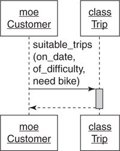
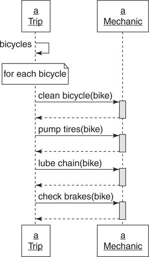
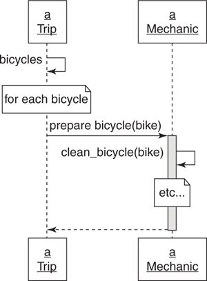
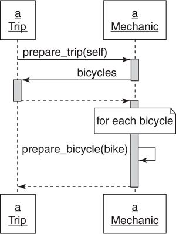
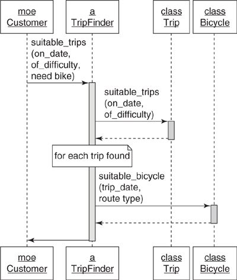

#Creating Flexible Interfaces

Object oriented applications are not just the sum of their classes. Although classes are visible: design discussions often revolve around classes [responsibilities](chap1-2.md) and [dependencies](managing-dependencies.md), object-oriented application is more than just classes.

Object oriented applications are _made up of classes_ and **defined by messages**. Classes control the source code structure of the application; messages reflect the mechanism of the application, the way that the application work.

Design deals not only with what objects know (**responsibilities**) and who they know (**dependencies**), but how they talk to each other (**messages**). Objects communicate through their **_interfaces_**. Flexible interfaces will allow applications to grow and change easily.

##Understanding interfaces

Applications are characterized by the patterns of their messages.

When objects in an application exposes too much of itself (through messages it received) and knows too much about the other classes (through messages sent), they are hard to reuse. This will result to that these objects can do only the things that they do right now. If one thing changed, everything change.

When objects reveals little about it self and knows little about others, the application is composed of plug-able, component-like objects that can be reuse and change independently.

The problem lie _not in what each class does_ but with what **it reveals**.

Each object should defined **set of methods** that it **expects others to use**, and these methods compromise the class's _public interface_.

(_interface_ can be used to represents a set of messages where the messages themselves define the interface. Many different classes may implement the methods that the interface requires. Any class that implements the required methods can act like the interface kind of thing)

##Defining Interfaces

Each class exists to fulfill a single responsibility _but implement many methods_. These method might be general methods that expose the main responsibility of the class or might be the tiny utility methods that are only meant to be used internally. These general methods should be public while these methods that deals with internal implementation details should be private.

Example with a restaurant kitchen. Customers order food off a menu. These orders come into the kitchen through a little window and the food eventually comes out. The kitchen may do a lot of thing but it only exposes a _publicc interface_, which is the menu, to the customer. All of other works are hidden from the customer.

####Public interfaces

The methods that make up the public interface are:

  - **Reveal its primary responsibility**

  - Are **expected to be invoke by others**

  - **Will rarely change**

  - **Are safe for others to depend on**

  - **Are thoroughly documented in the test** (must be tested)

####Private interfaces

All other methods in the class are part of its private interface:

  - **Handle implementation details**

  - **Not expected to be sent by other objects**

  - **Can change frequently**

  - **unsafe for others to depend on**

  - **not necessary to be tested**

####Responsibilities, Dependencies, and Interfaces

The public interface is a contract that articulates the responsibilities of the class, public methods should read like a description of responsibilities.

The public parts of a class are the stable parts; the private parts are the changeable parts. Class should depend only on the thing that change less often than it does. When marking a method public or private in a class, the user of this class can know which methods that are safely depend.

##Finding the Public Interface

The design goal is to **retain maximum future flexibility** while writing only **enough code to meet today’s requirements**. Good public interfaces reduce the cost of unanticipated change; bad public interfaces raise it.

This section introduce a new application to illustrate a number of rules-of-thumb about interfaces.

**Example application requirements: Bicycle Touring Company**

A bicycle touring company offer both road and mountain bike trips. Each trip follows a specific route and may occur several times during the year. Each has limitations on the number of customers who may go and requires a specific number of guides who double as mechanics.

Each route is rated according to its aerobic difficulty. Mountain bike trip have an additional rating that reflects technical difficulty. Customers have an aerobic fitness level and a mountain bike technical skill level to determine if a trip is right for them.

Customers may rent bicycles or they may choose to bring their own. The company has a few bicycles available for customer rental and it also shares in a pool of bicycle rentals with local bike shops. Rental bicycles come in various sizes and are suitable for either road or mountain bike trips.

###Constructing an Intention

Form some intentions of the requirement first. Something easy like expecting class form from _nouns_ from the requirements. In this application, these are classes that are expected to have: Customer, Trip, Route, Bike, and Mechanic. They have both _data_ and _behavior_. They are called _domain objects_, which are obvious, stand for big visible real-world things that will end up with a representation in the database.

Domain objects are easy to find but not at the design center of the application. If domain objects are concentrated on design, it will be tend to coerce behavior into them. Instead, focus on the **messages that pass between the domain objects**.

So before start typing code, start form an intention about the _objects_ and the _messages_ needed to satisfy the use case.

Sequence diagrams that provide a simple, inexpensive way to explore design and doesn't require coding will do a great help.

###Using Sequence Diagram

Sequence diagrams provide a simple way to experiment with different _object arrangements_ and _message passing schemes_. Example: this diagram represents an attempt to implement the use case above.



This diagram illustrates the two main parts of a sequence diagram: **objects** and **messages** passing between them.

In this example, the diagram contain two objects: `Customer` Moe and `Trip`. It also contains a single message, `suitable_trips`, sent by Moe to the `Trip`. The message requires three parameters: `on_date`, `of_difficulty` and `need_bike`.

In this diagram, Moe expects the `trip` class to find a suitable trip for it. `Trip` would be possible for finding trips on a date and of a difficulty, but Moe also need `Trip` to handle the bicycle rental too (the `need_bike` parameter).

Sequence diagrams prompts the question: _"Should this receiver be responsible for responding to this message?"_, which is _"Should Trip be responsible for figuring out if an appropriate bicycle is available for each suitable trip?"_

Sequence diagrams **expose messages pass between objects**, and because objects should only communicate using public interfaces, sequence diagrams are a tool for exposing, experimenting with, and ultimately defining those interfaces.

With sequence diagram, the design **change** from **focus on classes with who and what they know** to **focus on the messages**. It is now determine **where to send the messages** instead of figuring classes responsibilities.

`Customer` is reasonable to send `suitable_trips` but the problem is that `Trip`  shouldn't receive it.

So, if `Trip` shouldn't be figuring out if bicycles are available, perhaps a `Bicycle` class should do it. `Trip` can be responsible for `suitable_trips` and `Bicycle` for `suitable_bicycle`. Customer can get the answer from both of the objects. It's described in the following diagram:



With this design, the extraneous responsibilities (check the available of the bicycle) are removed from `Trip` but it merely transfers to the `Customer`.

Moe now not only knows _what_ he wants (list of trips), he also know _how_ other objects provide it (knows an object that implements `suitable_trips`, and find `suitable_bicycle` from those trips). The `Customer` class has become the owner of the application rules that assess trip suitability.

###Asking for "What" Instead of Telling "How"

There is a subtle distinction between message that **asks for what the sender wants** and a message that **tells the receiver how to behave**. This different is a key part of creating reusable classes with well defined interfaces.

To illustrate this, let's start with a new example. When a trip is about to depart, it needs to make sure all the bicycles scheduled to be used are in good shape.

`Trip` could know exactly how to make a bike ready for a trip and could ask a `Mechanic` to do each of those things:


In this diagram:

  - The Trip' public interface includes `bicycles`.

  - Mechanic's public interface `clean_bicycle`, `pump_tires`, `lube_chain`, and `check_brakes`.

  - Trip expects to be holding onto an object that can respond to the above method (Mechanic instance)

`Trip` knows many details about what `Mechanic` does. So when `Mechanic` add new procedures to the bike preparation process `Trip` must change as well.

What `Trip` need is to prepare bike, so it should asks `Mechanic` to prepare bike only, leaving the implementation details to `Mechanic`:



In this diagram:

  - Trip' public interface includes `bicycles` method.

  - Mechanic's public interface includes `prepare_bicycle`.

  - Trip expects to have a reference on an object that can respond to `prepare_bicycle`.

`Trip` wants each of its bicycles to be prepared, and it trusts the `Mechanic` to accomplish this task. Because `Mechanic` is responsible for knowing how to prepare bicycle, `Trip` will have the correct result from `Mechanic` regardless of future improvement to `Mechanic`

One side effect of this is the reduction of public interface. In the previous solution, `Mechanic` has 4 public interface, now it only have one. This reduces the likelihood of Mechanic someday changing its public interface and forcing changes on many other classes.

However, `Trip` still knows a lot about `Mechanic`. It expects to have an object that respond to `prepare_bicycle` for each bicycles it has.

###Context Independence

The **things** that an object **knows about other objects** make up its **context**. Example: `Trip` _has_ a single responsibility but it expects a _context_. `Trip` expects to be holding onto a `Mechanic` object that can respond to the `prepare_bicycle` message to do its job.

**This context will follow object every where** (testing or otherwise). Any use of `Trip` requires that its context be established. Preparing a trip _always_ requires preparing bicycles so `Trip` always sends the `prepare_bicycle` to its `Mechanic` instance. `Trip` can't be reused unless a Mechanic-like object that respond to this message is provided.

Objects that have a simple context are easy to use and test; they expect few things from their context. Objects that have a complicated context are hard to use and test; they require complicated setup before doing anything.

Object should be completely independent of its context. This king of objects could be reused in novel and unanticipated ways.

Dependency injection is a technique for collaborating with others **without knowing who** they are. But the new problem here is for object to **invoke the correct behavior** from other object **without knowing what** it does.

It may seem impossible for Trip to have context independence. Trips have bicycles, bicycles must be prepared, and mechanics prepare bicycles.

However, the solution to this problem lies in the distinction between _what_ and _how_, and the solution requires concentrating on what `Trip` wants.

What `Trip` wants is to be prepared. But, preparing _bicycles_ may belong to the province of `Mechanic`. The need for bicycle preparation is more how a Trip gets prepared than what a Trip wants.

So, `Trip` need to tell  `Mechanic` what it wants only, that is to be prepared, and leave the rest for `Mechanic` to do the job:



`Trip` now knows nothing about `Mechanic` but still manages to collaborate with it to get bicycles ready. `Trip` tells `Mechanic` what it wants, passes `self` as an argument, and `Mechanic` immediately calls back to `Trip` to get the list of the bicycles that need preparing.

  - Trip's public interface includes `bicycles`

  - Mechanic's public interface includes `prepare_trip` and `prepare_bicycle` perhaps

  - Trip expects to be holding onto an object that can respond to `prepare_trip`.

  - Mechanic expects the argument passed along with the `prepare_trip` to respond to `bicycles`.

###Using Messages to Discover Objects

Let's return to the [original design problem](#using-sequence-diagram). There are two solution for the use case. But both designs contain a violation of the single responsibility principle. In the first solution, `Trip` knows too much. In the second, `Customer` knows too much, tells other objects _how_ to behave, and requires too much context.

Customer should send the `suitable_trips` message because it's _what_ it wants. But the problem is who should receive this message. It's not suitable for `Trip` or ` Bicycle` to receive this message.

So, an object that embody the rules at the intersection of `Customer`, `Trip`, and `Bicycle` need to be created. The `suitable_trips` will be part of its public interface. The new class for this object is called `TripFinder`, which responsible for finding suitable trips:



`TripFinder` contains all knowledge of what makes a trip suitable. It knows the rules; its job is to do whatever is necessary to respond to this message.

Moving this method into `TripFinder` makes the behavior available to any other object. `TripFinder` can be used via a Web service to locate suitable trips.

##Writing Code That Puts Its Best (Inter)Face Forward)

###Create Explicit Interfaces

Every time creating a class, declare its interfaces. Method in **public** interface should:

  - **Be explicitly identified as such**

  - **Be more about _what_ than _how_**

  - **Have names that rarely change**

  - **Take a hash as an options parameter**

Either **do not test private methods** or **segregate those tests from the tests of public methods**.

Ruby provides three relevant keywords: `public`, `protected`, and `private`. These key words serve two distinct purpose:

  - They indicate which methods are stable and which are unstable.

  - They control how visible a method is to other parts of the application.

###Public, Protected, and Private Keywords

`private` denotes the **least stable** kind of method and provides the **most restricted visibility**. Private methods **must be called** with an **implicit receiver** or may **never be called** with an **explicit receiver**.

Example: if `Trip` has private method `fun_factor`, and this method cannot be sent with `self` (`self.fun_factor`) or with a `Trip` instance (`a_trip.fun_factor`). However, `fun_factor` can be sent defaulting to `self` from within instances of Trip and its subclasses.

`protected` also indicates an unstable method, but with slightly different visibility restrictions. Protected methods **allow explicit receivers** as long as the receiver is `self` or an instance of the same class or subclass of self.

Thus, if `fun_factor` is a `protected` method, it can be sent with self (`self.fun_factor`) or with an instance (`a_trip.fun_factor`), but only within a class where `self` is the same kind of thing with it (`a_trip`  created in class `Trip` or subclass of `Trip` can send `fun_factor` explicitly)

`public` indicates that a method is stable and visible everywhere.

###Always use Public Interface of Others

Public interface is dependable and not going to change in the future. So, it should always be used when design. If the **design forces the use of a private method** in another class, **rethink the design**.

When the design depend on a private interface, the risk of being forced to change is increased. The dependencies should be avoided.

But when the design _must_ depend on a private interface, isolating the use of those private interface, prevent references to these method in the application (through wrapper methods or classes)

###Minimize Context

Construct public interfaces with an eye toward minimizing the context they require from others. Keep the **what** verses **how** distinction; create public methods that allow senders to get _what they want without knowing_ how it implemented.

If the original object hasn't have a public interface, create the own one. It can be a new method in the existing class are a single wrapping method in the current class. Always create some kind of public interfaces to be used. This reduces the class's context, making it easier to reuse and simpler to test.

##Law of Demeter

The Law of Demeter (LoD) is a set of coding rules that results in loosely coupled objects. Loose coupling is nearly always a virtue but is just one component of design and must be balanced against competing needs. Some Demeter violations are harmless, but others expose a failure to correctly identify and define public interfaces.

###Defining Demeter

Demeter **restricts the set of objects** to which a method may _send_ messages; it **prohibits** routing a message to a **third object via a second object** of a **different type**. It is often paraphrased as _"only talk to your neighbors"_ or _"use only one dot"_. Example:

```ruby
def depart
  customer.bicycle.wheel.tire
  customer.bicycle.wheel.rotate
  hash.keys.sort.join(', ')
end
```

Each line is a message train often called as _train wrecks_ containing a number of dots. These trains indicate that there may be some violation Demeter.

###Consequences of Violations


###Avoiding Violations

One common way to remove _"train wrecks"_ is to use delegation to avoid "dots". Delegate a message is to pass it on to another object, often via a wrapper method. The wrapper method encapsulates or hides knowledge embodied in the message chain.

In Ruby, delegation can be done using `delegate.rb` and `forwardable.rb` and the Ruby on Rails framework includes the `delegate` method.

Delegation removes the visible evidence of violations. This technique is sometimes useful, but beware, **using delegation to hide tight coupling is not the same as decoupling the code**.

###Listening to Demeter

Reaching across disparate objects to invoke distant behavior is tantamount to saying: _"there’s some behavior way over there that I need right here and I **know how to go get it**"_. The code knows not only _what_ it wants (the behavior that is reached) but _how_ to navigate through a bunch of intermediate objects to reach the behavior. It creates the coupling between the current object and these navigating objects.

This coupling causes problem like forcing change in the current object when some unrelated change occur in the message chain. And it make the class binds itself to a specific implementation and so it cannot be reused in other context.

Example: `depart` method knows this chain of objects `customer.bicycle.wheel.tire`, it knows that `customer` must always have `bicycle` which in turn must have Wheels that rotate or have ties.

Instead of messages chaining, consider about **what** `depart` wants from `customer`:

    customer.ride

The `ride` method hides implementation details and reduce both the context and dependencies.

**The violation of Demeter** are clues that there are **objects whose public interfaces are lacking**. Listening to Demeter means paying attention to the object's public interfaces.
