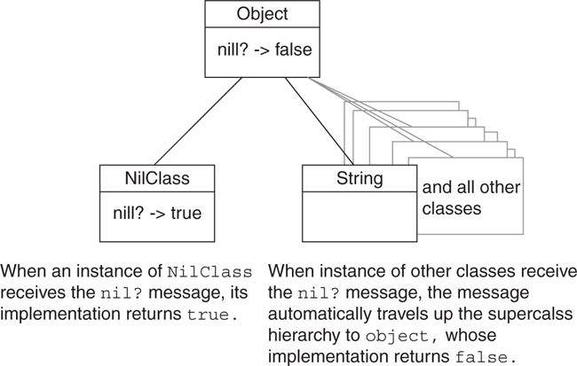
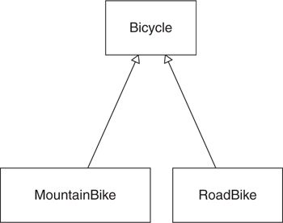

#Acquiring Behavior through Inheritance

Inheritance is one of the code sharing technique which has built into the very syntax of the language.

##Understanding Classical Inheritance

**Inheritance is a mechanism for _automatic message delegation_**. It defines a forwarding path for _not-understood_ messages. It means, it one object cannot respond to a receive message, it delegate that messages to another. With inheritance between objects, the forwarding process happens automatically without explicitly delegate the message.

In classical inheritance, these relationship are defined by creating subclasses. Messages are forwarded from subclass to superclass; the shared code is defined in the class hierarchy.

The _classical_ term is served to distinguish the superclass/subclass mechanism from other inheritance techniques. Example: prototypical inheritance in Javascript, modules in Ruby.

This section focus on classical inheritance.

##Recognizing Where to Use Inheritance

Example Problem: The Trip planing company now leads road bike trip. Road bicycle are lightweight, curved handlebar (drop bar), skinny tired bikes that are meant for paved roads. Mechanics are responsible for keeping bicycles running. They take an assortment of spare parts on every trip. The spare they need depend on which bicycle they take.

Let's start with a concrete class. Since this Trip application already have a `Bicycle` class, every road bike is represented by an instance of this class.

Bikes have an overall size, a handlebar tape color, a tire size and a chain type:

```ruby
class Bicycle
  attr_reader :size, :tape_color

  def initialize(args)
    @size       = args[:size]
    @tape_color = args[:tape_color]
  end

  # every bike has the same defaults for
  # tire and chain size
  def spares
    { chain:        '10-speed',
      tire_size:    '23',
      tape_color:   tape_color}
  end

  # Many other methods...
end
```

`Bicycle` instances can respond to the `spare`, `size` and `tape_color` messages and a Mechanic can figure out what spare parts to take by asking `spares` on a Bicycle instance.

This class works until something changes. The Trip company now begin to lead mountain bike trips. Mountain bikes although is a kind of Bicycle but it has some different with Road bikes. They have sturdy frames, fat tires, straight-bar handlebars and suspension.

When a preexisting concrete class contains most of the behavior, it's tempting to solve the problem by adding code to the existing class. This next example code does just that:

```ruby
class Bicycle
  attr_reader :style, :size, :tape_color,
              :front_shock, :rear_shock

  def initialize(args)
    @type        = args[:style]
    @size        = args[:size]
    @tape_color  = args[:tape_color]
    @front_shock = args[:front_shock]
    @rear_shock  = args[:rear_shock]
  end

  # checking "style" starts down a slippery slope
  def spares
    if style == :road
      { chain:        '10-speed',
        tire_size:    '23',       # milimeters
        tape_color:   tape_color }
    else
      { chain:        '10-speed',
        tire_size:    '2.1',      # inches
        rear_shock:   rear_shock }
    end
  end
end
```

This code makes decisions about spare parts based on the value held in `style`. And because of that, when a new style added, the `if` statement have to change. And also, there are duplicated values in this example.

`Bicycle` has an implied public interface that includes individual parts. These parts are unreliable because it may not be initialized with a Bicycle instance. And when using a bicycle instance's `tape_color` or `rear_shock`, it will have to check the `style` to ensure that is a Mountain bike instance.

`Bicycle` now has more than one responsibility, contains things that might change for different reasons, and cannot be reused as is.

This code contains an if statement that **checks an attribute that holds the category** of `self` to **determine what message to send** to `self`. This pattern is the same type with the pattern that checked the **class of an object** to **determine what message to send** to that _object_.

While the second pattern is used to discovered a missing duck type, here the first pattern is used to **indicate a missing subtype**. (subclass)

###Finding the Embedded Types

The `style` variable could be think of a `type` or `category`. These names can be helped to notice the underlying pattern. It effectively divides instances of bicycle into two different kinds of things. These two things share some of the behavior but differ along the `style` dimension.

**Inheritance solves that problem, which is highly related types that share common behavior but differ along some**.

###Choosing Inheritance

Objects receive messages and handle it. It either **responds directly** or it **passes the message** on to some **other object** for a response.

Inheritance provides a relationship between two object that when the **first object receives a message** that is does **not understand**, it **automatically forwards**, or delegates, the message to the second.

Ruby provide a single inheritance, whereby subclass is allowed only one parent superclass.

_Message forwarding_ via _classical inheritance_ takes place between **classes**. Duck types cut across classes so they don't use classical inheritance to share common behavior, instead they use Ruby Modules.

In Ruby, all classes have `Object` as its superclass when they don't specify their superclass. Every class is a subclass of something.

Example with message forwarding in Ruby: Ruby objects respond to the `nil?` message:



Subclass contains its superclass entire public interface and must respond to any message defined in that interface. Also subclass can have its own public interface which can do many kind of different things. Thus, subclasses are **specializations** of their superclasses.

##Finding the Abstraction

The default `Bicycle` class was actually slightly more specialized. It represents a specific kind of bike - a road bike. It will make it hard for Bicycle to represent any other kind of bike like mountain bike. The application expect a `MountainBike` to be a specialization of `Bicycle`.

Subclasses are specializations of their superclasses. A `MountainBike` should be everything a `Bicycle` is, plus more. Any object that expects a `Bicycle` should be able to interact with a `MountainBike`.

For inheritance to work, two things must always be true:

  1. The objects that is modeled must truly have a generalization-specialization relationship.

  2. Use correct coding technique.

###Creating an Abstract Superclass

The inheritance structure between Bicycle vs `MountainBike` and `RoadBike` is represented in this diagram:



in Ruby code:

```ruby
class Bicycle
  # This class is now empty.
  # All code has been moved to RoadBike.
end

class RoadBike < Bicycle
  # Now a subclass of Bicycle.
  # Contains all code from the old Bicycle class.
end

class MountainBike < Bicycle
  # Still a subclass of Bicycle (which is now empty).
  # Code has not changed.
end
```

Bicycle now represents an **abstract class**. **Abstract** means that being **disassociated from any specific instance**. In order to be abstract, `Bicycle` should not define a complete bike, it should define a bits that all bicycles share. `Bicycle` is not a class to which it would ever receive a message.

Abstract classes exist to be subclassed. They provide a common repository for behavior that is shared across a set of subclasses.

Do not create an abstract superclass with only one subclass. Until there is a specific requirement that lead to the situation to make an abstract class, it is ok to make a concrete class.

Even with this `Bicycle` example which has two kind of bicycle, it still might not be the right moment to commit to inheritance. Creating hierarchy has costs; the best way to minimize these costs is maximize the chance of getting the abstraction **right before allowing subclasses to depend on it**. While two bikes supply fair amount of information about the common abstraction, three bikes would supply a great deal more.

Putting off the creation of `Bicycle` hierarchy means `MountainBike` and `RoadBike` classes have a great deal of duplicated code. A decision here is to accepts the duplicated code for more information about the abstraction or DRY the duplicated code. If a third bike is imminent, it's fine to duplicated code and wait for better information. However, if duplicated code need to change every day, it may be cheaper to create the hierarchy.

###Promoting Abstract Behavior

The `size` and `spares` methods are common to all bicycles, they should belongs to Bicycle's public interface. These method need to move from `RoadBike`. Because `size` is simplest method, it should be the place to start:

```ruby
class Bicycle
  attr_reader :size     # <- promoted from RoadBike

  def initialize(args={})
    @size = args[:size] # <- promoted from RoadBike
  end
end

class RoadBike < Bicycle
  attr_reader :tape_color

  def initialize(args)
    @tape_color = args[:tape_color]
    super(args)  # <- RoadBike now MUST send 'super'
  end
  # ...
end
```

The general rule for refactoring into a new inheritance hierarchy is to arrange code so that you can **promote abstractions** rather than **demote concretions**. Which mean it's acceptable to have duplicated code first at the subclass, then it can be promoted to the superclass later rather than transform concrete code from superclass to subclass. The design of superclass should start with an empty, skeleton class and find methods that would be shared between subclasses then promote these method to superclass.

###Separating Abstract from Concrete

The default `spares` method is known too much (`chain`, `tire_size` and `tape_color`) and contain fixed value so it can't be promoted to the abstract `Bicycle` like `size` method.

First thing to do is to find the common attributes which all bicycles share which is `chain` and `tire_size`. These attributes, like `size`, should be represented by accessors instead of hard-coded values:

```ruby
class Bicycle
  attr_reader :size, :chain, :tire_size     # <- promoted from RoadBike

  def initialize(args={})
    @size = args[:size]
    @chain = args[:chain]
    @tire_size = args[:tire_size]
  end
end
```

To separate abstract from concrete, find the common attributes that the abstract class might contain so it can be used in the concrete subclasses.

###Using the Template Method Pattern

Template method is a technique of **defining a basic structure (methods)** in the **superclass** and the **subclasses** will **define their own behavior** on these _template_ methods.

Using this technique to implement the default value for `chain` and `tire_size`:

```ruby
class Bicycle
  attr_reader :size, :chain, :t     # <- promoted from RoadBike

  def initialize(args={})
    @size = args[:size]
    @chain = args[:chain] || default_chain
    @tire_size = args[:tire_size] || default_tire_size
  end

  def default_chain
    "10-speed"
  end

  def default_tire_size
    raise NotImplementedError
  end
end
class RoadBike < Bicycle
  # ...
  def default_tire_size   # <- subclass default
    "23"
  end
end

class MountainBike < Bicycle
  # ...
  def default_tire_size   # <- subclass default
    "2.1"
  end
end
```

The `default_tire_size` method in `Bicycle` doesn't have an implementation so it raises an exception to provide useful documentation for other who inherit `Bicycle` so they could provide their own implementation for this method when they forget or don't know that they have to implement this method.

##Managing Coupling Between Superclasses and Subclasses

`Bicycle` now contains most of the abstract behavior. The only missing piece is `spares`. This `spares` superclass implementation can be written in a number of ways; and many could make the superclass and subclass tightly coupled together. Managing this coupling is important; tightly coupled classes make it hard to change.

###Understanding Coupling

Let's see the first (the simplest) implementation of `spares`, which demonstrated the tightly coupled classes.

```ruby
class Bicycle
  #...
  def spares
    { tire_size:  tire_size,
      chain:      chain}
  end
  #...
end

class RoadBike < Bicycle
  attr_reader :tape_color

  def initialize(args)
    @tape_color = args[:tape_color]
    super(args)
  end

  def spares
    super.merge({ tape_color: tape_color})
  end

  def default_tire_size
    '23'
  end
end

class MountainBike < Bicycle
  attr_reader :front_shock, :rear_shock

  def initialize(args)
    @front_shock = args[:front_shock]
    @rear_shock =  args[:rear_shock]
    super(args)
  end

  def spares
    super.merge({rear_shock: rear_shock})
  end

  def default_tire_size
    '2.1'
  end
end
```

The `MountainBike` and `RoadBike` follow similar pattern. They know things about themselves (their spare parts specializations) and things about their superclass (`spares` return a hash and it responds to `initialize`).

Knowing things about other classes always creates dependencies and they coupled objects together. The dependencies of the code above **created by the sends of** `super` **in the subclasses**.

For example: when a new kind of bike `RecumbentBike` that inherit `Bicycle` but the creator forgot to send `super` in the RecumbentBike's `initialize` method, thus `RecumbentBike` instances don't have a valid `size`, `chain` or `tire_size`. When `RecumbentBike` instances call `spares` their `tire_size` and `chain` will always be `nil`. The problem is similar with the `spares` method that forgot to send `super`. The instances will get the wrong behavior and make it hard to debug.

The pattern of code in this hierarchy requires that subclasses not only know what they do but also how they are supposed to **interact with their superclass**. It causes duplication of code across subclasses, requiring that all send `super` in exactly the same places.

When a subclass sends `super`, it depends on the superclass algorithm. If the algorithm changes, then the subclass may break even if their own specializations are not affected.

###Decoupling Subclasses Using Hook Messages.

Instead of allowing subclasses to know the algorithm and requiring that they send `super`, superclasses can instead send **hook** messages, which **provide subclasses a place to contribute information by implementing matching methods**.

For example: using this technique to give subclasses a way to contribute to initialization. `Bicycle`’s `initialize` method now sends `post_initialize` and `RoadBike` supplies its own specialized initialization by overriding `post_initialize`

```ruby
class Bicycle
  def initialize(args={})
    @size       = args[:size]
    @chain      = args[:chain]     || default_chain
    @tire_size  = args[:tire_size] || default_tire_size

    post_initialize(args)   # Bicycle both sends
  end

  def post_initialize(args) # and implements this
    nil
  end
  # ...
end

class RoadBike < Bicycle
  def post_initialize(args)         # RoadBike can
    @tape_color = args[:tape_color] # optionally
  end                               # override it
  # ...
end
```

This change not only remove the send of `super` from `RoadBike`'s `initialize` method, it also removes the `initialize` method. `RoadBike` only contributes specializations to the abstract initialize bicycle.

Putting control of the timing in the superclass means the algorithm can change without forcing changes upon the subclasses.

This technique can be used for `spares` method to remove the send of `super`:

```ruby
class Bicycle
  #...
  def spares
    {tire_size:  tire_size,
      chain:      chain}.merge(local_spares)
  end

  def local_spares
    {}
  end
  #...
end

class RoadBike < Bicycle
  # ...
  def local_spares
    {tape_color: tape_color}
  end
end
```

##Summary

Inheritance solves the problem of related types that share a great deal of common behavior but differ across some dimension.

The best way to create an abstract superclass is by pushing code up from concrete subclasses.

Abstract superclasses use the template method pattern to invite inheritors to supply specializations, and use hook methods to allow these inheritors to contribute these specializations without being forced to send super.
