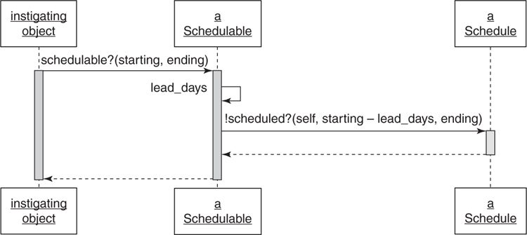

#Sharing Role Behavior with Modules

Classical inheritance can sometimes go wrong. For example, when the Trip company develops a need for a new bike which its behavior is a combination of `RoadBike` and `MountainBike` instead of `Bicycle`.

To reap benefits from using inheritance, it's require to understand not only **how to write inheritable code** but also **when it make sense** to do so. Use of classical inheritance is always optional; every problem that it solves can be solved in another way. Because no design technique is free, creating the most cost-effective application requires **making informed tradeoffs** between the **relative costs** and **benefits of alternatives**.

This section explores an alternative that uses the techniques of inheritance to share a **role**.

##Understanding Roles

Some problems require **sharing behavior among** otherwise **unrelated objects**. It's a **role** and object plays.

When objects begin to play a common role, they enter into a relationship with the objects **for whom they play the role**.

###Finding Roles

The `Preparer` duck type from the [Duck typing](duck-typing.md) section is a role. Objects that implement `Preparer` interface play this role. Other object can interact with these `Preparer` role object without concern for their class.

The `Preparer` role objects will enter a relationship with objects with `Preparable` role. Example, `Trip` class act as a `Preparable` and `Mechanic`, `Driver` and `TripCoordinator` play the `Preparer` role. The `Preparable` role has its own interface which includes all of the messages that any `Preparer` might expect to send to, that is, the methods `bicycles`, `customers` and `vehicle` of `Trip`. The `Preparable` role is not obvious because `Trip` is its only implementation but it's important to recognize that it exist.

Objects that act as `Preparer` only have the common interface. They share only the method signature but no other code.

Because it is common to have more sophisticated roles which requires **not only specific message signatures but also specific behavior**. When a role need shared behavior, the problem of organizing the shared code occur. Ideally this code would be **defined in a single place** and can be used by any object that act the role.

In Ruby, _modules_ can be used to define a named group of methods that are independent of class and can be mixed in to any object.

###Organizing Responsibilites

Before choosing between duck type and modules, first thing to do is learning how to do it correctly. Technique from the [inheritance](inheritance.md) section can be useful here.

Example problem: scheduling a trip. Trips occur at specific points in time and involve bicycles, mechanics, and motor vehicles. The Trip company needs a way to arrange all of these objects so that it can determines which objects are available.

The requirements are that bicycles have a minimum of one day between trips, vehicles a minimum of three days, and mechanics, four days.

Assume that a `Schedule` class exists. Its interface already includes these methods:

```ruby
scheduled?(target, starting, ending)
add(target, starting, ending)
remove(target, starting, ending)
```

Each of the above methods takes three arguments: the _target object_, the _start and end dates_. The `Schedule` is responsible for knowing the _target_ is already scheduled and for adding and removing _targets_ from the schedule. These responsibilities rightly belong here.

`Schedule` however can't know if an object can be scheduled or not because knowing the object is _not_ schedule during an interval isn't enough information. It also need the lead time of each kind (class) of object into account.

To check the lead time of each object base on its kind, the duck typing technique can be used here to reduce dependencies. The `target` now play the role of discovering the `lead_days`:


The `Schedule` expects its target to behave like something that understands `lead_days`, that is, like something that is `schedulable`.

**Letting Objects Speak for Themselves**

Using this duck type improves the code, however in this example, it still contains unnecessary dependencies.

To illustrate these dependencies, imagine a `StringUtils` class which has methods for managing strings. `StringUtils` can be asked to check if a string is empty by `StringUtils.empty? some_string`. Use a separate class to manage string is redundant; strings are objects so they have their own behavior, they manage themselves. Requiring that other objects know about a third party, `StringUtils`, to get behavior from a string add and unnecessary dependency.

Objects should **manage themselves**; they should contain **their own behavior**.

The previous example violates this rule. The other object have to know about `Schedule` to know if the `target` is available instead ask the `target` directly. This will make the other objects depend on the `Schedule`, even though it only interested in the `target`.

Thus, targets should respond to `schedulable?` method which should be added to the interface of the `Schedulable` role.

The following step will show how to extract the role with ruby modules.

###Writing the Concrete Code

Adding method to a role requires making two decisions: **what the code should do** and **where the code should live**.

The simplest way to get start is to separate the two decisions. Pick an arbitrary concrete class (for example `Bicycle`) and implement the role method (`schedulable?`) directly in that class. Once a version that works for `Bicycle` is done, it can be refactored to arrange the code to allow all `Schedulable` to share behavior.

Example code:

```ruby
class Bicycle
  attr_reader :schedule, :size, :chain, :tire_size

  # Inject the Schedule and provide a default
  def initialize(args={})
    @schedule = args[:schedule] || Schedule.new
    # ...
  end

  # Return true if this bicycle is available
  # during this (now Bicycle specific) interval.
  def schedulable?(start_date, end_date)
    !scheduled?(start_date - lead_days, end_date)
  end

  # Return the schedule's answer
  def scheduled?(start_date, end_date)
    schedule.scheduled?(self, start_date, end_date)
  end

  # Return the number of lead_days before a bicycle
  # can be scheduled.
  def lead_days
    1
  end

  # ...
end
```

This code hides knowledge of who the `Schedule` is and what the `Schedule` does inside of `Bicycle`. Objects holding onto a `Bicycle` no longer need know about the existence or behavior of the `Schedule`.

###Extracting the Abstraction

The decision about what the code should do has been decided. Now is the where the code reside part so that it can be shared among objects of different classes.

The following example shows a new `Schedulable` module, which contains an abstraction extracted from the `Bicycle` class above:

```ruby
module Schedulable
  attr_writer :schedule

  def schedule
    @schedule ||= ::Schedule.new
  end

  def schedulable?(start_date, end_date)
    !scheduled?(start_date - lead_days, end_date)
  end

  def scheduled?(start_date, end_date)
    schedule.scheduled?(self, start_date, end_date)
  end

  # includers may override
  def lead_days
    0
  end
end
```

The pattern of messages now look like this:



The code in `Schedulable` _is_ the abstraction and it uses the template method pattern to invite objects to provides specializations to the algorithm it supplies (`Schedulable` override `lead_days`).

Although modules and classical inheritance rely on the same technique that is automatic message delegation, the distinction between them is that classical inheritance is a **_is-a_** relationship while modules represent **_behave-like-a_** relationship.

###Looking up methods

Here is a diagram that represent the nearly complete pattern of looking up method in ruby:


##Writing Inheritable Code

The usefulness and maintainability of inheritance hierarchies and modules is in direct proportion to the quality of the code. Sharing inherited behavior requires very specific coding techniques, which are covered in the following.

###Recognize the Antipatterns

There are two pattern that indicate the need of inheritance:

  1. An object that uses a variable with a name like `type` or `category` to **determine what message to send to** `self` **contains** two **highly related** but **slightly** different types. Code like this can be rearranged to use classical inheritance by putting the common code in an abstract superclass and creating subclasses for the different types.

  2. When a sending object checks the class of a receiving object to determine what message to send. In this situation, all of the receiving objects play a common role. This role should be codified as a duck type and the receiver should implement the duck type's interface.

In addition to sharing an interface, duck types might also share behavior. Thus, using module to place the shared code so that it can be included in each class or object that plays the role.

###Insist on the Abstraction

**All of the code** in an abstract superclass should **apply to every class** that inherits it. Superclasses and modules **shouldn't contain code** that **applies to partial subclasses**.

If the abstraction are not correctly identify, there may not be one, and **if no common abstraction exists** then **inheritance is not the solution** to the problem.

###Honor the Contract

Subclasses agree to a **contract**, that is they promise to be substitutable for their superclasses. Subclasses are expected to **conform** to their **superclass's interface**, they must **respond to every message** in that interface, taking the same kind of inputs and returning the same kinds of outputs.

Subclasses may accept input parameters that have broader restrictions and may return results that have narrower restrictions, while remaining perfectly suitable for their superclasses.

This is the base idea of **Liskov Substitution Principle** (LSP). The principle is stated as:

> Let _q(x)_ be a property provable about objects

> _x_ of type _T_. Then **_q(y)_** should be true for objects _y_ of type _S_ where _S_ is a subtype of _T_.

Following this principle creates applications where a subclass can be used anywhere its superclass would do, and where objects that include modules can be trusted to interchangeably play the role.

###Using the Template Method Pattern

This pattern separate the abstract from the concrete. The _abstract code_ **defines the algorithms** and the _concrete inheritors_ of that abstraction **contribute specializations** by overriding these methods.

The template methods **represent the parts** of the algorithm that **vary** and creating them forces making explicit decisions about what parts are varied and what not.

###Preemptively Decouple Classes

**Avoid** writing code that **requires its inheritors** to send `super`; instead use hook messages to allow subclasses to participate while absolving them of responsibility for knowing the abstract algorithm

Hook methods solve the problem of sending `super` only for adjacent levels of hierarchy. Example: `Bicycle` sent hook method `local_spares` that `MountainBike` overrode. When there is a subclass like `MonsterMountainBike` that is the subclass of `MountainBike`, in order to combine its own spare parts with those of its parent, `MonsterMountainBike` have to override `local_spares` and send `super` within it.

###Create Shallow Hierarchies

The limitations of hook methods are one of the reasons to create shallow hierarchies.

Every **hierarchy** can be thought of **a pyramid** that has both **depth and breadth**. An **object's depth** is the **number of superclasses between its and the top**. Its breath is the **number of its direct subclasses**.

The following diagram represent a few possible variations of shape:


##Summary

Ruby module is used to share behavior between objects that play a common role. Code defined in a module can be added to any object (instance of a class, a class or another module)

Coding technique for modules mirror those of inheritance.

When object acquires behavior whether from a superclass or modules, it makes a commitment to honoring an implied contract. This contract is defined by the Liskov Substitution Principle (LSP), which says that a subtype should be substitutable for its supertype (object should act like what it claim to be).
